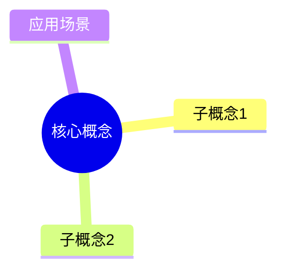

# Note Polish（笔记抛光）

## 输入
用户提供一篇原始笔记（可能混乱/口语/不完整）。

## 输出（严格结构）
1) 标题优化（更可检索）
2) YAML frontmatter（尽量少字段，但要有 tags/status）
3) 正文结构化（用二/三级标题）
4) 关键要点（3~7 条）
5) 自测题（3~5 题）
6) 反向链接建议（列出应链接到哪些 MOC/相关笔记）

## YAML Frontmatter 标准格式
```yaml
---
type: concept | interview | learning | project | output
domain: 领域名称
status: 🌿 苗 | ☀️ 树 | 💎 钻
tags: [标签1, 标签2]
created: YYYY-MM-DD
updated: YYYY-MM-DD
---
```

## 正文结构模板（领域知识卡）
```markdown
# 知识点标题



## 核心问题
面试问法：xxx

## 3行结论
1. 是什么：xxx
2. 为什么：xxx
3. 怎么用：xxx

## 核心要点
1. xxx
2. xxx
3. xxx

## 易错点
1. xxx
2. xxx

## 自测题
1. Q: xxx
   A: xxx
```

## 规则
- 不新增事实；不确定处用"待确认：……"标注
- 尽量保留用户原句，只做结构与表达优化
- Mermaid 只有在确实能表达结构时才生成（避免乱画）
- 自测题必须有答案要点
- 必须建议至少1个MOC链接

## 常用MOC链接建议
- Java相关 → [[10-领域知识/01-计算机/Java/Java-MOC|Java知识地图]]
- 数据库相关 → [[10-领域知识/01-计算机/数据库/数据库-MOC|数据库知识地图]]
- 项目相关 → [[01-导航索引/02-项目总览-MOC|项目总览]]
- 面试相关 → [[30-输出作品/01-面试回答/面试回答索引|面试回答索引]]
