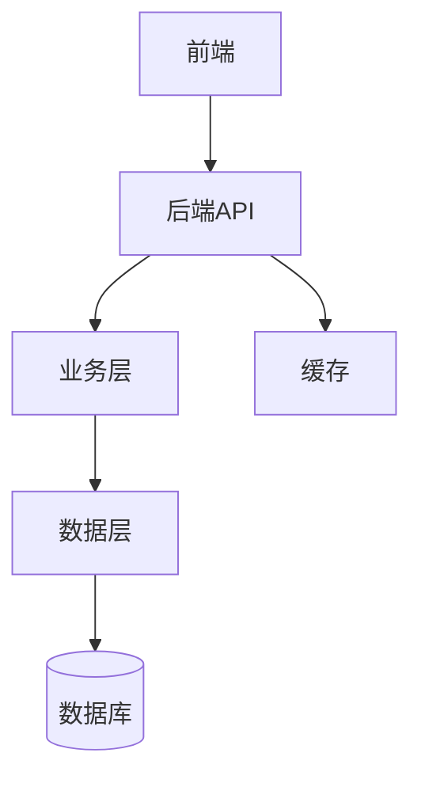

# Project Home（项目主页）

## 输入
- 项目名
- 目标（1~3 句）
- 当前进度（可选）
- 技术栈（可选）

## 输出
生成 1 个 `00-项目主页.md` 模板，包含：
- 项目简介与目标
- 里程碑与待办（本周/下周）
- 模块结构（可用 Mermaid）
- 关键文档索引（需求/设计/接口/部署）
- 踩坑索引（链接清单）
- 输出作品索引（指向 30-输出作品）
- 复盘区（每周追加 3 行即可）

## 项目主页模板
```markdown
---
project: {{项目名}}
status: doing | completed | paused
tags: [项目实战, {{技术标签1}}, {{技术标签2}}]
created: {{日期}}
updated: {{日期}}
---

# {{项目名}} | 项目主页

## 1. 项目目标
- {{目标1}}
- {{目标2}}
- {{目标3}}

**学习重点**：{{核心学习目标}}

## 2. 本周里程碑
- [ ] {{任务1}}
- [ ] {{任务2}}
- [ ] {{任务3}}

## 3. 技术栈
- 后端：{{技术栈}}
- 前端：{{技术栈}}
- 中间件：{{技术栈}}
- 数据库：{{技术栈}}

## 4. 模块地图


**核心模块**：
- {{模块1}}：{{功能说明}}
- {{模块2}}：{{功能说明}}
- {{模块3}}：{{功能说明}}

## 5. 关键笔记索引

### 学习笔记
- [[{{笔记1}}]]
- [[{{笔记2}}]]

### 源码分析
- [[{{源码分析1}}]]
- [[{{源码分析2}}]]

### 设计文档
- [[{{设计文档1}}]]

## 6. 踩坑索引（持续追加）
| 问题 | 解决方案 | 笔记链接 |
|------|---------|---------|
| {{问题1}} | {{解决方案}} | [[{{笔记}}]] |
| {{问题2}} | {{解决方案}} | [[{{笔记}}]] |

## 7. 输出作品（可投递/可复习）
- [[30-输出作品/01-面试回答/{{标题}}]]
- [[30-输出作品/02-技术文章/{{标题}}]]

## 8. 每周复盘（每周追加 3 行）
### {{日期}}
- ✅ 本周做对了什么：{{总结}}
- ❌ 本周卡住的点：{{问题}}
- ▶ 下周最小行动：{{计划}}
```

## 规则
- 默认存放：`20-项目实战/01-在做/<项目名>/00-项目主页.md`
- 不写空泛大段，重可执行索引
- 里程碑要具体（不要写"学习xxx"，要写"完成xxx功能的源码分析"）
- 踩坑索引必须有解决方案，不要只列问题
- 每周复盘要量化（完成了几个功能、学会了几个知识点）

## 项目主页与其他文件的关系
1. **项目主页** = 索引中枢（只放链接和简要说明）
2. **学习笔记** = 过程记录（放在 01-学习笔记/）
3. **源码分析** = 深度笔记（放在 02-源码分析/，可包含Canvas）
4. **输出作品** = 可复用成果（放在 30-输出作品/）

## 常见项目类型建议

### 实战课程项目（如hmdp）
- 重点：源码分析 + 知识点提炼 + 面试回答
- 产出：每个功能 → 1篇源码分析 + 1篇面试回答

### 个人项目
- 重点：需求设计 + 技术选型 + 踩坑记录
- 产出：技术文章 + 可复用代码片段

### 开源贡献
- 重点：代码阅读 + PR记录 + 社区交流
- 产出：源码笔记 + 贡献总结
