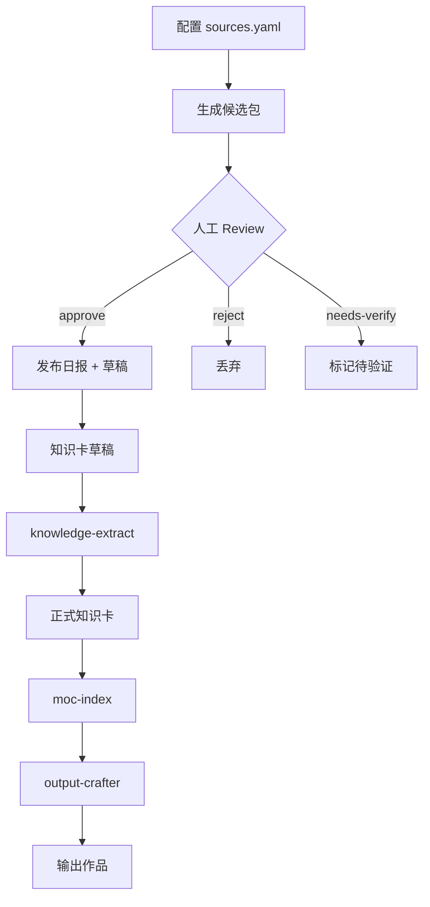

# News Note Assistant - PKM v2.1 资讯造血系统

## 📦 文件清单

```
.claude/skills/news-note-assistant/
├── SKILL.md                        # Skill 定义（核心）
├── sources.yaml                    # 信息源配置
├── template-candidate-pack.md      # 候选包模板
├── template-daily-report.md        # 日报模板
├── template-knowledge-draft.md     # 知识卡草稿模板
└── README.md                       # 本文件
```

---

## 🎯 系统目标

将每日来自 **GitHub / YouTube / Hugging Face** 的技术资讯，通过 **三道闸门（Gate0/1/2）** 转化为：

1. **候选包**（Gate 0）→ 仅供审阅，不入库
2. **正式日报**（Gate 2）→ 进入 `02-学习记录/01-日报/`
3. **知识卡草稿**（Gate 2）→ 进入 `00-收集箱/News-Knowledge-Drafts/`

**核心原则**：
- ✅ 强制人工 Review（Human-in-the-loop）
- ✅ 白名单信息源（仅 3 个平台）
- ✅ 反幻觉约束（只用 title/description/summary）
- ✅ 强制溯源（每条必有链接）

---

## 🚀 快速开始

### 1. 配置信息源（首次使用）

编辑 `sources.yaml`，配置你关注的：
- GitHub 仓库/Trending
- YouTube 频道/搜索关键词
- Hugging Face 模型/标签

**当前默认配置**：已针对 Java 后端 + Redis + MySQL + hmdp 项目优化

### 2. 生成候选包（每日）

对 Claude 说：
```
生成今日候选包（window_hours=24）
```

输出位置：
```
00-收集箱/News-Inbox/YYYY-MM-DD/00-candidate-pack.md
```

### 3. Review 候选包（人工）

打开候选包，在每个事件组下勾选：
- `[x] approve` - 批准发布
- `[x] reject` - 拒绝
- `[x] needs-verify` - 需要验证

### 4. 发布日报与草稿（自动）

对 Claude 说：
```
我已 review，请发布
```

系统将自动：
- 生成正式日报 → `02-学习记录/01-日报/YYYY-MM-DD-资讯日报.md`
- 生成 2-3 张知识卡草稿 → `00-收集箱/News-Knowledge-Drafts/*.md`
- 更新 `News-MOC`

### 5. 草稿卡加工（使用现有 Skills）

对 Claude 说：
```
把这 3 张草稿卡加工成正式知识卡并挂载 MOC
```

Claude 会引导你使用：
```
inbox-triage → knowledge-extract → moc-index → output-crafter
```

---

## 📂 目录结构

### 新增目录
```
00-收集箱/
├── News-Inbox/              # 候选包（临时）
│   └── YYYY-MM-DD/
│       └── 00-candidate-pack.md
└── News-Knowledge-Drafts/   # 知识卡草稿（待加工）
    └── *.md

02-学习记录/
└── 01-日报/                 # 正式日报
    └── YYYY-MM-DD-资讯日报.md

01-导航索引/
└── News-MOC.md              # 资讯系统总索引
```

---

## 🔒 反幻觉硬约束

### 1. 摘要来源限制
❌ 禁止：注入常识扩写、推断细节
✅ 允许：仅基于 `title` / `description` / `summary` 编写

### 2. 强制溯源
❌ 禁止：没有来源链接的事件
✅ 要求：每条事件至少 1 个来源链接

### 3. 冲突处理
❌ 禁止：自行判断谁对谁错
✅ 要求：并列呈现 + 标注 `【需人工确认】`

### 4. 推测标注
❌ 禁止：隐藏推测混入事实
✅ 要求：`【推测】` 开头 + 写明依据

### 5. 缺失信息
❌ 禁止：脑补未提供的信息
✅ 要求：明确写 `尚不明确（来源未提供）`

---

## 🎛️ 配置参数

### sources.yaml 关键字段

```yaml
global:
  window_hours: 24              # 抓取窗口（小时）
  max_events: 10                # 候选包最多事件数
  max_sources_per_event: 5      # 每个事件最多来源数

  ranking_weights:
    topic_relevance: 0.5        # 主题相关性权重
    source_count: 0.3           # 多来源覆盖权重
    recency: 0.2                # 时效性权重

whitelist:
  allowed_hosts:                # 白名单域名
    - github.com
    - youtube.com
    - huggingface.co
  reject_non_whitelist: true    # 拒绝非白名单来源
```

---

## 📊 工作流可视化



---

## 🔗 与现有 Skills 集成

| 阶段 | Skill | 作用 |
|------|-------|------|
| Gate 0 | news-note-assistant | 生成候选包 |
| Gate 1 | 人工 Review | 勾选 approve/reject |
| Gate 2 | news-note-assistant | 发布日报 + 草稿 |
| 加工 | inbox-triage | 路由草稿卡 |
| 提炼 | knowledge-extract | 深度加工 |
| 挂载 | moc-index | 挂载 MOC |
| 输出 | output-crafter | 转化为作品 |

---

## 🛠️ 故障排查

### 问题 1：候选包中出现非白名单来源

**检查**：
- `00-candidate-pack.md` 底部"白名单审计"部分
- `rejected_count` 应为 0

**解决**：
- 检查 `sources.yaml` 配置是否正确
- 确认白名单域名列表完整

### 问题 2：日报生成失败

**可能原因**：
- 候选包中没有勾选 `approve`
- 候选包格式不符合预期

**解决**：
- 确保至少勾选 1 个 `approve`
- 检查候选包是否使用标准模板

### 问题 3：知识卡草稿质量低

**可能原因**：
- 原始来源信息过于简略
- 主题与用户领域不匹配

**解决**：
- 调整 `sources.yaml` 中的关注源
- 提高 `ranking_weights.topic_relevance` 权重

---

## 📅 维护建议

### 每日
- [ ] 生成候选包
- [ ] Review 并发布

### 每周
- [ ] 检查 News-MOC 统计
- [ ] 转化 2-3 张草稿为正式知识卡

### 每月
- [ ] 调整 sources.yaml 配置
- [ ] 归档旧日报到 `90-归档区/`

---

## 📝 版本历史

- **v2.1.0** (2026-02-03)
  - 初始版本
  - 支持 GitHub / YouTube / Hugging Face 白名单
  - 实现 Gate0/1/2 三道闸门
  - 集成反幻觉硬约束

---

*最后更新：2026-02-03*
