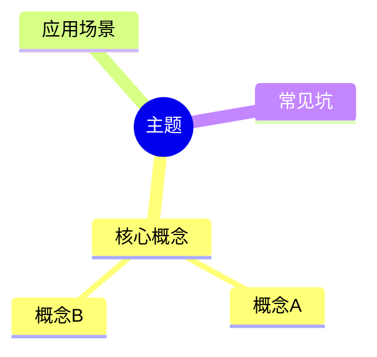

# Obsidian Note Organizer

## Overview
Obsidian 笔记自动化整理工具，用于规范化笔记结构、检查链接有效性、修复 Frontmatter。

## Instructions

### Step 1: 定义笔记根目录
```bash
VAULT_ROOT="D:/Docs/Notes/ObsidianVault"
KNOWLEDGE_DIR="$VAULT_ROOT/20-知识库"
```

### Step 2: 扫描所有笔记
```bash
# 获取所有 md 文件
find "$KNOWLEDGE_DIR" -name "*.md" -type f
```

### Step 3: Frontmatter 检查

必需字段：
- `title` - 标题
- `type` - 类型：concept | overview | interview | project | resource
- `domain` - 领域：[领域1, 领域2]
- `tags` - 标签
- `source` - 来源：notebooklm | web | book | voice | course
- `created` - 创建日期：YYYY-MM-DD
- `status` - 状态：draft | review | done

```bash
# 检查缺失 type 的文件
grep -L "^type:" "$KNOWLEDGE_DIR"/**/*.md

# 检查缺失 domain 的文件
grep -L "^domain:" "$KNOWLEDGE_DIR"/**/*.md
```

### Step 4: 双向链接检查

```bash
# 提取所有 [[wikilink]]
grep -rh "\[\[" "$KNOWLEDGE_DIR"/**/*.md | sed 's/.*\[\([^]]*\)\].*/\1/' | sort -u
```

常见断链：
- `[[UDP协议]]` - 不存在
- `[[HTTP协议]]` - 不存在
- `[[Socket编程]]` - 不存在
- `[[05-拥塞控制]]` - 改为实际存在的文件

### Step 5: 结构检查

必需章节：
- `## TL;DR` - 摘要
- `## References` - 参考资料

可选章节（推荐）：
- `## Checklist` - 复习清单
- `## Mermaid` - 思维导图
- `## 常见坑` - 注意事项

```bash
# 检查缺失 TL;DR 的文件
grep -L "^## TL;DR" "$KNOWLEDGE_DIR"/**/*.md

# 检查缺失 References 的文件
grep -L "^## References" "$KNOWLEDGE_DIR"/**/*.md
```

### Step 6: 自动修复模板

#### 6.1 修复 Frontmatter
```markdown
---
title: "标题"
type: concept
domain: [领域]
tags: [标签]
source: notebooklm
created: YYYY-MM-DD
status: draft
---
```

#### 6.2 修复断链
```markdown
<!-- 错误 -->
[[UDP协议]]

<!-- 正确：删除或标注待补充 -->
（待补充 UDP协议）
```

#### 6.3 添加 Checklist 模板
```markdown
## Checklist

- [ ] 理解核心概念
- [ ] 能给出示例
- [ ] 了解常见坑
```

#### 6.4 添加 Mermaid 模板
```markdown
## Mermaid 思维导图


```

### Step 7: 执行整理

#### 7.1 统计当前状态
```bash
# 统计文件数
find "$KNOWLEDGE_DIR" -name "*.md" | wc -l

# 统计 Frontmatter 完整度
grep -l "^type:" "$KNOWLEDGE_DIR"/**/*.md | wc -l
grep -l "^domain:" "$KNOWLEDGE_DIR"/**/*.md | wc -l

# 统计结构完整性
grep -l "^## TL;DR" "$KNOWLEDGE_DIR"/**/*.md | wc -l
grep -l "^## References" "$KNOWLEDGE_DIR"/**/*.md | wc -l
grep -l "^## Checklist" "$KNOWLEDGE_DIR"/**/*.md | wc -l
```

#### 7.2 生成报告
输出格式：
```markdown
## 笔记整理报告

| 检查项 | 数量 | 覆盖率 |
|--------|------|--------|
| 总文件数 | XX | 100% |
| 有 type | XX | XX% |
| 有 domain | XX | XX% |
| 有 TL;DR | XX | XX% |
| 有 References | XX | XX% |
| 有 Checklist | XX | XX% |

### 需要修复的文件

1. `path/to/file.md` - 缺失 type, domain
2. `path/to/file2.md` - 断链: [[UDP协议]]

### 待创建的文件

- [[UDP协议]]
- [[HTTP协议]]
```

## Output

| 输出项 | 说明 |
|--------|------|
| Frontmatter 报告 | 缺失字段列表 |
| 链接报告 | 断链列表 |
| 结构报告 | 缺失章节列表 |
| 修复建议 | 自动修复方案 |

## Error Handling

| 错误 | 原因 | 解决方案 |
|------|------|----------|
| 文件未找到 | 路径错误 | 检查 VAULT_ROOT |
| 权限不足 | 文件被锁定 | 关闭 Obsidian |
| 正则匹配失败 | 格式异常 | 手动检查文件 |

## Examples

### 示例 1: 全面检查
```
用户：检查所有笔记的格式
执行：
1. 扫描 20-知识库 下所有 .md 文件
2. 检查 Frontmatter 7 个字段
3. 检查双向链接有效性
4. 检查 References 章节
5. 输出完整报告
```

### 示例 2: 修复断链
```
用户：修复 TCP 协议系列笔记的断链
执行：
1. 查找 [[05-拥塞控制]] 链接
2. 替换为 [[../TCP拥塞控制|拥塞控制]]
3. 删除不存在的链接并标注待补充
```

### 示例 3: 补充结构
```
用户：为缺失 Checklist 的笔记添加
执行：
1. 查找无 Checklist 的笔记
2. 在 References 前插入标准 Checklist
```

---

## 扩展功能 v2.0

### Step 8: 自动分类与移动

#### 8.1 领域识别规则

基于 Frontmatter 的 `domain` 字段和文件内容关键词自动判断领域：

| 领域 | 关键词 |
|------|--------|
| 编程语言 | programming, language, syntax, python, java, go, c++, rust, javascript |
| 数据结构与算法 | algorithm, data structure, leetcode, 链表, 二叉树, 动态规划 |
| 操作系统 | OS, linux, kernel, process, memory, 进程, 线程, 内存管理 |
| 计算机网络 | network, TCP, HTTP, DNS, socket, 网络, 协议 |
| 数据库 | database, mysql, redis, mongodb, sql, 数据库 |
| 中间件 | kafka, rabbitmq, message queue, 消息队列 |
| 分布式与微服务 | distributed, microservice, spring cloud, 分布式, 微服务 |
| 云原生 | docker, kubernetes, k8s, cloud native, 容器 |
| 安全 | security, encryption, attack, defense, 安全 |
| 编译原理 | compiler, lexer, parser, ast, 编译 |
| 架构与工程实践 | architecture, performance, testing, devops, 架构 |
| AI-ML | machine learning, deep learning, neural network, 机器学习, 深度学习 |

#### 8.2 目录结构验证

检查文件是否在正确的目录下：

```
20-知识库/
├── 编程语言/
│   ├── Python/
│   ├── Java/
│   └── Go/
├── 数据结构与算法/
├── 操作系统/
│   ├── Linux/
│   └── Windows/
├── 计算机网络/
│   ├── TCP/
│   ├── HTTP/
│   └── DNS/
├── 数据库/
│   ├── MySQL/
│   ├── Redis/
│   └── PostgreSQL/
├── 中间件/
│   ├── Kafka/
│   └── RabbitMQ/
├── 分布式与微服务/
├── 云原生/
│   ├── Docker/
│   └── Kubernetes/
├── 安全/
├── 编译原理/
├── 架构与工程实践/
└── AI-ML/
```

#### 8.3 领域检测函数

```python
def detect_domain(file_path):
    # 1. 首先检查 Frontmatter 的 domain 字段
    frontmatter = parse_frontmatter(file_path)
    if frontmatter.get('domain'):
        return frontmatter['domain']

    # 2. 检查文件内容关键词
    content = read_file(file_path)
    for domain, keywords in DOMAIN_KEYWORDS.items():
        for keyword in keywords:
            if keyword.lower() in content.lower():
                return domain

    # 3. 根据文件路径推断
    path_lower = file_path.lower()
    if 'python' in path_lower: return '编程语言'
    if 'java' in path_lower: return '编程语言'
    if 'tcp' in path_lower or 'http' in path_lower: return '计算机网络'
    if 'mysql' in path_lower or 'redis' in path_lower: return '数据库'

    return None
```

#### 8.4 自动移动逻辑

```python
def suggest_move(file_path, detected_domain):
    current_dir = get_parent_dir(file_path)
    target_dir = f"20-知识库/{detected_domain}"

    # 处理子目录
    subdirs = {
        '编程语言': {'python': 'Python', 'java': 'Java', 'go': 'Go'},
        '操作系统': {'linux': 'Linux', 'windows': 'Windows'},
        '计算机网络': {'tcp': 'TCP', 'http': 'HTTP', 'dns': 'DNS'},
        '数据库': {'mysql': 'MySQL', 'redis': 'Redis', 'postgresql': 'PostgreSQL'},
        '云原生': {'docker': 'Docker', 'kubernetes': 'Kubernetes'},
    }

    filename = get_filename(file_path).lower()
    for domain, subdir_map in subdirs.items():
        if detected_domain == domain:
            for keyword, subdir in subdir_map.items():
                if keyword in filename:
                    target_dir = f"20-知识库/{domain}/{subdir}"
                    break

    if current_dir != target_dir:
        return {
            "action": "move",
            "from": file_path,
            "to": f"{target_dir}/{get_filename(file_path)}",
            "reason": f"文件应位于 {detected_domain} 目录"
        }

    return None
```

#### 8.5 执行移动

```bash
# 移动前先备份
cp -r "$KNOWLEDGE_DIR" "$KNOWLEDGE_DIR.backup"

# 移动文件
mv "$FROM_PATH" "$TO_PATH"

# 更新内部链接（如果需要）
sed -i 's|\[\[../path/to/old|../new/path|g' "$TO_PATH"
```

---

### Step 9: 去重与合并

#### 9.1 重复检测策略

| 检测类型 | 方法 | 阈值 |
|----------|------|------|
| 文件名重复 | 直接比较文件名 | 100% |
| 标题重复 | 比较 Frontmatter title 字段 | 100% |
| 内容重复 | SimHash 或余弦相似度 | > 80% |

```python
def detect_duplicates():
    files = get_all_md_files()

    # 9.1.1 文件名重复检测
    filename_map = {}
    for f in files:
        name = get_filename_without_date(f)
        if name not in filename_map:
            filename_map[name] = []
        filename_map[name].append(f)

    duplicates = []
    for name, paths in filename_map.items():
        if len(paths) > 1:
            duplicates.extend(paths[1:])  # 保留第一个，其余标记为重复

    # 9.1.2 标题重复检测
    title_map = {}
    for f in files:
        frontmatter = parse_frontmatter(f)
        title = frontmatter.get('title', '')
        if title:
            if title not in title_map:
                title_map[title] = []
            title_map[title].append(f)

    # 9.1.3 内容相似度检测
    content_similar = []
    for i, f1 in enumerate(files):
        for f2 in files[i+1:]:
            similarity = calculate_similarity(f1, f2)
            if similarity > 0.8:
                content_similar.append({
                    'file_a': f1,
                    'file_b': f2,
                    'similarity': similarity
                })

    return {
        'filename_duplicates': duplicates,
        'title_duplicates': title_map,
        'content_similar': content_similar
    }
```

#### 9.2 合并策略

```python
def merge_notes(file_a, file_b):
    # 1. 保留更新鲜的内容（created 日期更晚的）
    frontmatter_a = parse_frontmatter(file_a)
    frontmatter_b = parse_frontmatter(file_b)

    created_a = frontmatter_a.get('created', '1970-01-01')
    created_b = frontmatter_b.get('created', '1970-01-01')

    if created_b > created_a:
        keep_file, remove_file = file_b, file_a
    else:
        keep_file, remove_file = file_a, file_b

    # 2. 合并 Frontmatter（取并集）
    merged_frontmatter = merge_frontmatter(frontmatter_a, frontmatter_b)

    # 3. 合并 References
    merged_references = merge_references(file_a, file_b)

    # 4. 创建重定向
    redirect_content = generate_redirect(keep_file, remove_file)

    return {
        "action": "merge",
        "keep": keep_file,
        "remove": remove_file,
        "redirect": f"[[{get_filename(keep_file)}]]"
    }

def merge_frontmatter(fm_a, fm_b):
    merged = fm_a.copy()
    for key, value in fm_b.items():
        if key not in merged:
            merged[key] = value
        elif key in ['tags', 'domain']:
            # 合并数组
            merged[key] = list(set(fm_a[key]) | set(value))
    return merged

def merge_references(file_a, file_b):
    refs_a = extract_references(file_a)
    refs_b = extract_references(file_b)
    return list(set(refs_a) | set(refs_b))
```

#### 9.3 重定向文件模板

被合并的文件内容替换为：

```markdown
---
title: (已合并) 原标题
type: concept
domain: [领域]
tags: [标签]
source: notebooklm
created: YYYY-MM-DD
status: archived
redirect: [[新文件]]
merged_from: [原文件]
---

# 此笔记已合并到 [[新文件]]

> 创建时间: YYYY-MM-DD
> 合并时间: {当前日期}

## 原笔记摘要

（可选：保留原笔记的 TL;DR）

## 合并原因

（可选：说明为什么合并）

---

*此笔记已归档，内容已合并到 [[新文件]]*
```

#### 9.4 执行合并

```bash
# 1. 保留更新的文件
cp "$KEEP_FILE" "$KEEP_FILE.new"

# 2. 合并内容
cat "$KEEP_FILE.new" | merge_content "$REMOVE_FILE" > "$KEEP_FILE"

# 3. 创建重定向文件
echo "$REDIRECT_CONTENT" > "$REMOVE_FILE"

# 4. 更新双向链接
# 查找引用 REMOVE_FILE 的文件并更新
grep -rl "\[\[$REMOVE_FILE_NAME\]\]" "$KNOWLEDGE_DIR" | xargs sed -i \
    "s|\[\[$REMOVE_FILE_NAME\]\]|[[$KEEP_FILE_NAME]]|g"
```

---

### Step 10: 增强的报告功能

#### 10.1 分类移动报告

```markdown
### 需要移动的文件

| 文件 | 当前目录 | 建议目录 | 原因 |
|------|----------|----------|------|
| Python入门.md | 根目录 | 编程语言/Python | domain: 编程语言 |
| TCP协议.md | 根目录 | 计算机网络/TCP | 内容包含 TCP 关键词 |

### 目录结构问题

- 20-知识库/编程语言/ 存在 .md 文件（应放在子目录）
- 20-知识库/数据库/ 缺少子目录分类
```

#### 10.2 去重合并报告

```markdown
### 重复文件

| 文件 A | 文件 B | 相似度 | 建议操作 |
|--------|--------|--------|----------|
| Python基础.md | Python入门.md | 85% | 合并到 Python基础.md |
| TCP三次握手.md | TCP握手详解.md | 92% | 合并到 TCP三次握手.md |

### 已创建重定向

- Python入门.md -> Python基础.md
- TCP握手详解.md -> TCP三次握手.md
```

#### 10.3 完整统计报告

```markdown
## 笔记整理报告 (v2.0)

| 检查项 | 数量 | 覆盖率 |
|--------|------|--------|
| 总文件数 | XX | 100% |
| 有 type | XX | XX% |
| 有 domain | XX | XX% |
| 有 TL;DR | XX | XX% |
| 有 References | XX | XX% |
| 有 Checklist | XX | XX% |

### 分类统计

| 领域 | 文件数 |
|------|--------|
| 编程语言 | XX |
| 计算机网络 | XX |
| 数据库 | XX |
| ... | ... |

### 需要移动

- X 个文件需要重新分类

### 需要合并

- X 对重复文件需要处理

### 统计摘要

- 预计节省: X MB
- 预计减少: X 个断链
```

---

### Step 11: Frontmatter 新增字段

#### 11.1 重定向字段

| 字段 | 说明 | 示例 |
|------|------|------|
| `redirect` | 重定向目标 | `[[新文件]]` |
| `merged_from` | 合并来源 | `[原文件A, 原文件B]` |

#### 11.2 完整 Frontmatter 示例

```yaml
---
title: Python 基础
type: concept
domain: [编程语言, Python]
tags: [python, 入门]
source: notebooklm
created: 2024-01-15
status: done
next_review: 2024-04-15
interval: 1
ease: 2.5
reps: 0
# 新增字段
redirect: null
merged_from: []
---
```

---

### Step 12: 执行完整整理流程

#### 12.1 一键检查

```bash
# 检查所有问题
python organize_notes.py --check-all

# 只检查分类
python organize_notes.py --check-domain

# 只检查重复
python organize_notes.py --check-duplicates
```

#### 12.2 自动修复

```bash
# 自动移动到正确目录
python organize_notes.py --auto-move --dry-run

# 自动合并重复
python organize_notes.py --auto-merge --dry-run

# 执行实际修改（去掉 --dry-run）
python organize_notes.py --auto-move --auto-merge
```

#### 12.3 备份与回滚

```bash
# 整理前自动备份
cp -r "$KNOWLEDGE_DIR" "$KNOWLEDGE_DIR.backup.$(date +%Y%m%d)"

# 回滚
rm -rf "$KNOWLEDGE_DIR"
cp -r "$KNOWLEDGE_DIR.backup.20240315" "$KNOWLEDGE_DIR"
```

---

## Next Steps

1. 定期运行检查
2. 持续改进模板
3. 添加更多自动化修复
