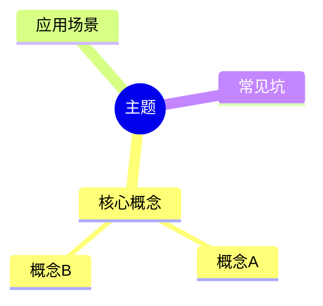

# Obsidian Note Organizer

## Overview
Obsidian 笔记自动化整理工具，用于规范化笔记结构、检查链接有效性、修复 Frontmatter。

## Instructions

### Step 1: 定义笔记根目录
```bash
VAULT_ROOT="D:/Docs/Notes/ObsidianVault"
KNOWLEDGE_DIR="$VAULT_ROOT/20-知识库"
```

### Step 2: 扫描所有笔记
```bash
# 获取所有 md 文件
find "$KNOWLEDGE_DIR" -name "*.md" -type f
```

### Step 3: Frontmatter 检查

必需字段：
- `title` - 标题
- `type` - 类型：concept | overview | interview | project | resource
- `domain` - 领域：[领域1, 领域2]
- `tags` - 标签
- `source` - 来源：notebooklm | web | book | voice | course
- `created` - 创建日期：YYYY-MM-DD
- `status` - 状态：draft | review | done

```bash
# 检查缺失 type 的文件
grep -L "^type:" "$KNOWLEDGE_DIR"/**/*.md

# 检查缺失 domain 的文件
grep -L "^domain:" "$KNOWLEDGE_DIR"/**/*.md
```

### Step 4: 双向链接检查

```bash
# 提取所有 [[wikilink]]
grep -rh "\[\[" "$KNOWLEDGE_DIR"/**/*.md | sed 's/.*\[\([^]]*\)\].*/\1/' | sort -u
```

常见断链：
- `[[UDP协议]]` - 不存在
- `[[HTTP协议]]` - 不存在
- `[[Socket编程]]` - 不存在
- `[[05-拥塞控制]]` - 改为实际存在的文件

### Step 5: 结构检查

必需章节：
- `## TL;DR` - 摘要
- `## References` - 参考资料

可选章节（推荐）：
- `## Checklist` - 复习清单
- `## Mermaid` - 思维导图
- `## 常见坑` - 注意事项

```bash
# 检查缺失 TL;DR 的文件
grep -L "^## TL;DR" "$KNOWLEDGE_DIR"/**/*.md

# 检查缺失 References 的文件
grep -L "^## References" "$KNOWLEDGE_DIR"/**/*.md
```

### Step 6: 自动修复模板

#### 6.1 修复 Frontmatter
```markdown
---
title: "标题"
type: concept
domain: [领域]
tags: [标签]
source: notebooklm
created: YYYY-MM-DD
status: draft
---
```

#### 6.2 修复断链
```markdown
<!-- 错误 -->
[[UDP协议]]

<!-- 正确：删除或标注待补充 -->
（待补充 UDP协议）
```

#### 6.3 添加 Checklist 模板
```markdown
## Checklist

- [ ] 理解核心概念
- [ ] 能给出示例
- [ ] 了解常见坑
```

#### 6.4 添加 Mermaid 模板
```markdown
## Mermaid 思维导图


```

### Step 7: 执行整理

#### 7.1 统计当前状态
```bash
# 统计文件数
find "$KNOWLEDGE_DIR" -name "*.md" | wc -l

# 统计 Frontmatter 完整度
grep -l "^type:" "$KNOWLEDGE_DIR"/**/*.md | wc -l
grep -l "^domain:" "$KNOWLEDGE_DIR"/**/*.md | wc -l

# 统计结构完整性
grep -l "^## TL;DR" "$KNOWLEDGE_DIR"/**/*.md | wc -l
grep -l "^## References" "$KNOWLEDGE_DIR"/**/*.md | wc -l
grep -l "^## Checklist" "$KNOWLEDGE_DIR"/**/*.md | wc -l
```

#### 7.2 生成报告
输出格式：
```markdown
## 笔记整理报告

| 检查项 | 数量 | 覆盖率 |
|--------|------|--------|
| 总文件数 | XX | 100% |
| 有 type | XX | XX% |
| 有 domain | XX | XX% |
| 有 TL;DR | XX | XX% |
| 有 References | XX | XX% |
| 有 Checklist | XX | XX% |

### 需要修复的文件

1. `path/to/file.md` - 缺失 type, domain
2. `path/to/file2.md` - 断链: [[UDP协议]]

### 待创建的文件

- [[UDP协议]]
- [[HTTP协议]]
```

## Output

| 输出项 | 说明 |
|--------|------|
| Frontmatter 报告 | 缺失字段列表 |
| 链接报告 | 断链列表 |
| 结构报告 | 缺失章节列表 |
| 修复建议 | 自动修复方案 |

## Error Handling

| 错误 | 原因 | 解决方案 |
|------|------|----------|
| 文件未找到 | 路径错误 | 检查 VAULT_ROOT |
| 权限不足 | 文件被锁定 | 关闭 Obsidian |
| 正则匹配失败 | 格式异常 | 手动检查文件 |

## Examples

### 示例 1: 全面检查
```
用户：检查所有笔记的格式
执行：
1. 扫描 20-知识库 下所有 .md 文件
2. 检查 Frontmatter 7 个字段
3. 检查双向链接有效性
4. 检查 References 章节
5. 输出完整报告
```

### 示例 2: 修复断链
```
用户：修复 TCP 协议系列笔记的断链
执行：
1. 查找 [[05-拥塞控制]] 链接
2. 替换为 [[../TCP拥塞控制|拥塞控制]]
3. 删除不存在的链接并标注待补充
```

### 示例 3: 补充结构
```
用户：为缺失 Checklist 的笔记添加
执行：
1. 查找无 Checklist 的笔记
2. 在 References 前插入标准 Checklist
```

## Next Steps

1. 定期运行检查
2. 持续改进模板
3. 添加更多自动化修复
