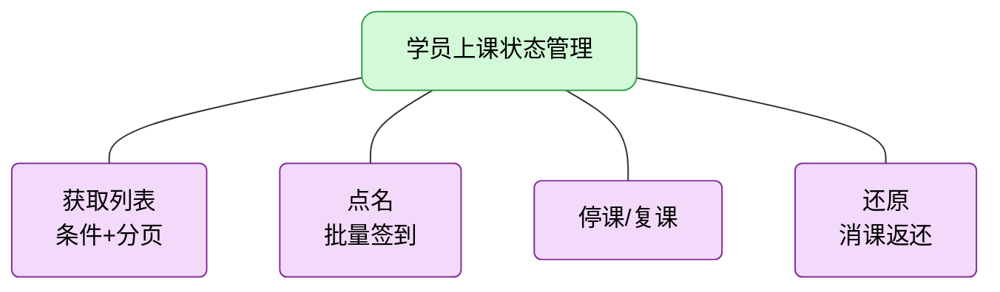
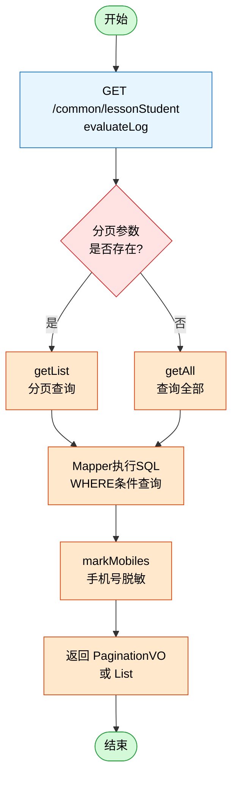
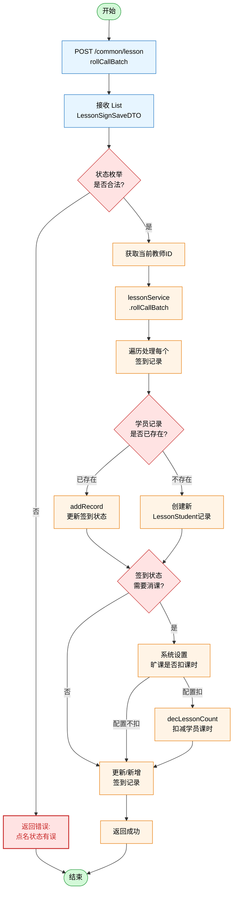
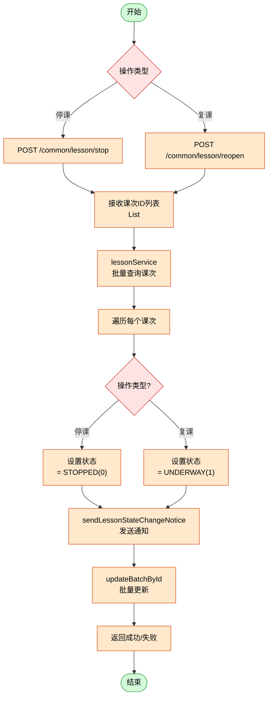
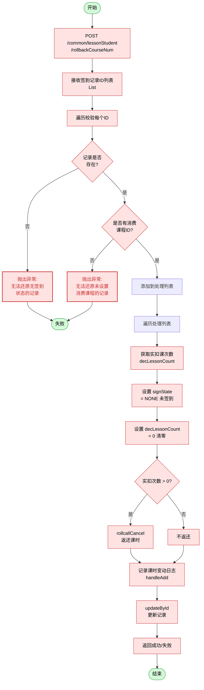

## 学员上课状态管理 - 流程图

### 总览

---

### 1. 获取列表流程

**查询条件**：lessonId、studentId、teacherId、keyword、startDate/endDate、onlyEvaluate

---

### 2. 点名流程（批量签到）

**签到状态枚举（SignStateEnum）**：
- NONE(0) - 未签到
- NORMAL(1) - 已签到
- LATE(2) - 补签
- LEAVE(3) - 请假
- ABSENT(4) - 旷课

---

### 3. 停课/复课流程

**课次状态枚举（LessonStateEnum）**：
- STOPPED(0) - 已停课
- UNDERWAY(1) - 进行中
- COMPLETE(2) - 已结课

---

### 4. 还原流程（消课返还）

---

### 图例

| 颜色 | 含义 |
|------|------|
| 绿色 | 开始/结束 |
| 蓝色 | API入口 |
| 黄色 | 决策判断 |
| 橙色 | 处理/操作 |
| 红色边框 | 异常/错误 |
