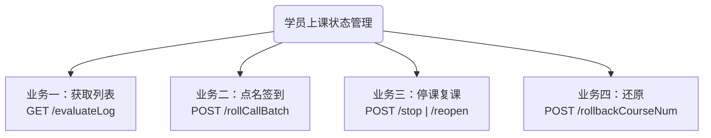
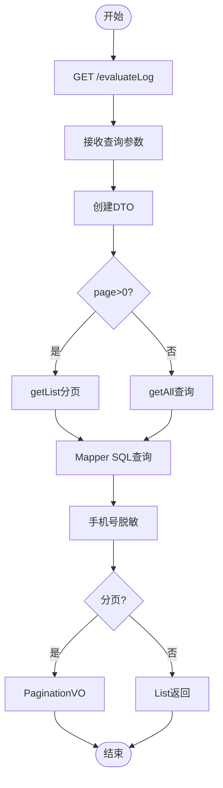
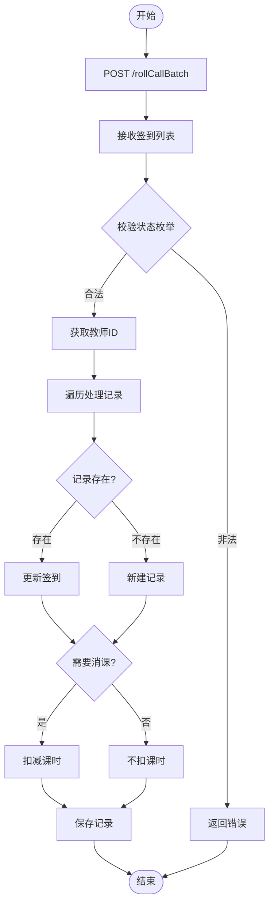
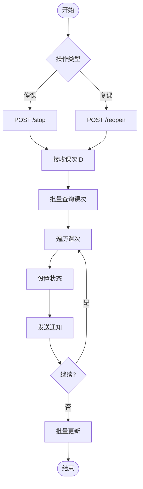
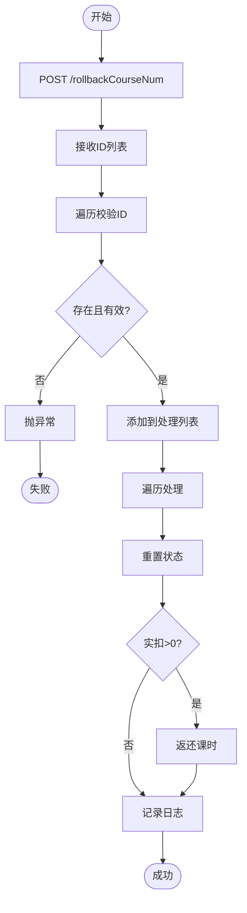

## 学员上课状态管理 - 流程图

### 总览

---

### 业务一：获取列表流程

---

### 业务二：点名签到流程

---

### 业务三：停课/复课流程

---

### 业务四：还原流程

---

### 四个业务对比

| 业务 | API | 核心操作 | 数据表 |
|------|-----|----------|--------|
| 业务一 | GET /evaluateLog | 条件查询+分页 | lesson_student |
| 业务二 | POST /rollCallBatch | 批量签到+消课 | lesson_student |
| 业务三 | POST /stop/reopen | 状态变更+通知 | lesson |
| 业务四 | POST /rollbackCourseNum | 状态重置+返还 | lesson_student |

---

### 图例

- 绿色：开始/结束
- 蓝色边框：API入口
- 菱形：决策判断
