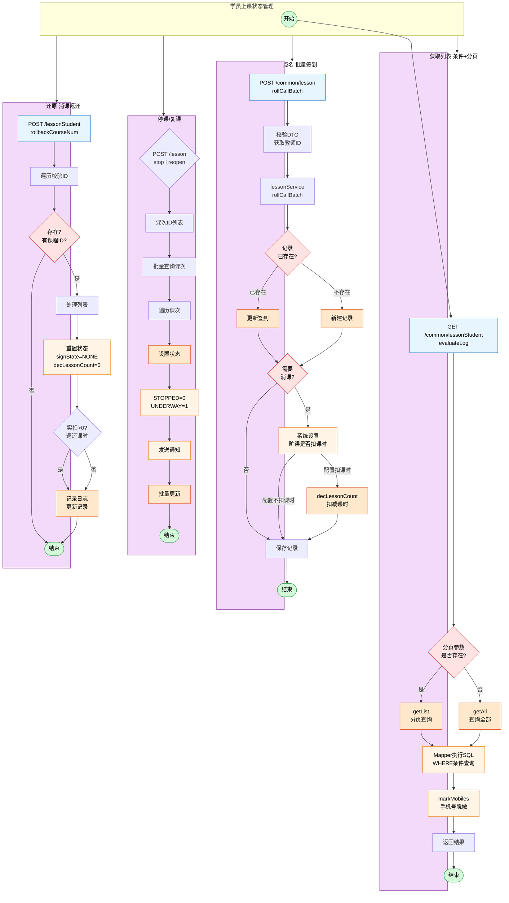

## 学员上课状态管理 - 流程图

```mermaid
flowchart TB
    subgraph root["学员上课状态管理"]
        direction TB
        start1((开始))
    end

    subgraph list["获取列表 条件+分页"]
        direction TB
        list_api["GET /common/lessonStudent<br/>evaluateLog"]
        list_check{"分页参数<br/>是否存在?"}
        list_yes["getList<br/>分页查询"]
        list_no["getAll<br/>查询全部"]
        list_mapper["Mapper执行SQL<br/>WHERE条件查询"]
        list_desensitize["markMobiles<br/>手机号脱敏"]
        list_return["返回结果"]
        list_end1([结束])
    end

    subgraph rollcall["点名 批量签到"]
        direction TB
        rollcall_api["POST /common/lesson<br/>rollCallBatch"]
        rollcall_validate["校验DTO<br/>获取教师ID"]
        rollcall_service["lessonService<br/>rollCallBatch"]
        rollcall_check{"记录<br/>已存在?"}
        rollcall_update["更新签到"]
        rollcall_create["新建记录"]
        rollcall_deduct{"需要<br/>消课?"}
        rollcall_setting["系统设置<br/>旷课是否扣课时"]
        rollcall_dec["decLessonCount<br/>扣减课时"]
        rollcall_save["保存记录"]
        rollcall_end1([结束])
    end

    subgraph stop["停课/复课"]
        direction TB
        stop_api{"POST /lesson<br/>stop | reopen"}
        stop_ids["课次ID列表"]
        stop_query["批量查询课次"]
        stop_loop["遍历课次"]
        stop_set["设置状态"]
        stop_enum["STOPPED=0<br/>UNDERWAY=1"]
        stop_notice["发送通知"]
        stop_update["批量更新"]
        stop_end1([结束])
    end

    subgraph rollback["还原 消课返还"]
        direction TB
        rollback_api["POST /lessonStudent<br/>rollbackCourseNum"]
        rollback_loop["遍历校验ID"]
        rollback_check{"存在?<br/>有课程ID?"}
        rollback_process["处理列表"]
        rollback_reset["重置状态<br/>signState=NONE<br/>decLessonCount=0"]
        rollback_restore{"实扣>0?<br/>返还课时"}
        rollback_log["记录日志<br/>更新记录"]
        rollback_end1([结束])
    end

    %% 根节点连接
    root --> list
    root --> rollcall
    root --> stop
    root --> rollback

    %% 获取列表流程
    start1 --> list_api
    list_api --> list_check
    list_check -->|是| list_yes
    list_check -->|否| list_no
    list_yes --> list_mapper
    list_no --> list_mapper
    list_mapper --> list_desensitize
    list_desensitize --> list_return
    list_return --> list_end1

    %% 点名流程
    rollcall_api --> rollcall_validate
    rollcall_validate --> rollcall_service
    rollcall_service --> rollcall_check
    rollcall_check -->|已存在| rollcall_update
    rollcall_check -->|不存在| rollcall_create
    rollcall_update --> rollcall_deduct
    rollcall_create --> rollcall_deduct
    rollcall_deduct -->|是| rollcall_setting
    rollcall_deduct -->|否| rollcall_save
    rollcall_setting -->|配置扣课时| rollcall_dec
    rollcall_setting -->|配置不扣课时| rollcall_save
    rollcall_dec --> rollcall_save
    rollcall_save --> rollcall_end1

    %% 停课/复课流程
    stop_api --> stop_ids
    stop_ids --> stop_query
    stop_query --> stop_loop
    stop_loop --> stop_set
    stop_set --> stop_enum
    stop_enum --> stop_notice
    stop_notice --> stop_update
    stop_update --> stop_end1

    %% 还原流程
    rollback_api --> rollback_loop
    rollback_loop --> rollback_check
    rollback_check -->|是| rollback_process
    rollback_check -->|否| rollback_end1
    rollback_process --> rollback_reset
    rollback_reset --> rollback_restore
    rollback_restore -->|是| rollback_log
    rollback_restore -->|否| rollback_log
    rollback_log --> rollback_end1

    %% 样式定义
    classDef startEnd fill:#d3f9d8,stroke:#2f9e44,color:#000
    classDef api fill:#e7f5ff,stroke:#1971c2,color:#000
    classDef process fill:#fff4e6,stroke:#e67700,color:#000
    classDef decision fill:#ffe3e3,stroke:#c92a2a,color:#000
    classDef action fill:#ffe8cc,stroke:#d9480f,color:#000
    classDef module fill:#f3d9fa,stroke:#862e9c,color:#000,width:200px

    class start1,list_end1,rollcall_end1,stop_end1,rollback_end1 startEnd
    class list_api,rollcall_api,rollback_api api
    class list_desensitize,rollback_reset,stop_notice,list_mapper,rollcall_setting,stop_enum process
    class list_check,rollcall_check,rollback_check,rollcall_deduct decision
    class list_yes,list_no,rollcall_update,rollcall_create,rollcall_dec,stop_set,stop_update,rollback_log action
    class list,rollcall,stop,rollback module
```

**图例：**
- 绿色：开始/结束
- 蓝色：API入口
- 橙色：操作节点
- 红色：决策判断
- 紫色：功能模块