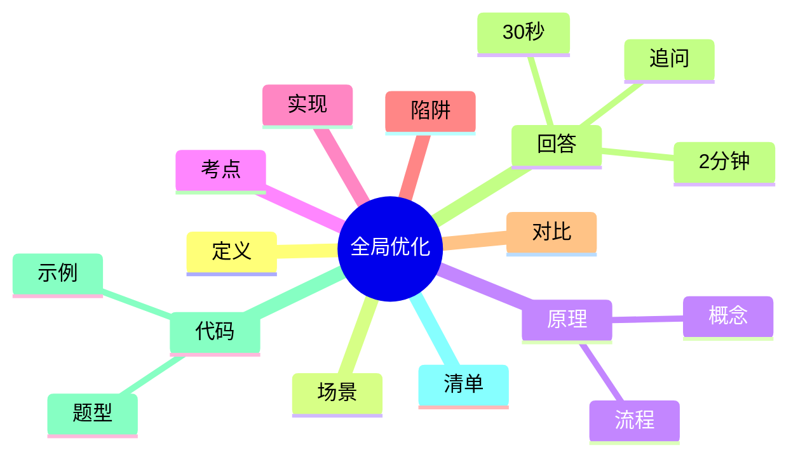

---
title: "全局优化"
aliases: ["全局优化 八股", "全局优化 面试"]
tags: [Java, 八股, Interview/高频, JVM, JIT, 编译优化]
created: 2026-01-21
level: interview
status: draft
---

# 全局优化

> [!summary] TL;DR（3-5 行）
> - 一句话定义：全局优化是编译器基于全局控制流/数据流信息做跨基本块甚至跨方法的优化。
> - 面试一句话结论：JIT 的“全局优化”常在方法级 IR 图上完成，靠内联扩大边界。
> - 关键点：依赖/别名分析、内联扩大边界、去优化(deopt)、安全点。
> - 常见坑：把“局部优化”当全局、忽视副作用与 volatile 语义。

> [!tip]
> **工程师思维自检**：
> 1. 我能解释“为什么没优化”而不是只说“可能会优化”吗？
> 2. 我能给出可观测的 JIT 证据链吗？

---

## 1. 定义与定位

- **它是什么**：编译器在全局范围（方法级或跨基本块）进行的优化，依赖全局数据流信息。
- **解决什么问题**：减少冗余计算、移除不可达或无用代码、优化循环与分支。
- **体系中的位置**：JVM JIT（C1/C2）优化阶段，核心发生在 IR 图转换阶段。[[JIT 编译]] [[HotSpot]]

---

## 2. 应用场景

- 场景 1：热点方法与循环（高频执行路径）。
- 场景 2：吞吐/延迟敏感的服务端应用。
- 不适用：大量 I/O、反射或副作用强的逻辑（优化边界小）。

---

## 3. 核心原理（面试够用版）

> [!note] 先给结论，再解释“怎么做到”

- **核心机制**（5-7 条要点）：
  1) 构建全局控制流与数据流（IR/SSA）。
  2) 依赖分析/别名分析决定可重排与可消除范围。
  3) 常见优化：CSE、LICM、DCE、范围检查消除。
  4) 内联扩大优化边界，把跨方法机会“拉平”。
  5) 逃逸分析 + 锁消除降低同步成本。[[逃逸分析]]
  6) 安全点与去优化保证动态加载场景的正确性。

### 3.1 关键流程（步骤）

1. 解释执行收集 profile（热点/分支统计）。
2. JIT 触发，构建 IR 图并做全局分析。
3. 执行全局优化（CSE/LICM/DCE 等）。
4. 生成机器码并在假设失效时去优化回退。

### 3.2 关键概念

- **依赖分析**：判断表达式是否受写内存影响。
- **别名分析**：判断两个引用是否可能指向同一对象。
- **去优化(deopt)**：假设失效时回退到解释执行。

### 3.3 费曼类比

> [!tip] 用人话解释
> 把方法当作流水线，局部优化只修一台机器，全局优化会看整条线，把重复工序合并，把不变的步骤移到最前。

---

## 4. 关键细节清单（高频考点）

- 考点 1：**副作用限制重排**，I/O、锁、volatile 读写通常不可移动。
- 考点 2：**内联是全局优化前置条件**，没内联就缺上下文。
- 考点 3：**优化是“可能发生”而非“必然发生”**，依赖 profile 与阈值。
- 考点 4：**去优化点**保证动态语言特性下的正确性。

---

## 5. 源码/实现要点（不装行号，只抓关键）

> [!tip] 目标：回答“源码层面为什么是这样”

- **关键组件**：HotSpot C1/C2 编译器与 IR 图优化管线。
- **关键流程**：IR 构建 → 全局分析 → 变换（CSE/LICM/DCE） → 代码生成。
- **关键策略**：内联、逃逸分析、锁消除、范围检查消除。
- **面试话术**：JIT 的全局优化以方法为单位，跨方法靠内联“变成方法内”。

---

## 6. 易错点与陷阱（至少 5 条）

1) 把“全局”理解为“全程序”，忽略方法级边界。
2) 认为编译器一定会优化，忽略 profile 与阈值。
3) 忽视 volatile/锁/I-O 的副作用与内存语义。
4) 把 CSE/LICM 当作“语义等价必然发生”。
5) 忽略去优化与安全点成本，误判性能。

---

## 7. 对比与扩展（至少 2 组）

- **全局优化 vs 局部优化**：前者跨基本块，后者仅块内。
- **JIT vs AOT**：JIT 有运行期 profile，AOT 依赖静态信息。
- 扩展问题：如何通过内联扩大“全局”的有效范围？

### 对比表

| 特性 | 全局优化 | 局部优化 |
| :--- | :--- | :--- |
| 信息范围 | 全局数据流/控制流 | 基本块内 |
| 常见优化 | CSE/LICM/DCE | 常量折叠/代数化简 |
| 依赖分析 | 必需 | 可选 |

---

## 8. 标准面试回答（可直接背）

### 8.1 30 秒版本（电梯回答）

> [!quote]
> 全局优化是编译器利用全局控制流与数据流信息做跨基本块优化，JIT 里通常在方法级 IR 图上完成。靠内联扩大边界，常见优化有 CSE、循环不变外提和死代码消除。限制来自副作用、volatile/锁语义与去优化需求。

### 8.2 2 分钟版本（结构化展开）

> [!quote]
> 1) 定义与定位：全局优化依赖全局数据流信息，JIT 在 IR 图上做。 
> 2) 场景：热点方法、循环内重复计算，改善吞吐与延迟。 
> 3) 原理：依赖/别名分析决定可重排范围，内联扩大边界；CSE/LICM/DCE 是典型优化。 
> 4) 易错点：副作用、volatile、去优化成本被忽视。 
> 5) 扩展：JIT vs AOT 的边界与信息来源不同。

### 8.3 深挖追问（面试官继续问什么）

- 追问 1：哪些语句会阻止 CSE/LICM？→ 有副作用的调用、volatile 读写、锁与 I/O。
- 追问 2：为什么 JIT 仍是“方法级全局”？→ 动态加载使全程序不可知。
- 追问 3：怎么观察优化是否发生？→ JIT 日志与 JITWatch。

---

## 9. 代码题与代码示例（必须有详注）

> [!important] 要求：注释解释“为什么这样写”，不是解释语法

### 9.1 面试代码题（2-3 题）

- 题 1：给出一段可被 CSE/LICM 优化的代码，并说明等价性条件。
- 题 2：为什么 `volatile` 会阻止某些全局优化？举例说明。
- 题 3：如何用 JVM 参数观察 JIT 是否做了内联与优化？

### 9.2 参考代码（Java）

```java
// 目标：演示“副作用会阻止全局优化”的原因
// 注意：JIT 是否真正优化取决于运行期 profile，这里是概念示例
public class GlobalOptimizationDemo {
    // volatile 读写具备内存语义，会限制重排/消除
    private static volatile int v = 1;

    // 纯函数：无副作用，可被 CSE/LICM 等优化
    private static int pure(int x) {
        // 这里的计算只依赖参数，编译器可复用结果
        return x * 31 + 7;
    }

    public static void main(String[] args) {
        int x = 42;

        // 1) 纯函数调用：理论上可将重复计算合并
        int a = pure(x);
        int b = pure(x);
        // 这里的 a/b 结果等价，CSE 可把 b 的计算复用 a
        int sum = a + b;

        // 2) volatile 读：每次读都必须“真的读”，不能随意消除
        int r1 = v;      // 需要从主内存可见的值
        int r2 = v;      // 仍需再次读，不能假设不变
        int sumVolatile = r1 + r2;

        // 输出只是为了防止被彻底优化掉
        System.out.println(sum + ":" + sumVolatile);
    }
}
```

---

## 10. 复习 Checklist（可勾选）

- [ ] 我能用一句话定义“全局优化”。
- [ ] 我能说出 2-3 个典型优化（CSE/LICM/DCE）。
- [ ] 我能解释副作用/volatile 为什么阻止优化。
- [ ] 我能说明 JIT 与 AOT 的优化边界差异。
- [ ] 我能描述内联如何扩大优化范围。
- [ ] 我能列举 2 种观察 JIT 的手段。
- [ ] 我已关联 [[JIT 编译]] 等相关笔记。

---

## 11. Mermaid 思维导图（Obsidian 可渲染）



---

## 相关笔记（双向链接）

- [[JIT 编译]]
- [[HotSpot]]
- [[内联]]
- [[逃逸分析]]
- [[循环优化]]
