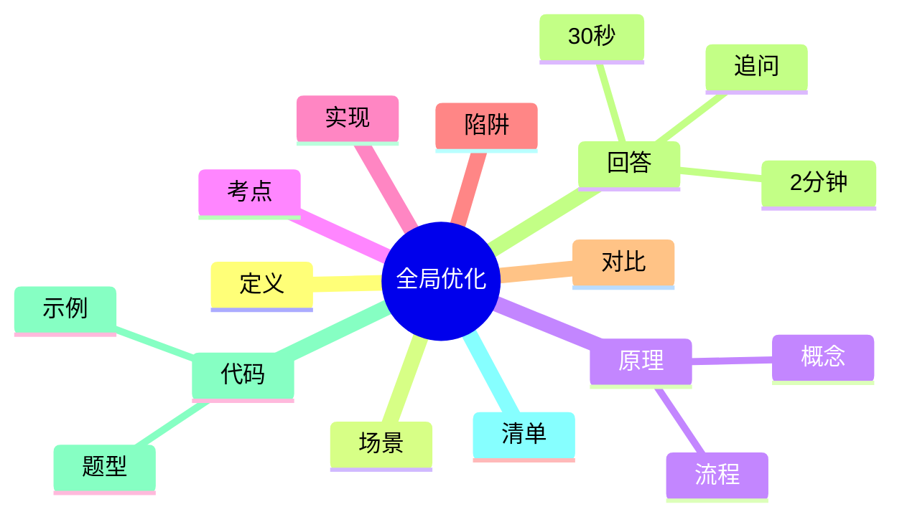
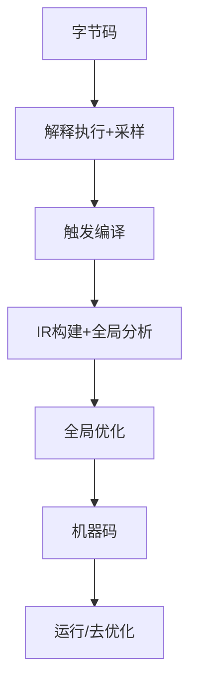

---
title: "全局优化"
aliases: ["全局优化 八股", "全局优化 面试"]
tags: [Java, 八股, Interview/高频, JVM, JIT, 编译优化]
created: 2026-01-21
level: interview
status: draft
---

# 全局优化

> [!summary] TL;DR（3-5 行）
> - 一句话定义：全局优化是编译器基于全局控制流/数据流信息对代码进行跨基本块甚至跨方法的优化。
> - 面试一句话结论：JIT 的“全局优化”通常发生在方法级 IR 图上，靠内联把更多上下文纳入优化边界。
> - 关键点：依赖分析/别名分析、内联扩大边界、去优化(deopt)与安全点、配置与观测。
> - 常见坑：把“局部优化”当全局、忽视副作用/volatile、以为优化一定发生。

> [!TIP]
> **工程师思维自检**：
> 1. 三个月后我能通过这篇笔记快速判断“可优化/不可优化”的原因吗？
> 2. 我能根据 JIT 观察手段定位“为什么没优化”吗？

---

## 1. 定义与定位

- **它是什么**：编译器利用全局（整个方法或更广范围）的控制流/数据流信息，执行跨基本块的优化。
- **解决什么问题**：减少冗余计算、改善分支与循环性能、提升指令级效率。
- **体系定位**：JVM JIT 编译器优化阶段（通常在 IR 图上完成），依赖内联扩大可见范围。[[JIT 编译]] [[HotSpot]]

---

## 2. 应用场景

- 场景 1：热点方法/循环（HotSpot 采样后编译），大量重复计算或可提前计算的表达式。
- 场景 2：服务端吞吐/延迟优化，需要靠 JIT 消除冗余、消除检查与分支预测失误。
- 不适用：强 IO 绑定或包含大量副作用的路径（全局优化空间有限）。

---

## 3. 核心原理（面试够用版）

> [!note] 先给结论，再解释“怎么做到”

- **核心机制**（5-7 点）：
  1) 构建全局控制流/数据流（IR 图或 SSA 形式）。
  2) 依赖分析/别名分析决定“能否重排/消除”。
  3) 常见优化：公共子表达式消除(CSE)、循环不变代码外提(LICM)、死代码消除(DCE)。
  4) 内联扩大优化边界，使“跨方法”的优化变成“方法内”。
  5) 逃逸分析与锁消除减少同步成本。[[逃逸分析]]
  6) 安全点与去优化保证动态类加载/反射下的正确性。

### 3.1 关键流程（步骤）

1. 解释执行收集热点（profile）。
2. 触发编译：构建 IR 图并做全局数据流分析。
3. 进行全局优化（CSE/LICM/DCE/范围检查消除等）。
4. 生成机器码并可在运行期去优化。

### 3.2 关键概念

- **依赖分析**：判断表达式是否受内存写影响。
- **别名分析**：判断两个引用是否可能指向同一对象。
- **去优化(deopt)**：假设失效时回退到解释执行。

### 3.3 费曼类比

> [!tip] 用人话解释
> 把方法想成一条流水线。局部优化只修某台机器；全局优化会看整条线的物料流向，合并重复工序、把不变的工序移到最前面。

---

## 4. 关键细节清单（高频考点）

- 考点 1：**副作用决定能否优化**，含 I/O/同步/volatile 的语句通常不可移动。
- 考点 2：**内联是全局优化的前置条件**，无内联则边界受限。
- 考点 3：**JIT 优化是“可能发生”而非“必然发生”**，依赖热点与配置。
- 考点 4：**去优化点**保证动态特性下正确性，带来回退成本。
- 考点 5：**观察手段**：`-XX:+PrintCompilation`、`-XX:+UnlockDiagnosticVMOptions` 等。

---

## 5. 源码/实现要点（不装行号，只抓关键）

> [!tip] 目标：回答“源码层面为什么是这样”

- **关键组件**：HotSpot JIT（C1/C2）编译器优化管线，基于 IR 图进行变换。
- **关键流程**：IR 构建 → 全局分析 → 变换（CSE/LICM/DCE/范围检查消除） → 代码生成。
- **关键策略**：内联、逃逸分析、锁消除、分支预测与循环优化协同。
- **面试话术**：JIT 的“全局优化”通常在方法级 IR 图上完成，靠内联把更多上下文纳入优化边界。

---

## 6. 易错点与陷阱（至少 5 条）

1) 把“局部优化”（基本块内）误认为“全局优化”。
2) 认为编译器一定会做 CSE/LICM（其实受 profile/配置影响）。
3) 忽视副作用：`volatile`、锁、I/O 会限制重排与消除。
4) 误解“全局”=“全程序”：JIT 通常仍是“方法级”，跨方法靠内联实现。
5) 把 JVM 参数当开关万能，忽略去优化与安全点成本。

---

## 7. 对比与扩展（至少 2 组）

- **全局优化 vs 局部优化**：前者跨基本块/依赖全局数据流；后者只在基本块内。
- **JIT vs AOT**：JIT 依赖运行期 profile；AOT 依赖静态信息，优化边界不同。
- 扩展问题：如何通过内联扩大“全局”的有效范围？

### 对比表

| 特性 | 全局优化 | 局部优化 |
| :--- | :--- | :--- |
| 信息范围 | 控制流/数据流全局 | 基本块内 |
| 常见优化 | CSE/LICM/DCE | 常量折叠/局部代数化简 |
| 依赖分析 | 必需 | 可选 |
| 失败原因 | 副作用/别名不明 | 语句局部依赖 |

---

## 8. 标准面试回答（可直接背）

### 8.1 30 秒版本（电梯回答）

> [!quote]
> 全局优化是编译器基于全局控制流和数据流信息，对代码做跨基本块甚至跨方法的优化。在 JVM 里主要由 JIT 在方法级 IR 图上完成，靠内联把更多上下文带进来，典型优化有 CSE、循环不变外提和死代码消除。限制来自副作用、volatile/锁语义和去优化需求。

### 8.2 2 分钟版本（结构化展开）

> [!quote]
> 1) 定义与定位：全局优化利用全局数据流信息做跨基本块优化，JIT 里在 IR 图上完成。 
> 2) 解决问题/场景：热点方法、循环内重复计算，提升吞吐与降低延迟。 
> 3) 核心原理：依赖/别名分析决定能否重排或消除，内联扩大边界；常见 CSE/LICM/DCE。 
> 4) 易错点：把“全局”当全程序，忽视副作用、volatile、去优化成本。 
> 5) 对比扩展：JIT vs AOT，JIT 有 profile 信息但边界受动态加载限制。

### 8.3 深挖追问（面试官继续问什么）

- 追问 1：哪些语句会阻止 CSE/LICM？→ 有副作用的调用、`volatile` 读写、锁与 I/O。
- 追问 2：为什么 JIT 仍是“方法级全局”？→ 动态加载/反射导致全程序不可知，靠内联扩边界。
- 追问 3：怎么观察优化是否发生？→ JIT 日志、`-XX:+PrintCompilation`、JITWatch。

---

## 9. 代码题与代码示例（必须有详注）

> [!important] 要求：注释解释“为什么这样写”，不是解释语法

### 9.1 面试代码题（2-3 题）

- 题 1：给出一段可被 CSE/LICM 优化的代码，并说明优化前后的等价性条件。
- 题 2：为什么 `volatile` 会阻止某些全局优化？举例说明。
- 题 3：如何用 JVM 参数观察 JIT 是否做了内联与优化？

### 9.2 参考代码（Java）

```java
// 目标：用可运行示例说明“副作用会阻止全局优化”的原因
// 注意：JIT 是否真正优化取决于运行时 profile，这里是概念示例
public class GlobalOptimizationDemo {
    // volatile 读写具备内存语义，会限制重排/消除
    private static volatile int v = 1;

    // 纯函数：无副作用，可被 CSE/LICM 等优化
    private static int pure(int x) {
        // 乘法+加法，输入决定输出，编译器可大胆重排
        return x * 31 + 7;
    }

    public static void main(String[] args) {
        int x = 42;

        // 1) 纯函数调用：理论上可将重复计算合并
        int a = pure(x);
        int b = pure(x);
        // 这里的 a/b 结果等价，CSE 可把 b 的计算复用 a
        int sum = a + b;

        // 2) volatile 读：每次读都必须“真的读”，不能随意消除
        int r1 = v;      // 需要从主内存可见的值
        int r2 = v;      // 仍需再次读，不能假设不变
        int sumVolatile = r1 + r2;

        // 输出只是为了防止被彻底优化掉
        System.out.println(sum + ":" + sumVolatile);
    }
}
```

---

## 10. 复习 Checklist（可勾选）

- [ ] 我能用一句话定义“全局优化”。
- [ ] 我能说出 2-3 个典型优化（CSE/LICM/DCE）。
- [ ] 我能解释副作用/volatile 为什么阻止优化。
- [ ] 我能说明 JIT 与 AOT 的优化边界差异。
- [ ] 我能描述内联如何扩大优化范围。
- [ ] 我能列举 2 种观察 JIT 的手段。
- [ ] 我已关联 [[JIT 编译]] 等相关笔记。

---

## 11. Mermaid 思维导图（Obsidian 可渲染）



### 原理流程图（JIT 视角）



---

## 参考与建议（可选）

### 官方/规范
- OpenJDK HotSpot 文档：了解 JIT/C2 的整体优化管线。

### 经典资料
- 《Java 性能权威指南》：理解 JIT 与性能诊断方法。

### 高质量站点
- JavaGuide：Java/JVM 面试要点结构化总结。
- PDai：JVM/JIT 原理讲解与面试题整理。

---

## 相关笔记（双向链接）

- [[JIT 编译]]
- [[HotSpot]]
- [[内联]]
- [[逃逸分析]]
- [[循环优化]]
