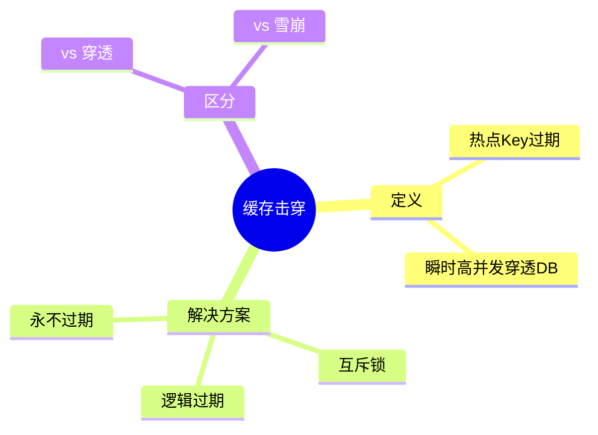

# 缓存击穿问题与解决方案

## 知识导图



## 结论

1. **缓存击穿**：单个热点 Key 过期瞬间，大量并发请求直接打到数据库
2. 核心解决思路：**控制重建缓存的并发** 或 **避免真正过期**
3. 生产环境常用：互斥锁（强一致）或逻辑过期（高可用）

## 核心要点

| 方案 | 原理 | 优点 | 缺点 |
|------|------|------|------|
| **互斥锁** | 只允许一个线程重建缓存，其他等待 | 强一致性 | 等待时间长，可能死锁 |
| **逻辑过期** | 缓存不设 TTL，用字段标记过期时间 | 高可用，不阻塞 | 短暂数据不一致 |
| **永不过期** | 热点数据不设过期时间 | 简单直接 | 数据更新需主动刷新 |

### 击穿 vs 穿透 vs 雪崩

| 问题 | 触发条件 | 影响范围 |
|------|----------|----------|
| **击穿** | 热点 Key 过期 | 单点压力 |
| **穿透** | 查询不存在的数据 | 持续攻击 |
| **雪崩** | 大量 Key 同时过期 | 全面崩溃 |

## 代码示例：互斥锁方案

```java
public String getWithMutex(String key) {
    String value = redis.get(key);
    if (value != null) {
        return value;  // 缓存命中，直接返回
    }

    String lockKey = "lock:" + key;
    try {
        // 尝试获取分布式锁
        boolean locked = redis.setnx(lockKey, "1", 10, TimeUnit.SECONDS);
        if (locked) {
            // 获取锁成功，查库并重建缓存
            value = db.query(key);
            redis.set(key, value, 30, TimeUnit.MINUTES);
            return value;
        } else {
            // 获取锁失败，休眠后重试
            Thread.sleep(50);
            return getWithMutex(key);  // 递归重试
        }
    } finally {
        redis.del(lockKey);  // 释放锁
    }
}
// 预期现象：并发请求时，只有1个线程查库，其他等待后获取缓存
```

## 易错点

1. **锁未设置过期时间**：获取锁的线程崩溃会导致死锁
2. **递归重试无上限**：应设置最大重试次数，避免栈溢出
3. **混淆击穿与雪崩**：击穿是单点热点，雪崩是批量过期
4. **逻辑过期更新失败未处理**：需要有兜底策略（如返回旧数据 + 告警）

## 自测题

1. **问**：缓存击穿和缓存雪崩的核心区别是什么？
   > **答**：击穿是单个热点 Key 过期；雪崩是大量 Key 同时过期

2. **问**：互斥锁方案中，为什么锁必须设置过期时间？
   > **答**：防止持有锁的线程异常退出导致锁永远无法释放（死锁）

3. **问**：逻辑过期方案为什么会有短暂的数据不一致？
   > **答**：发现过期后异步更新，更新完成前其他请求仍返回旧数据

4. **问**：如果用 Redis SETNX 实现分布式锁，需要注意哪些问题？
   > **答**：原子性（SET NX EX 合并）、锁续期、解锁时验证持有者

---

## ⚠ 待确认清单

| 疑点 | 验证方法 |
|------|----------|
| 逻辑过期的更新线程具体如何触发？失败如何兜底？ | 查阅《Redis 设计与实现》或黑马点评项目源码 |
| Redis SETNX vs Redisson 分布式锁的取舍标准 | 对比 Redisson 官方文档，编写 Demo 测试看门狗续期 |
| 击穿与雪崩边界：如果热点 Key 有多个同时过期算哪种？ | 查阅《高并发系统设计》或阿里云官方博客定义 |
