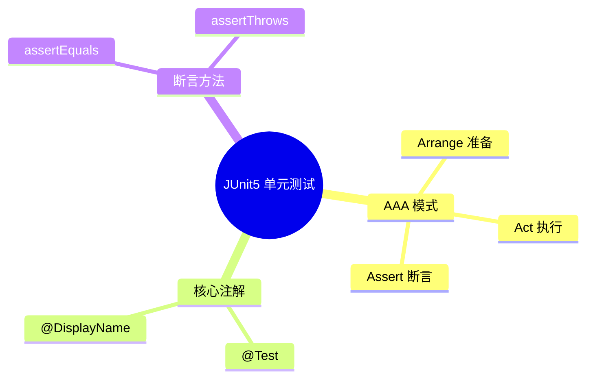

# JUnit5 单元测试 - AAA 模式示例

## 知识导图



## 结论

1. **AAA 模式**：Arrange（准备）→ Act（执行）→ Assert（断言），是单元测试的标准结构
2. `assertEquals` 用于校验结果是否符合预期，`assertThrows` 用于校验是否抛出指定异常
3. `@DisplayName` 让测试报告更具可读性

## 核心要点

> [!tip] AAA 模式三步走
> - **Arrange**：准备测试数据和环境
> - **Act**：执行被测方法
> - **Assert**：验证执行结果

| 注解/方法 | 用途 | 示例 |
|-----------|------|------|
| `@Test` | 标记测试方法 | `@Test void test()` |
| `@DisplayName` | 自定义测试名称 | `@DisplayName("描述")` |
| `assertEquals` | 断言值相等 | `assertEquals(expected, actual)` |
| `assertThrows` | 断言抛出异常 | `assertThrows(Exception.class, () -> {...})` |

## 代码示例

> [!example] 正常情况测试
> ```java
> @Test
> @DisplayName("字符串反转 - 正常情况")
> void shouldReverseString() {
>     // Arrange：准备输入数据
>     String input = "hello";
>
>     // Act：执行要验证的逻辑
>     String result = new StringBuilder(input).reverse().toString();
>
>     // Assert：断言结果是否符合预期
>     assertEquals("olleh", result, "字符串应该被反转");
> }
> ```
> 预期现象：测试通过，"hello" 反转为 "olleh"

> [!example] 异常情况测试
> ```java
> @Test
> @DisplayName("字符串反转 - 输入为 null 应抛异常")
> void shouldThrowExceptionWhenNull() {
>     // Arrange：准备 null 输入
>     String input = null;
>
>     // Act & Assert：断言执行时抛出指定异常
>     assertThrows(NullPointerException.class, () -> {
>         new StringBuilder(input).reverse();
>     });
> }
> ```
> 预期现象：StringBuilder 构造时抛出 NullPointerException

## 易错点

> [!warning] 常见错误
> 1. **参数顺序混淆**：`assertEquals(expected, actual)` 中 expected 在前
> 2. **异常类型不精确**：应断言具体异常类型，而非笼统的 `Exception`
> 3. **测试的是框架行为**：示例中测试的是 `StringBuilder`，实际应测试自己的业务方法

## 自测题

1. **问**：AAA 模式中的三个 A 分别代表什么？
   > **答**：Arrange（准备）、Act（执行）、Assert（断言）

2. **问**：`assertEquals` 的参数顺序是什么？
   > **答**：`assertEquals(expected, actual)` - 期望值在前，实际值在后

3. **问**：什么场景适合用 `assertThrows`？
   > **答**：验证方法在特定输入下是否抛出预期的异常

## 相关链接

- [[Java后端-MOC]]
- [[JUnit5-常用断言清单]]
- [[TDD 测试驱动开发]]

---

> [!question] 待确认
> - 示例中被测对象是 `StringBuilder`，实际项目中应测试自己的业务方法（如 `StringUtil.reverse()`）
