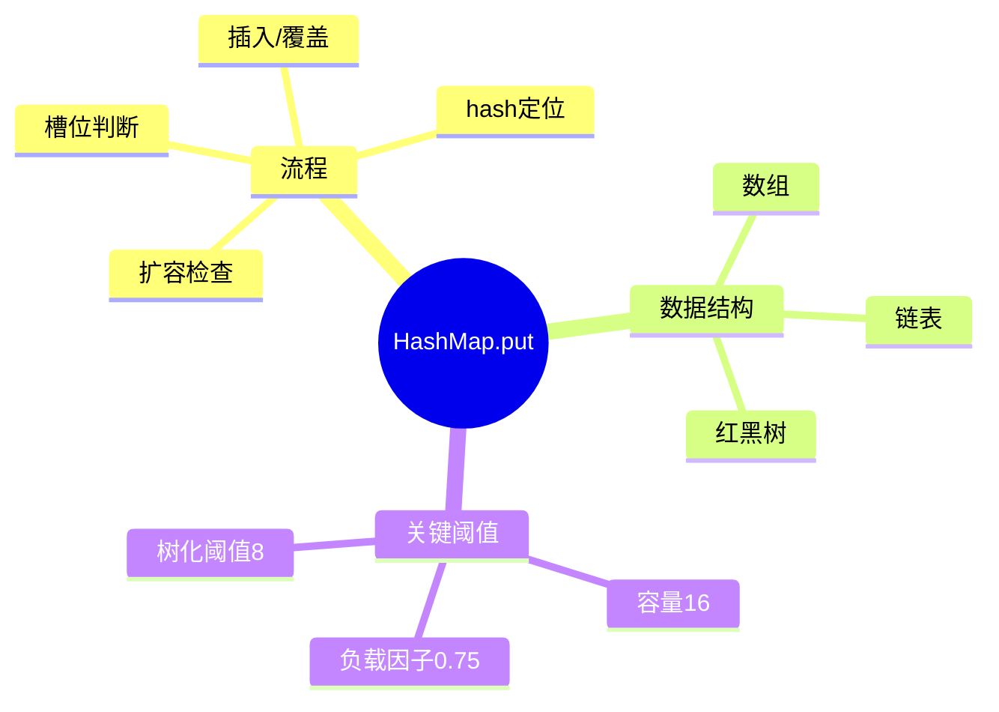
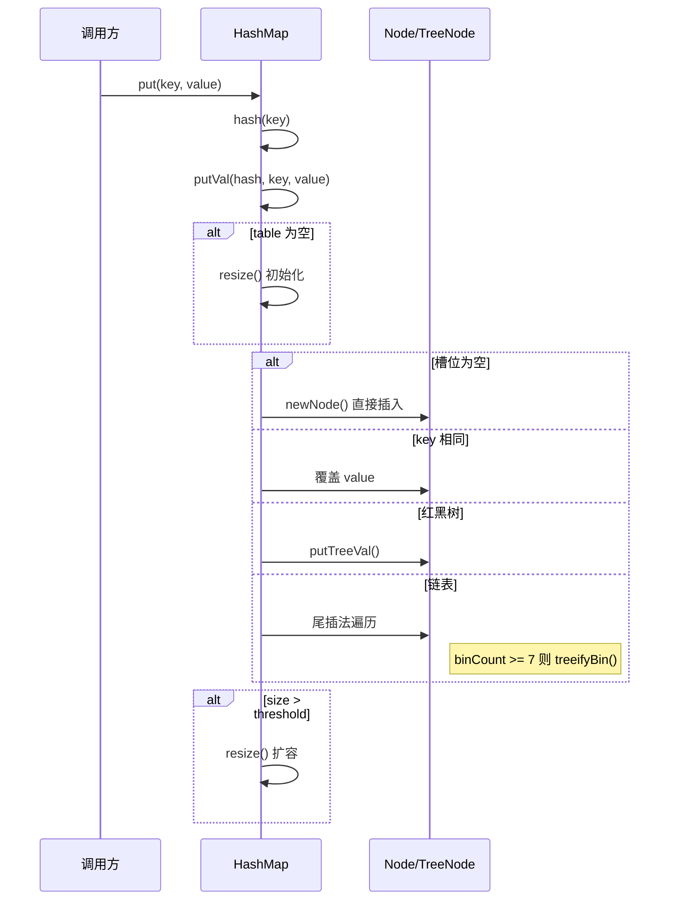

# HashMap.put 源码解析

## 知识导图



## 1. 核心身份卡

- **类/接口名**: `java.util.HashMap`
- **核心职责**: 基于哈希表实现的 K-V 存储容器，O(1) 时间复杂度存取
- **设计模式**: 数组 + 链表 + 红黑树（JDK8 优化）

## 2. 调用链路 (Call Chain)



## 3. 关键源码解析

```java
final V putVal(int hash, K key, V value, ...) {
    // 1. 懒初始化：首次 put 时才创建数组
    if (table == null)
        table = resize();  // 默认容量 16

    // 2. 定位槽位：(n-1) & hash 等价于 hash % n（n 为 2 的幂）
    int i = (n - 1) & hash;

    // 3. 槽位为空 → 直接插入新节点
    if (tab[i] == null)
        tab[i] = newNode(hash, key, value, null);

    // 4. 槽位有值 → 三种情况
    //    4a. key 相同 → 覆盖
    //    4b. 红黑树 → putTreeVal
    //    4c. 链表 → 尾插，长度 >= 8 则树化

    // 5. 扩容检查：size > capacity * loadFactor
    if (++size > threshold)
        resize();  // 容量翻倍，重新哈希
}
```

## 4. 调试指南 (Debug Guide)

| 断点位置 | 验证场景 |
|----------|----------|
| `HashMap.java:628` (putVal 入口) | 观察 hash 值计算结果 |
| `HashMap.java:634` (resize 调用) | 验证首次 put 触发初始化 |
| `HashMap.java:641` (槽位判断) | 观察 `(n-1) & hash` 定位 |
| `HashMap.java:662` (treeifyBin) | 插入第 8 个冲突元素时触发 |
| `HashMap.java:679` (resize 扩容) | size 超过 threshold 时触发 |

**验证方法**:
```java
HashMap<String, Integer> map = new HashMap<>(4); // 容量4，阈值3
map.put("a", 1); // 断点：观察 table 初始化
map.put("b", 2);
map.put("c", 3);
map.put("d", 4); // 断点：触发 resize 扩容到 8
```

## 5. ⚠ 盲区标记

| 盲区 | 说明 |
|------|------|
| `hash()` 实现 | 未提供，涉及高位扰动 `(h = key.hashCode()) ^ (h >>> 16)` |
| `resize()` 细节 | 未展开，涉及链表拆分和红黑树退化逻辑 |
| `treeifyBin()` | 树化条件：链表 ≥ 8 且 table.length ≥ 64，否则只扩容 |
| `TreeNode.putTreeVal()` | 红黑树插入逻辑未展开 |

## 自测题

1. **问**：HashMap 定位槽位为什么用 `(n-1) & hash` 而不是 `hash % n`？
   > **答**：位运算效率更高；前提是 n 必须是 2 的幂次方

2. **问**：链表转红黑树的条件是什么？
   > **答**：链表长度 ≥ 8 且数组长度 ≥ 64，否则优先扩容

3. **问**：为什么 JDK8 用尾插法替代 JDK7 的头插法？
   > **答**：头插法在并发扩容时可能形成环形链表导致死循环
