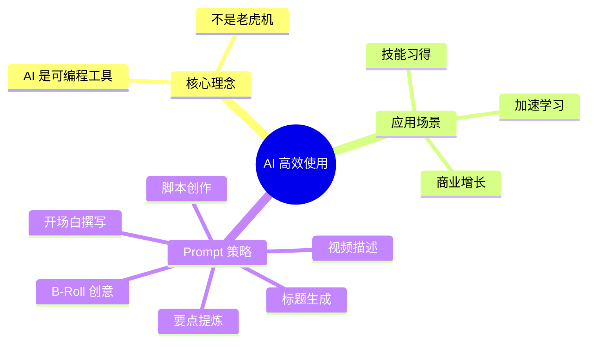

# 如何比 99% 的人更好地使用 AI

> [!info] 视频信息
> - **作者**: Dan Koe
> - **标题**: How To Use AI Better Than 99% Of People (This Changed My Life)
> - **来源**: [YouTube](https://youtu.be/xgpLjLHB5sA)

## 知识导图

## 结论

> [!abstract] 核心观点
> 1. **大多数人把 AI 当老虎机**：随便问问题、看答案，没有发挥真正潜力
> 2. **AI 是可编程工具**：应该给它清晰的指令，让它完成特定任务
> 3. **系统化 Prompt**：通过分析成功案例，创建可复用的提示词模板

## 核心要点

### 1. 思维转变

> [!tip] 关键认知
> - ❌ 错误方式：把 AI 当搜索引擎，问一个问题得一个答案
> - ✅ 正确方式：把 AI 当可编程助手，给它详细指令完成复杂任务

### 2. 六大 Prompt 策略 (以 YouTube 视频为例)

| 阶段 | Prompt 类型 | 目的 |
|------|-------------|------|
| 1 | **标题 Prompt** | 分析爆款标题规律，生成吸引人的新标题 |
| 2 | **要点 Prompt** | 将话题拆解为有价值的关键点 |
| 3 | **开场白 Prompt** | 基于成功视频的开场，创建吸引人的开头 |
| 4 | **脚本 Prompt** | 整合话题、要点、开场，生成完整脚本 |
| 5 | **B-Roll Prompt** | 根据脚本生成视觉素材创意 |
| 6 | **描述 Prompt** | 生成 SEO 友好的视频描述和章节 |

### 3. 实践方法

> [!example] 如何创建有效 Prompt
> 1. **找到专家来源**：分析你所在领域的成功案例
> 2. **提取规律**：让 AI 分析这些案例的共同模式
> 3. **生成指令**：将规律转化为可复用的 Prompt 模板
> 4. **迭代优化**：根据输出效果不断调整

## 自测题

1. **问**：大多数人使用 AI 的错误方式是什么？
   > **答**：把 AI 当老虎机/搜索引擎，只是问问题得答案，没有系统化编程

2. **问**：Dan Koe 提出的 AI 使用正确心态是什么？
   > **答**：把 AI 当作可编程工具，给它详细指令完成特定任务

3. **问**：创建有效 Prompt 的四步流程是什么？
   > **答**：找专家来源 → 提取规律 → 生成指令 → 迭代优化

## 相关链接

- [[Prompt工程入门]]
- [[AI辅助内容创作]]
- [[Java后端-MOC]]

---

> [!quote] 来源
> - [Dan Koe 官网文章](https://thedankoe.com)
> - [YouTube 视频](https://youtu.be/xgpLjLHB5sA)
