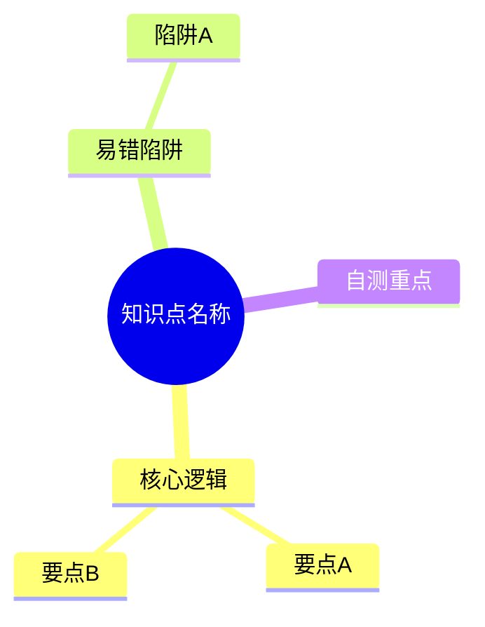

# PKM 知识库成品输出与路由规范

> [!IMPORTANT]
> 本规范是 AI 整理原始笔记、生成成品笔记的**最高准则**。AI 在处理任何 `00-收集箱` 中的内容并输出至库中时，必须全文无条件遵守。

## 1. 目录路由协议 (Type → Path)
AI 不准根据感觉选择目录，必须严格执行以下路由：

| 笔记类型 (Type) | 目标路径 | 备注 |
| :--- | :--- | :--- |
| **concept** | `01-知识库/计算机/{{对应学科}}/` | 通用计算机基础知识点 |
| **interview** | `01-知识库/计算机/Java与后端/00-面试题库/` | 面试八股文专项 |
| **interview_moc** | `04-输出作品/面试回答合集/` | 针对特定岗位或阶段的面试汇总 |
| **framework** | `01-知识库/计算机/Java与后端/04-框架/` | Spring, SpringBoot, MyBatis 等 |
| **sourcecode** | `01-知识库/计算机/Java与后端/06-源码阅读/` | 纯源码分析 |
| **learning** | `02-学习记录/` | 书籍、课程、教程的原始/阶段性记录 |
| **moc** | `05-索引导航/` | 知识地图、索引文件 |

---

## 2. 成品输出格式协议

### 2.1 YAML Frontmatter (必选)
每篇笔记头部必须包含且仅包含以下字段：
```yaml
---
type: concept | interview | framework | sourcecode | learning | moc
domain: 数据库 | Java | 操作系统 | ...
status: 🌿 苗 (初步整理) | ☀️ 树 (逻辑完备) | 💎 钻 (深度/高频)
source: 原创 | 引用(链接/书名)
---
```

### 2.2 视觉引导 (必选)
开篇第一块必须是 Mermaid 思维导图，层级深度不超过 3 层：


### 2.3 正文结构 (极简原则)
正文必须短而清晰，按以下固定模块书写：

1. **3 行结论**：≤3 条，用一句话讲清楚是什么、为什么。
2. **核心要点**：≤6 条，列出关键技术点或逻辑。
3. **易错点**：≤4 条，提醒实际开发或面试中的常见坑。
4. **自测题**：≥3 题，用于闭环检验。

### 2.4 代码示例规范
- **原则**：最小可理解示例。
- **限制**：不超过 40 行，注释占比需达 30% 以上。
- **必须包含**：在代码块后写明“**预期执行现象**”。

### 2.5 确定性保护
- 对于 AI 不确定的内容，**绝对禁止**写死。
- 必须使用 `> [!WARNING] 待确认` 标注。
- 必须紧跟 `验证方法`（例如：具体执行哪条命令，查看哪个日志）。

---

## 3. 对 AI 的约束
1. **真实性高于美观**：如果原始记录很乱，AI 只需确保理解逻辑，保留“真实反馈”。
2. **自动归档**：AI 整理后，必须主动移动或创建文件到对应的路由路径。
