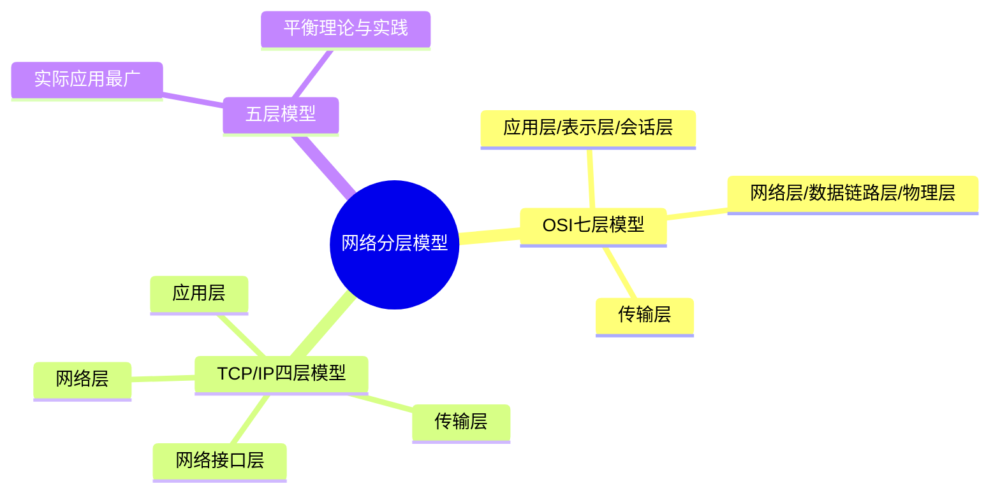

# 计算机网络分层模型-OSI与TCP/IP

## 知识导图

## 结论

1. **分层目的**：解耦各层职责，实现标准化和可替换性，降低系统复杂度
2. **实际应用**：TCP/IP 四层模型是互联网实际使用的标准，五层模型常用于教学
3. **核心思想**：每层独立完成特定功能，通过接口与上下层交互，实现模块化设计

## 核心要点

### 1. OSI 七层模型（理论标准）

- **7. 应用层**：HTTP、FTP、DNS、SMTP - 提供用户接口和网络服务
- **6. 表示层**：数据格式转换、加密解密、压缩 - SSL/TLS、JPEG
- **5. 会话层**：建立、管理、终止会话 - NetBIOS、RPC
- **4. 传输层**：TCP、UDP - 端到端通信，端口号
- **3. 网络层**：IP、ICMP、ARP - 路由选择、IP寻址，设备：路由器
- **2. 数据链路层**：MAC寻址、成帧 - 设备：交换机、网卡
- **1. 物理层**：比特流传输 - 设备：集线器、网线、光纤

### 2. TCP/IP 四层模型（实际应用）

- **应用层**：包含OSI的应用层+表示层+会话层 - HTTP、DNS、FTP、SMTP
- **传输层**：TCP、UDP - 端到端通信
- **网络层（IP层）**：IP、ICMP、ARP - 路由、寻址
- **网络接口层**：包含OSI的数据链路层+物理层 - 硬件接口

### 3. 五层模型（教学常用）

- **5. 应用层**：HTTP、FTP、DNS - 合并OSI会话层、表示层
- **4. 传输层**：TCP、UDP
- **3. 网络层**：IP、ICMP、路由器
- **2. 数据链路层**：MAC地址、交换机
- **1. 物理层**：比特流、网线、光纤

### 4. 数据封装过程

| 层次 | 数据单位 | 添加的信息 |
|------|---------|-----------|
| 应用层 | 数据（Data） | 应用数据 |
| 传输层 | 段（Segment） | 源端口、目的端口 |
| 网络层 | 包（Packet） | 源IP、目的IP |
| 数据链路层 | 帧（Frame） | 源MAC、目的MAC |
| 物理层 | 比特（Bit） | 电信号/光信号 |

### 5. 分层的优势

- **解耦**：每层独立职责，修改不影响其他层
- **标准化**：不同厂商设备可互通
- **易维护**：可单独替换某层协议
- **灵活性**：支持多种底层技术

### 6. 三种模型对比

| 特性 | OSI七层 | TCP/IP四层 | 五层模型 |
|------|---------|-----------|---------|
| 层数 | 7层 | 4层 | 5层 |
| 定位 | 理论标准 | 实际应用 | 教学常用 |
| 应用层 | 独立3层 | 合并为1层 | 合并为1层 |
| 底层 | 独立2层 | 合并为1层 | 独立2层 |
| 优点 | 理论完整 | 简洁实用 | 平衡两者 |

## 易错点

> [!warning] 常见陷阱
> 1. **网络层 ≠ 网络接口层**：网络层负责IP寻址和路由，网络接口层是物理层+数据链路层的合并
> 2. **MAC在数据链路层，IP在网络层**：不要混淆两种地址的层次
> 3. **端口号属于传输层**：端口号由TCP/UDP协议管理，不属于网络层
> 4. **五层模型不是拆分网络层**：而是合并了OSI的会话层、表示层到应用层

## 自测题

1. **问**：为什么OSI模型有7层，但实际互联网使用的是4层？
   > **答**：OSI是理论标准模型，设计时追求完整性；TCP/IP模型是先有实践后总结的，更注重实用性。OSI的会话层、表示层功能在实际应用中多由应用层直接实现（如HTTPS包含加密），因此TCP/IP将这三层合并为应用层。

2. **问**：数据从应用层到物理层传输时，每一层都做了什么？
   > **答**：
   > - 应用层：生成应用数据（如HTTP请求）
   > - 传输层：添加TCP/UDP头（源端口、目的端口、序列号等）形成段（Segment）
   > - 网络层：添加IP头（源IP、目的IP）形成包（Packet）
   > - 数据链路层：添加MAC头和尾（源MAC、目的MAC、CRC校验）形成帧（Frame）
   > - 物理层：转换为比特流（电信号/光信号）

3. **问**：路由器工作在哪一层？交换机工作在哪一层？为什么？
   > **答**：
   > - 路由器工作在网络层（第3层）：因为路由器根据IP地址进行路由选择和转发
   > - 交换机工作在数据链路层（第2层）：因为交换机根据MAC地址进行帧转发
   > - 注：现代三层交换机可以工作在网络层，具有路由功能

4. **问**：五层模型和TCP/IP四层模型的主要区别是什么？
   > **答**：五层模型将TCP/IP四层模型的"网络接口层"拆分为"数据链路层"和"物理层"，使得物理传输（比特流、硬件）和逻辑链路控制（MAC寻址、成帧）的职责更清晰，更适合教学。四层模型更简洁实用。

## 深入原理

### 为什么需要分层？

**历史背景**：早期网络设备各自为政，不同厂商的设备无法互通。OSI模型的提出是为了制定统一标准。

**核心优势**：
- **降低复杂度**：每层只需关注自己的功能，不需要了解其他层的实现细节
- **标准化接口**：上下层通过标准接口交互，任何符合标准的实现都可替换
- **技术演进**：可以独立升级某一层的技术，不影响其他层（如从IPv4升级到IPv6）

### 各层关键协议详解

| 层次 | 关键协议 | 作用 |
|------|---------|------|
| 应用层 | HTTP/HTTPS | Web浏览 |
| 应用层 | DNS | 域名解析 |
| 应用层 | FTP | 文件传输 |
| 应用层 | SMTP/POP3 | 邮件收发 |
| 传输层 | TCP | 可靠传输，三次握手 |
| 传输层 | UDP | 快速传输，无连接 |
| 网络层 | IP | 寻址和路由 |
| 网络层 | ICMP | Ping、错误报告 |
| 网络层 | ARP | IP地址到MAC地址映射 |
| 数据链路层 | Ethernet | 以太网协议 |
| 数据链路层 | PPP | 点对点协议 |

### 实际场景：浏览器访问网站的完整过程

1. **应用层**：浏览器生成HTTP GET请求
2. **传输层**：TCP协议添加端口号（源端口随机，目的端口80/443）
3. **网络层**：
   - DNS解析域名获得目的IP
   - IP协议添加源IP和目的IP
   - 路由表查找下一跳
4. **数据链路层**：
   - ARP协议获取下一跳的MAC地址
   - 添加源MAC和目的MAC
5. **物理层**：转换为电信号通过网线传输

## 相关链接

### 项目内部链接
- [[TCP三次握手与四次挥手]]
- [[HTTP协议详解]]
- [[DNS域名解析过程]]

### 外部参考资料
- [小林coding - 计算机网络](https://www.xiaolincoding.com/network/) - 网络协议详解
- [OSI模型详解 - RFC文档](https://www.iso.org/ics/35.100/x/) - 官方标准
- [TCP/IP详解 - 图解网络](https://www.xiaolincoding.com/network/1_base/tcp_ip_model.html) - 深度解析
