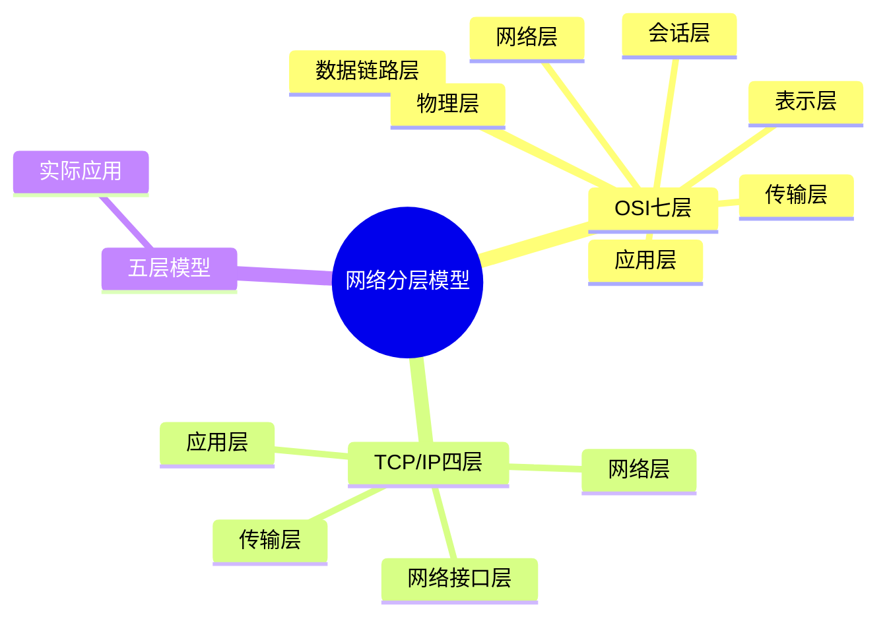

# 计算机网络分层模型：OSI 与 TCP/IP

## 知识导图

## 结论

1. **OSI七层模型**：理论标准，从物理层到应用层清晰划分职责，但实际应用较少
2. **TCP/IP四层模型**：互联网实际使用的模型，将OSI底层合并为网络接口层
3. **五层模型**：教学和实践最常用，平衡了理论完整性和实际应用简洁性

## 核心要点

- **物理层**：传输比特流（0和1），硬件：集线器、网线、光纤
- **数据链路层**：MAC地址寻址、成帧，硬件：交换机、网卡，协议：以太网、PPP
- **网络层**：IP地址路由、数据包转发，硬件：路由器，协议：IP、ICMP、ARP
- **传输层**：端到端可靠传输、端口号，协议：TCP（可靠）、UDP（快速）
- **会话层**：建立、管理、终止会话（OSI独有，TCP/IP合并到应用层）
- **表示层**：数据格式转换、加密解密、压缩（OSI独有）
- **应用层**：用户接口，协议：HTTP、HTTPS、FTP、DNS、SMTP

## 模型对比

### OSI七层 vs TCP/IP四层 vs 五层模型

| OSI七层 | 五层模型 | TCP/IP四层 | 主要功能 | 典型协议/设备 |
|---------|----------|-----------|---------|--------------|
| 应用层 | 应用层 | 应用层 | 网络服务接口 | HTTP、FTP、DNS、SMTP |
| 表示层 | ↑ | ↑ | 数据格式转换、加密 | SSL/TLS、JPEG、ASCII |
| 会话层 | ↑ | ↑ | 会话管理 | NetBIOS、RPC |
| 传输层 | 传输层 | 传输层 | 端到端通信、可靠性 | TCP、UDP、端口号 |
| 网络层 | 网络层 | 网络层（IP层） | 路由、IP寻址 | IP、ICMP、ARP、路由器 |
| 数据链路层 | 数据链路层 | 网络接口层 | MAC寻址、成帧 | 以太网、交换机、网卡 |
| 物理层 | 物理层 | ↑ | 比特流传输 | 集线器、网线、光纤 |

## 易错点

> [!warning] 常见混淆点
> 1. **网络层 ≠ 网络接口层**：网络层指IP层（路由），网络接口层是TCP/IP四层模型的底层（物理+数据链路）
> 2. **MAC地址在数据链路层，IP地址在网络层**：不要搞混两者的层级
> 3. **端口号属于传输层**：端口号由TCP/UDP协议管理，不是应用层概念
> 4. **五层模型不是"拆分网络层"**：是合并OSI的会话层、表示层到应用层

## 自测题

1. **问**：为什么实际应用中TCP/IP是四层模型，而教学常用五层模型？
   > **答**：TCP/IP四层模型是互联网实际使用的架构，将物理层和数据链路层合并为"网络接口层"。五层模型是教学简化版，保留了物理层和数据链路层的区分（便于理解硬件和协议的分工），同时去掉了OSI的会话层和表示层（实际应用中这两层功能已合并到应用层）。

2. **问**：数据从应用层到物理层的封装过程叫什么？每层添加什么？
   > **答**：叫做**封装（Encapsulation）**。应用层数据 → 传输层添加TCP/UDP头（段Segment）→ 网络层添加IP头（包Packet）→ 数据链路层添加MAC头和尾（帧Frame）→ 物理层转为比特流。接收端则是**解封装**过程。

3. **问**：HTTP协议工作在哪一层？它依赖哪些下层协议？
   > **答**：HTTP工作在**应用层**。依赖关系：HTTP → TCP（传输层，端口80/443）→ IP（网络层）→ 以太网/Wi-Fi（数据链路层）→ 物理介质。这就是为什么浏览器输入网址后，需要DNS解析（应用层）、TCP三次握手（传输层）、IP路由（网络层）等一系列过程。

4. **问**：交换机工作在哪一层？路由器工作在哪一层？
   > **答**：**交换机工作在数据链路层**（第2层），根据MAC地址转发帧；**路由器工作在网络层**（第3层），根据IP地址转发数据包。三层交换机同时具备交换和路由功能。

## 深入原理

### 数据传输的完整流程（以HTTP请求为例）

**发送端（从上到下）**：
1. **应用层**：浏览器生成HTTP请求（GET /index.html）
2. **传输层**：TCP添加源端口（随机）和目标端口（80），建立连接
3. **网络层**：IP添加源IP和目标IP地址，查找路由表
4. **数据链路层**：以太网添加源MAC和目标MAC地址（通过ARP获取），封装成帧
5. **物理层**：转换为电信号/光信号，通过网线/光纤传输

**接收端（从下到上）**：
物理层 → 数据链路层（检查MAC，去掉帧头）→ 网络层（检查IP，去掉IP头）→ 传输层（检查端口，重组TCP段）→ 应用层（Web服务器处理HTTP请求）

### 为什么需要分层？

| 优势 | 说明 |
|------|------|
| **解耦** | 每层只关注自己的职责，下层为上层提供服务 |
| **标准化** | 不同厂商的设备只需遵守接口标准即可互通 |
| **易维护** | 修改某层实现不影响其他层（如HTTP/1.1 → HTTP/2） |
| **灵活性** | 可替换某层协议（如TCP → UDP，有线 → 无线） |

## 相关链接

### 项目内部链接
- [[TCP三次握手与四次挥手]]
- [[HTTP协议详解]]
- [[DNS域名解析过程]]

### 外部参考资料
- [小林coding - 图解网络](https://www.xiaolincoding.com/network/) - 网络分层模型详解
- [小林coding - TCP/IP网络模型](https://www.xiaolincoding.com/network/1_base/tcp_ip_model.html) - 四层模型深度解析
- [RFC 1122 - Internet Protocol](https://www.rfc-editor.org/rfc/rfc1122) - TCP/IP官方标准
