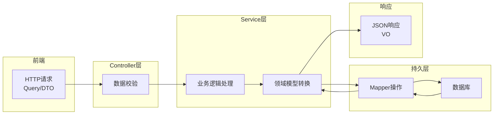

# 分层领域模型

## TL;DR

分层领域模型包含 DO/DTO/Query/VO 四种类型，分别在不同层之间流转。遵循阿里巴巴开发手册规范，统一命名后缀。

---

## 一、领域模型定义

### 1.1 四大领域对象

| 模型 | 名称 | 作用范围 | 说明 |
|------|------|----------|------|
| DO | Data Object | 持久层 | 与数据库表一一对应 |
| DTO | Data Transfer Object | 业务层 | 层间数据传输 |
| Query | Query Object | Controller→Service | 查询条件封装 |
| VO | View Object | Service→Controller | 返回前端数据 |

### 1.2 为什么不使用Map

- 超过2个参数应封装为Query对象
- Map无法维护、不可读
- 无法约束字段类型和必填性

---

## 二、数据流转流程



### 2.1 流转步骤

1. **Controller层**：接收前端Request，校验数据
2. **Service层**：执行业务逻辑，模型转换
3. **DAO层**：与数据库交互
4. **返回**：逐层转换VO响应给前端

---

## 三、命名规范

### 3.1 后缀规范

| 类型 | 后缀 | 示例 |
|------|------|------|
| 数据对象 | DO | UserDO |
| 传输对象 | DTO | UserDTO |
| 查询对象 | Query | UserQuery |
| 视图对象 | VO | UserVO |

### 3.2 包名规范

基础包名：`com.zerotask.eams.{模块名}`

```
com.zerotask.eams.{模块名}.dto
com.zerotask.eams.{模块名}.query
com.zerotask.eams.{模块名}.vo
```

示例：
```
com.zerotask.eams.system.dto
com.zerotask.eams.edu.query
```

---

## 四、各层命名规范

### 4.1 Controller层

| 操作 | 前缀 |
|------|------|
| 查询单个 | getXxx |
| 查询列表 | listXxx |
| 分页查询 | pageXxx |
| 新增 | addXxx / saveXxx |
| 修改 | updateXxx / modifyXxx |
| 删除 | deleteXxx / removeXxx |

### 4.2 Service层

| 操作 | 前缀 |
|------|------|
| 单个查询 | getXxx |
| 列表查询 | listXxx |
| 分页查询 | pageXxx |

### 4.3 DAO层

| 操作 | 前缀 |
|------|------|
| 单一查询 | selectById |
| 列表查询 | selectList |
| 分页查询 | selectPage |

---

## 五、Query对象示例

### 5.1 基础Query

```java
@Data
public class UserQuery extends PageQuery {

    private String name;        // 姓名（模糊查询）
    private Integer status;     // 状态
    private LocalDateTime startTime;  // 开始时间
    private LocalDateTime endTime;    // 结束时间
}
```

### 5.2 PageQuery（分页基类）

```java
@Data
public class PageQuery {

    @Min(value = 1, message = "页码不能小于1")
    private Integer pageIndex = 1;

    @Range(min = 1, max = 100, message = "每页条数1-100")
    private Integer pageSize = 10;
}
```

---

## 六、实战示例

### 6.1 DTO定义

```java
@Data
public class AddUserDTO {

    @NotBlank(message = "用户名不能为空")
    private String username;

    @NotBlank(message = "密码不能为空")
    @Length(min = 6, max = 20, message = "密码6-20位")
    private String password;

    @Range(min = 0, max = 1, message = "性别只能是0或1")
    private Integer gender;
}
```

### 6.2 VO定义

```java
@Data
public class UserVO {

    private String id;
    private String username;
    private Integer gender;
    private LocalDateTime createTime;
}
```

---

## References

- 阿里巴巴Java开发手册
- [[20-知识库/架构与工程实践/02-Java项目架构实战]]
