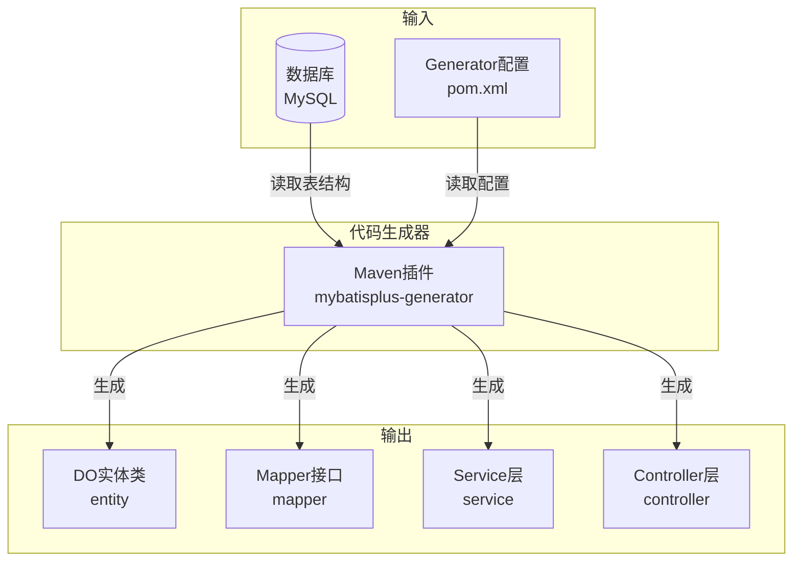
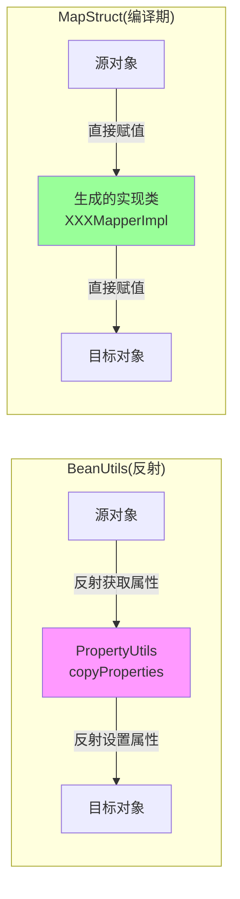

# 代码生成

## TL;DR

使用MyBatis-Plus Generator逆向工程自动生成DO/Mapper/Service/Controller代码，大幅提升开发效率。

### 代码生成流程



---

## 一、MyBatis-Plus Generator

### 1.1 插件配置

在业务模块的pom.xml中配置：

```xml
<plugin>
    <groupId>com.zerotask</groupId>
    <artifactId>mybatisplus-generator</artifactId>
</plugin>
```

### 1.2 执行生成

```bash
mvn mybatisplus:generator -Dmodule=业务模块名 -Dtable=表名
```

### 1.3 生成内容

- **DO**：实体类
- **Mapper**：数据操作接口
- **Service**：业务层接口及实现
- **Controller**：控制器

---

## 二、实体类配置

### 2.1 ID策略

非自增表需指定雪花算法：

```java
@Data
@TableName("simple")
public class SimpleDO {

    @TableId(type = IdType.ASSIGN_ID)
    private String id;

    private String name;
    private Integer age;
    private Integer gender;

    @TableField(fill = FieldFill.INSERT)
    private LocalDateTime createTime;

    @TableField(fill = FieldFill.INSERT_UPDATE)
    private LocalDateTime updateTime;
}
```

### 2.2 常用ID类型

| 类型 | 说明 |
|------|------|
| AUTO | 自增 |
| ASSIGN_ID | 雪花算法 |
| UUID | UUID字符串 |

---

## 三、自动填充

### 3.1 MetaObjectHandler

```java
@Component
public class MybatisPlusMetaObjectHandler implements MetaObjectHandler {

    @Override
    public void insertFill(MetaObject metaObject) {
        // 插入时填充创建时间
        this.strictInsertFill(metaObject, "createTime",
            LocalDateTime.class, LocalDateTime.now());
        this.strictInsertFill(metaObject, "updateTime",
            LocalDateTime.class, LocalDateTime.now());
    }

    @Override
    public void updateFill(MetaObject metaObject) {
        // 修改时填充更新时间
        this.strictUpdateFill(metaObject, "updateTime",
            LocalDateTime.class, LocalDateTime.now());
    }
}
```

### 3.2 配置说明

- 需要在实体类 `@TableField` 注解中指定 `fill` 属性
- 同时配置Handler和注解才会生效

---

## 四、Service层实现

### 4.1 分页查询示例

```java
@Override
public Page<SimpleDO> pageXxx(SimpleQuery query) {
    // 构建分页对象
    Page<SimpleDO> page = new Page<>(query.getPageIndex(), query.getPageSize());

    // 构建查询条件
    QueryWrapper<SimpleDO> wrapper = new QueryWrapper<>();
    if (StrUtil.isNotBlank(query.getName())) {
        wrapper.like("name", query.getName());
    }

    // 排序
    wrapper.orderByDesc(
        "update_time is null",
        "update_time",
        "create_time",
        "id"
    );

    return baseMapper.selectPage(page, wrapper);
}
```

### 4.2 单条查询

```java
@Override
public SimpleDO getById(String id) {
    return baseMapper.selectById(id);
}
```

---

## 五、MapStruct对象转换

### 5.1 MapStruct vs BeanUtils



### 5.2 对象转换流程

```xml
<dependency>
    <groupId>org.mapstruct</groupId>
    <artifactId>mapstruct</artifactId>
</dependency>
<dependency>
    <groupId>org.mapstruct</groupId>
    <artifactId>mapstruct-processor</artifactId>
</dependency>
```

### 5.2 转换接口

```java
@Mapper(componentModel = "spring")
public interface SimpleConvertMapper {

    // DO -> DTO
    SimpleDTO toDTO(SimpleDO entity);

    // DTO -> DO (新增)
    SimpleDO toEntity(AddSimpleDTO dto);

    // DTO -> DO (修改)
    SimpleDO toEntity(UpdateSimpleDTO dto);
}
```

### 5.3 使用示例

```java
@Autowired
private SimpleConvertMapper convertMapper;

// 查询结果转换
Page<SimpleDTO> result = baseMapper.selectPage(page, wrapper);
return PageUtil.convertPage(result, convertMapper::toDTO);
```

> **优势**：编译期生成转换代码，性能优于BeanUtils反射

---

## References

- [MyBatis-Plus官方文档](https://baomidou.com/)
- [[20-知识库/架构与工程实践/02-Java项目架构实战]]
