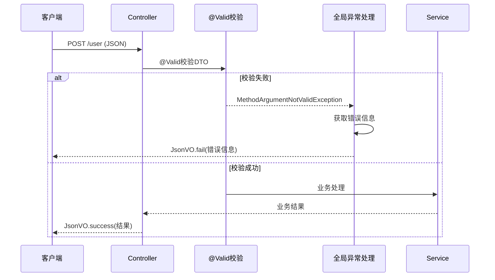
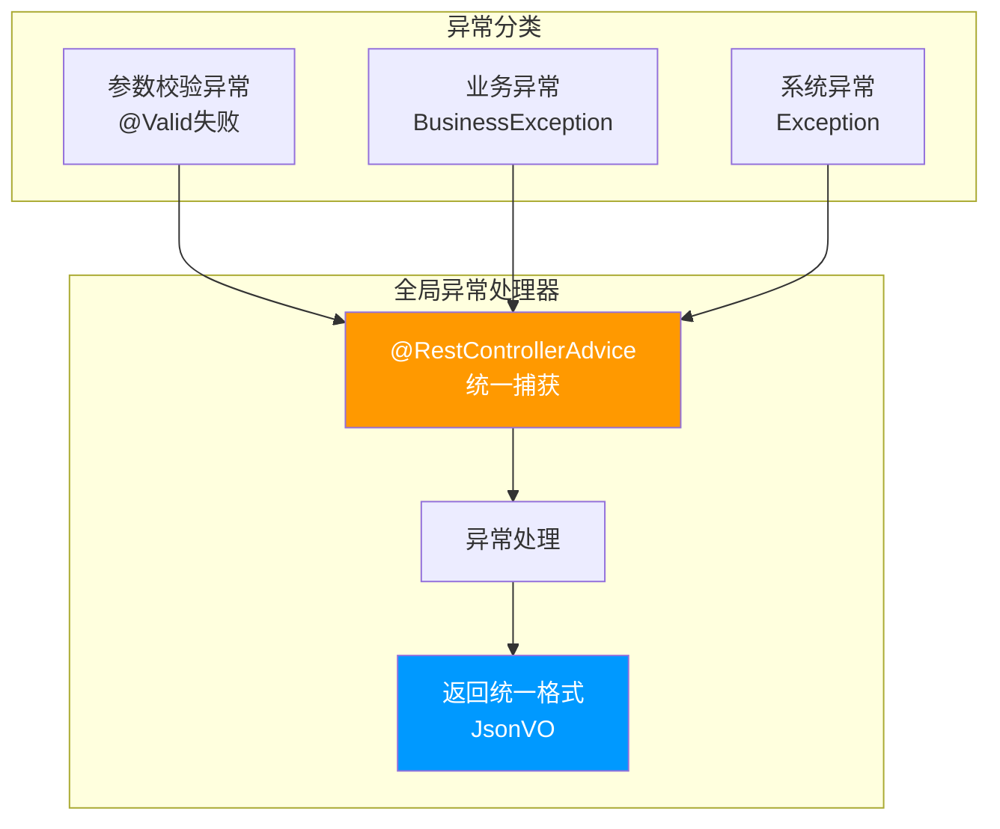

# 参数校验

## TL;DR

使用Spring Validation + 全局异常处理实现参数校验，避免在业务代码中写大量if-else判断。

### Validation校验流程



---

## 一、Validation依赖

项目已在eams-domain中引入：

```xml
<dependency>
    <groupId>org.springframework.boot</groupId>
    <artifactId>spring-boot-starter-validation</artifactId>
</dependency>
```

---

## 二、常用校验注解

### 2.1 基础注解

| 注解 | 说明 |
|------|------|
| @NotNull | 不能为null |
| @NotBlank | 字符串不能为空 |
| @NotEmpty | 集合不能为空 |
| @Null | 必须为null |
| @Min | 最小值 |
| @Max | 最大值 |
| @Range | 范围 |
| @Length | 长度范围 |
| @Size | 集合大小 |
| @Pattern | 正则匹配 |
| @Email | 邮箱格式 |
| @Phone | 手机号格式 |

### 2.2 进阶注解

| 注解 | 说明 |
|------|------|
| @Valid | 嵌套校验 |
| @Validated | 类级别校验 |

---

## 三、实体类注解示例

```java
@Data
public class AddUserDTO {

    @NotBlank(message = "用户名不能为空")
    private String username;

    @NotBlank(message = "密码不能为空")
    @Length(min = 6, max = 20, message = "密码6-20位")
    private String password;

    @Range(min = 0, max = 1, message = "性别只能是0或1")
    private Integer gender;

    @Min(value = 0, message = "年龄不能为负数")
    @Max(value = 150, message = "年龄不能超过150")
    private Integer age;

    @Email(message = "邮箱格式不正确")
    private String email;

    @Pattern(regexp = "^1[3-9]\\d{9}$", message = "手机号格式不正确")
    private String phone;
}
```

---

## 四、Controller使用

### 4.1 基本用法

```java
@PostMapping("/user")
public JsonVO<UserVO> add(@Valid @RequestBody AddUserDTO dto) {
    return JsonVO.success(userService.add(dto));
}

@PutMapping("/user")
public JsonVO<Void> update(@Valid @RequestBody UpdateUserDTO dto) {
    userService.update(dto);
    return JsonVO.success();
}
```

### 4.2 路径参数校验

```java
@GetMapping("/user/{id}")
public JsonVO<UserVO> getById(
    @PathVariable @NotBlank(message = "ID不能为空") String id) {
    return JsonVO.success(userService.getById(id));
}
```

### 4.3 Swagger注解

```java
@Operation(summary = "新增用户")
@ApiOperation(value = "添加实例", tags = "user")
@PostMapping("/user")
public JsonVO<UserVO> add(
    @Valid @RequestBody @ApiParam(value = "用户信息") AddUserDTO dto) {
    return JsonVO.success(userService.add(dto));
}
```

---

## 五、全局异常处理

### 5.1 异常处理流程



### 5.2 GlobalExceptionHandler

```java
@RestControllerAdvice
public class GlobalExceptionHandler {

    /**
     * 处理参数校验异常
     */
    @ExceptionHandler(MethodArgumentNotValidException.class)
    public JsonVO<Void> handleValidException(MethodArgumentNotValidException e) {
        String message = e.getBindingResult().getFieldError().getDefaultMessage();
        return JsonVO.fail(message);
    }

    /**
     * 处理其他异常
     */
    @ExceptionHandler(Exception.class)
    public JsonVO<Void> handleException(Exception e) {
        return JsonVO.fail("服务器错误");
    }
}
```

### 5.2 自定义校验异常

```java
@ExceptionHandler(BusinessException.class)
public JsonVO<Void> handleBusinessException(BusinessException e) {
    return JsonVO.fail(e.getCode(), e.getMessage());
}
```

---

## 六、Query分页参数校验

```java
@Data
public class UserQuery extends PageQuery {

    private String name;

    @Override
    public void validate() {
        // 自定义校验逻辑
        if (pageIndex < 1) {
            pageIndex = 1;
        }
        if (pageSize < 1 || pageSize > 100) {
            pageSize = 10;
        }
    }
}
```

---

## References

- [Spring Validation官方文档](https://spring.io/projects/spring-validation)
- [[20-知识库/架构与工程实践/02-Java项目架构实战]]
