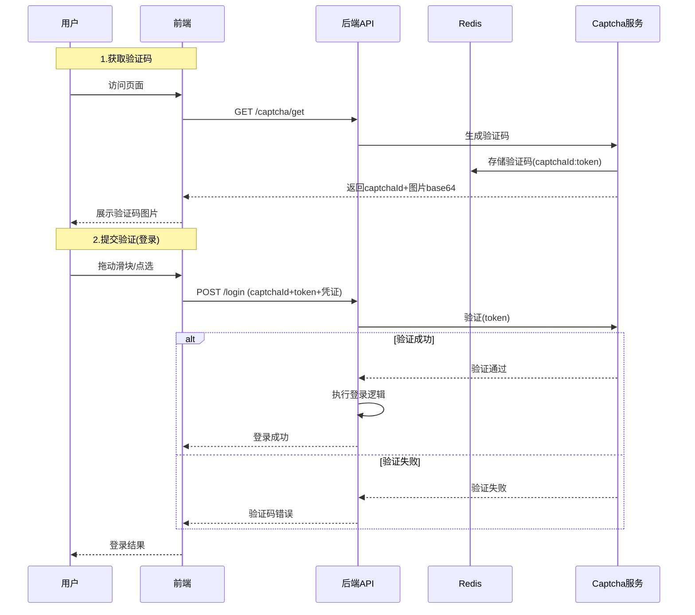
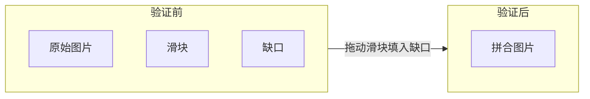

# 验证码集成

## TL;DR

集成Captcha验证码插件，支持滑块验证、文字点选等多种验证方式，后端存储使用Redis。

### 验证码验证流程



### 滑块验证码示意



---

## 一、Captcha插件

### 1.1 简介

Captcha是Java版行为验证码，包含多种验证类型：
- 滑动验证码
- 文字点选验证码
- 无感验证码

### 1.2 官方文档

> 注意：官方文档已迁移，新地址请参考官方最新文档

---

## 二、依赖引入

### 2.1 Maven依赖

```xml
<dependency>
    <groupId>com.anji</groupId>
    <artifactId>captcha-spring-boot-starter</artifactId>
</dependency>
```

### 2.2 Redis依赖

验证码存储需要Redis支持：

```xml
<dependency>
    <groupId>org.springframework.boot</groupId>
    <artifactId>spring-boot-starter-data-redis</artifactId>
</dependency>
```

---

## 三、配置

### 3.1 application.yml配置

```yaml
captcha:
  cache-type: redis
  redis:
    host: localhost
    port: 6379
  # 验证码类型
  captcha-type: blockPuzzle
```

### 3.2 验证码类型

| 类型 | 说明 |
|------|------|
| blockPuzzle | 滑动拼图 |
| clickWord | 文字点选 |

---

## 四、接口开发

### 4.1 获取验证码

```java
@RestController
public class CaptchaController {

    @Autowired
    private CaptchaService captchaService;

    /**
     * 获取验证码
     */
    @GetMapping("/captcha/get")
    public JsonVO<CaptchaVO> get() {
        GetCaptchaVO captchaVO = captchaService.getCaptcha();
        return JsonVO.success(convert(captchaVO));
    }

    /**
     * 二次校验（登录时调用）
     */
    @PostMapping("/captcha/check")
    public JsonVO<Void> check(@RequestBody CaptchaCodeDTO dto) {
        CaptchaCodeVO vo = new CaptchaVO();
        vo.setCaptchaVerification(dto.getCaptchaVerification());

        ResponseModel responseModel = captchaService.check(vo);
        if (!responseModel.isSuccess()) {
            return JsonVO.fail(responseModel.getRepMsg());
        }
        return JsonVO.success();
    }

    private CaptchaVO convert(GetCaptchaVO source) {
        CaptchaVO target = new CaptchaVO();
        target.setCaptchaId(source.getCaptchaId());
        target.setCaptchaImageBase64(source.getCaptchaImageBase64());
        // ... 其他字段
        return target;
    }
}
```

### 4.2 DTO定义

```java
@Data
public class CaptchaCodeDTO {

    @NotBlank(message = "验证码不能为空")
    private String captchaVerification;
}
```

---

## 五、前端集成

### 5.1 获取验证码流程

1. 前端调用 `/captcha/get` 获取验证码图片和ID
2. 展示验证码图片
3. 用户完成滑动/点选
4. 获取到 `captchaVerification` 凭证
5. 登录时传入后端校验

### 5.2 登录时校验

```javascript
// 登录请求示例
async function login(username, password, captchaVerification) {
    const response = await fetch('/auth/login', {
        method: 'POST',
        headers: {
            'Content-Type': 'application/json'
        },
        body: JSON.stringify({
            username,
            password,
            captchaVerification  // 验证码凭证
        })
    });
    return response.json();
}
```

---

## 六、常见问题

### 6.1 验证码无效

- 检查Redis是否正常连接
- 验证凭证是否过期
- 检查前端传入的captchaVerification是否正确

### 6.2 滑动验证失败

- 确认前端传入的滑动距离数据
- 检查验证码类型配置

---

## References

- [Captcha官方文档](https://gitee.com/anji-plus/captcha)
- [[20-知识库/架构与工程实践/02-Java项目架构实战]]
