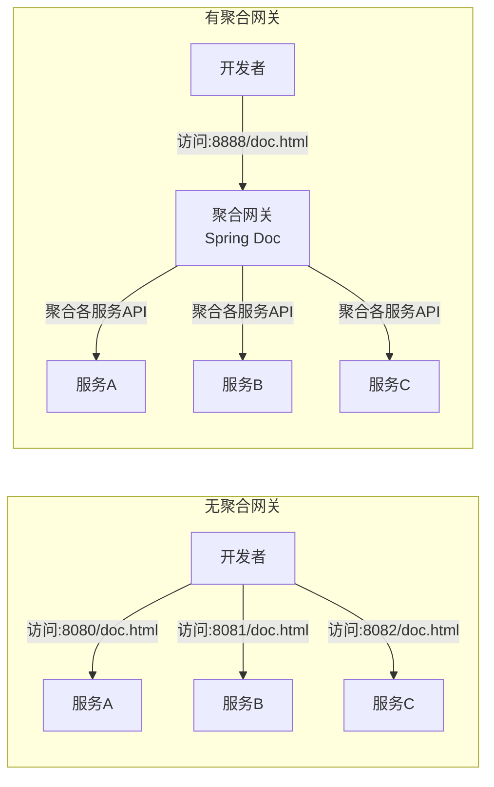
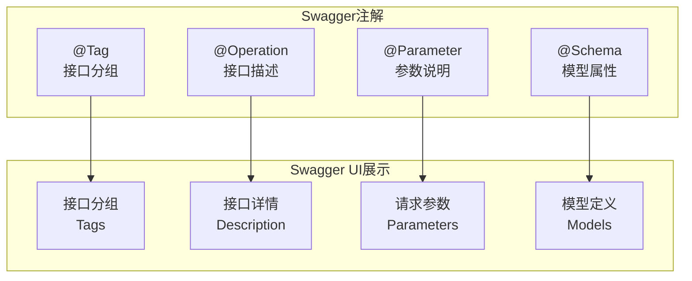

# Swagger配置

## TL;DR

集成Spring Doc/OpenAPI生成API文档，通过Swagger3展示接口，支持分组、注解自定义。

### Swagger文档访问流程



### OpenAPI注解对应关系



---

## 一、依赖引入

### 1.1 Maven依赖

项目已在eams-command中集成，直接在业务模块引入：

```xml
<dependency>
    <groupId>com.zerotask</groupId>
    <artifactId>eams-command</artifactId>
</dependency>
```

---

## 二、配置类

### 2.1 SwaggerConfig

```java
@Configuration
public class SwaggerConfig {

    @Bean
    public OpenAPI customOpenAPI() {
        return new OpenAPI()
                .info(new Info()
                        .title("示例模块API")
                        .version("1.0.0")
                        .description("示例模块接口文档"))
                .addTagsItem(new Tag().name("simple").description("示例接口"));
    }
}
```

### 2.2 使用Command提供的配置

项目已在eams-command中提供了基础配置，可直接继承：

```java
// 使用Command提供的模板
SwaggerUtil.defaultSwagger("示例模块", "com.zerotask.eams.simple.controller");
```

---

## 三、Controller注解

### 3.1 常用注解

| 注解 | 说明 |
|------|------|
| @Tag | 接口分组 |
| @Operation | 接口描述 |
| @ApiParam | 参数说明 |
| @RequestBody | 请求体 |
| @Parameter | 路径参数 |

### 3.2 示例

```java
@Tag(name = "用户管理", description = "用户相关接口")
@RestController
@RequestMapping("/user")
public class UserController {

    @Operation(summary = "新增用户", description = "创建一个新用户")
    @PostMapping
    public JsonVO<UserVO> add(
            @Valid @RequestBody
            @ApiParam(value = "用户信息", required = true)
            AddUserDTO dto) {
        return JsonVO.success(userService.add(dto));
    }

    @Operation(summary = "根据ID查询用户")
    @GetMapping("/{id}")
    public JsonVO<UserVO> getById(
            @Parameter(description = "用户ID", required = true)
            @PathVariable String id) {
        return JsonVO.success(userService.getById(id));
    }

    @Operation(summary = "分页查询用户")
    @GetMapping("/page")
    public JsonVO<PageVO<UserVO>> page(
            @Valid UserQuery query) {
        return JsonVO.success(userService.page(query));
    }
}
```

---

## 四、领域模型注解

### 4.1 DTO/VO注解

```java
@Data
public class AddUserDTO {

    @NotBlank(message = "用户名不能为空")
    @Schema(description = "用户名", example = "zhangsan")
    private String username;

    @NotBlank(message = "密码不能为空")
    @Length(min = 6, max = 20)
    @Schema(description = "密码", example = "123456")
    private String password;

    @Schema(description = "性别 0-男 1-女", example = "0")
    private Integer gender;
}
```

---

## 五、聚合网关（Spring Doc）

### 5.1 背景

当微服务数量增多时，每个服务都有独立的API文档地址，记忆困难。通过聚合网关统一访问。

### 5.2 配置

```yaml
spring:
  doc:
    swagger-ui:
      paths: /v3/api-docs/*
```

### 5.3 Nacos配置示例

```yaml
spring:
  doc:
    swagger-ui:
      tags-sorter: alpha
      operations-sorter: alpha
    group:
      simple:
        paths: /simple/**
        routes:
          - path: /simple/v3/api-docs
          - path: /auth/v3/api-docs
```

### 5.4 访问方式

启动聚合网关后，通过单一入口访问：

```
http://localhost:8080/swagger-ui.html
```

可切换查看不同微服务的API文档。

---

## 六、访问文档

### 6.1 文档地址

```
http://{服务地址}/doc.html
# 或
http://{服务地址}/swagger-ui.html
```

### 6.2 示例

访问示例模块文档：
```
http://localhost:10001/doc.html
```

---

## 七、常见问题

### 7.1 文档不显示

- 检查是否添加了 `@EnableOpenApi` 注解
- 检查Controller是否在扫描包路径下

### 7.2 分组不显示

- 检查 `@Tag` 注解是否正确配置

### 7.3 参数说明不显示

- 需要添加 `@ApiParam` 或 `@Parameter` 注解

---

## References

- [SpringDoc OpenAPI](https://springdoc.org/)
- [[20-知识库/架构与工程实践/02-Java项目架构实战]]
