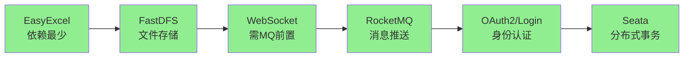
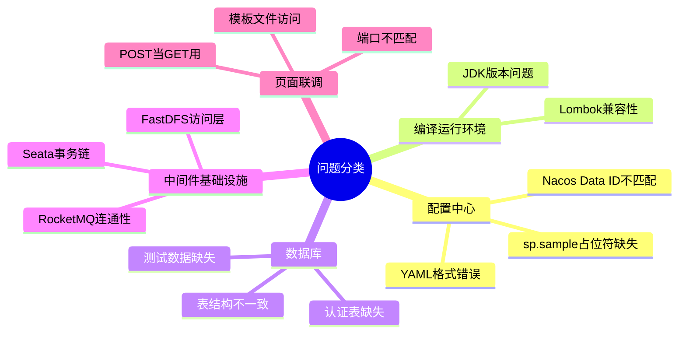

# Java 组件使用（一）内训测试全过程纪要

> [!info] TL;DR
> 本文记录《Java 组件使用（一）》内训的完整测试过程，涉及 **EasyExcel、FastDFS、WebSocket、RocketMQ、OAuth2、Seata** 六大组件。测试过程中先后解决了 Nacos 配置加载失败、JDK 与 Lombok 不兼容、FastDFS HTTP 访问层未启动、RocketMQ 依赖导致 WebSocket 启动失败、OAuth2 认证库表缺失、jwt.jks 格式异常、Seata 远端数据与事务依赖不完整等问题。

---

## 一、任务背景与初始目标

### 1.1 任务目标

根据《Java 组件使用（一）》内训视频，整理内训笔记，运行示例代码，并在评论区提交笔记和运行截图。

### 1.2 基本原则

> [!warning] 基本原则
> - 优先按培训要求完成组件验证与笔记整理
> - **不直接修改业务代码**
> - 优先通过环境配置、启动方式、依赖补齐、测试步骤说明来推进验证

### 1.3 涉及模块

| 模块 | 主要功能 |
|------|----------|
| eams-sample | 主示例模块 |
| eams-sample-ws | WebSocket 模块 |
| eams-sample-rmq | RocketMQ 模块 |
| eams-oauth2 | OAuth2 认证服务 |
| eams-login | 登录服务 |
| eams-sample-seata | Seata 分布式事务示例 |

### 1.4 核心测试组件

1. EasyExcel 导入导出
2. FastDFS 文件上传/下载/删除
3. WebSocket 聊天
4. RocketMQ 消息推送
5. OAuth2 / Login / Token 获取
6. Seata 分布式事务示例

---

## 二、问题排查与解决全过程

### 2.1 配置中心问题

#### 问题 1：占位符未解析

> [!error] 首次启动报错
> ```
> Could not resolve placeholder 'sp.sample' in value "${sp.sample}"
> ```

**根因定位**：
- `application.yaml` 中 `server.port=${sp.sample}` 和 `spring.application.name=${sn.sample}` 占位符未注入
- Nacos 中配置名是 `third-service.yaml`，而代码要求的是 `third-services.yaml`（Data ID 不匹配）
- Nacos YAML 配置内容格式错误（缩进、换行、URL 断开等）

**解决措施**：
- 修正 Nacos Data ID 名称
- 逐个修复 YAML 配置格式
- 修复 `sp.sample`、`sn.sample`、MySQL URL、FastDFS、RocketMQ、Seata 等关键配置项

#### 问题 2：编译环境报错

> [!error] 报错信息
> ```java
> java.lang.NoSuchFieldError: com.sun.tools.javac.tree.JCTree$JCImport.qualid
> ```

**根因定位**：JDK 版本与 Lombok / 注解处理器不兼容

**解决措施**：
- 本机存在多个 JDK：JDK8 过老、JDK11 目录为空、JDK17 和 JDK21 可用
- 补充项目级 JDK17 运行方式
- 增加 Maven 辅助脚本强制以 JDK17 执行构建

---

### 2.2 数据库问题

#### 问题 1：OAuth2 启动报错

> [!error] 报错信息
> ```sql
> Table 'zo_eams.menu' doesn't exist
> ```

**根因定位**：OAuth2 示例依赖额外的认证专用表结构，而非主业务库原样结构

#### 问题 2：jwt.jks 文件格式异常

> [!error] 报错信息
> ```text
> Cannot load keys from store: class path resource [jwt.jks]
> Invalid keystore format
> ```

**根因定位**：资源目录中的 `jwt.jks` 实际已被转换为 PKCS12 格式，但代码按 JKS 读取

**解决措施**：比对 `jwt.jks`、`jwt.jks.old`、`jwt.pfx`，恢复可用的 JKS 文件

#### 问题 3：数据库字段不匹配

> [!error] 报错信息
> ```sql
> Unknown column 'username' in 'field list'
> ```

**根因定位**：
- OAuth2 查询 `user` 表时需要 `username` 字段
- 主业务库 `user` 表字段为 `name/mobile/password`，与 OAuth2 示例实体不一致

**解决措施**：
- 在现有 `user` 表增加 `username` 字段
- 插入 `admin` / `test` 两个测试用户
- 补齐 `role`、`user_role`、`menu`、`role_menu` 等表及示例数据

---

### 2.3 中间件与基础设施问题

#### 问题 1：FastDFS HTTP 访问层未启动

**排查过程**：
```bash
# Linux 侧端口检查
ss -lntp | grep 22122  # tracker 在监听
ss -lntp | grep 23000  # storage 在监听
ss -lntp | grep 8888   # 未监听！
```

> [!danger] 结论
> tracker 和 storage 正常，但 HTTP 文件访问层（nginx）未提供服务

**解决措施**：
- 检查 tracker/storaged 注册状态
- 检查容器端口映射
- 修正 Nacos 中 `fastdfs.tracker-servers` 和 `fastdfs.nginx-servers` 配置
- 确认 storage 注册 IP 未误写为容器内网 IP

#### 问题 2：WebSocket 启动失败

> [!error] 报错信息
> ```text
> org.springframework.cloud.stream.binder.BinderException
> connect to [192.168.146.130:9876] failed
> ```

**根因定位**：`eams-sample-ws` 启动时绑定了 RocketMQ 消费者，RocketMQ 不可用导致 WebSocket 无法启动

#### 问题 3：WebSocket 页面端口不匹配

- `chat.html` 中 WebSocket 地址写死为 `ws://localhost:20003/chat`
- 实际 WsApplication 启动端口是 `10800`
- 导致 localhost 访问被拒绝

#### 问题 4：chat.html 无法直接访问

- `chat.html` 放在 `templates` 目录而非 `static`
- 无额外页面映射，直接访问返回 Whitelabel 404

**解决措施**：
- 方案一：通过 Nacos 把 `sp.ws` 调整到 `20003` 统一端口
- 方案二：直接用浏览器打开本地 `chat.html` 文件测试

#### 问题 5：WebSocket 必须使用有效 JWT

- 服务端从 token 中解析用户 ID 作为连接标识
- 登录链路必须先打通

---

### 2.4 页面与联调方式问题

#### 问题：POST 接口当 GET 访问

> [!error] 报错信息
> ```http
> 405 Method Not Allowed
> ```

> [!warning] 原因
> 直接在浏览器地址栏访问 POST 接口，浏览器发送的是 GET

> [!tip] 解决措施
> 使用 Knife4j、PowerShell 或 Postman 以 POST 方式调用

---

## 三、组件测试顺序

为最大化出结果和截图效率，建议顺序为：



| 顺序 | 组件 | 原因 |
|------|------|------|
| 1 | EasyExcel | 依赖最少，最易出效果 |
| 2 | FastDFS | 文件存储基础组件 |
| 3 | WebSocket | 需要 RocketMQ 前置 |
| 4 | RocketMQ | 消息推送 |
| 5 | OAuth2/Login | 身份认证 |
| 6 | Seata | 分布式事务 |

---

## 四、数据库脚本说明

### 脚本清单

| 脚本 | 用途 |
|------|------|
| zo_eams.sql | 主业务库 |
| zo_eams_init_dict.sql | 字典数据 |
| zo_eams_init_region.sql | 地区数据 |
| zo_eams_init_sys.sql | 系统数据 |
| zo_eams_init_user.sql | 用户数据 |
| zo_eams_test_data.sql | 测试数据（可选） |

### 导入策略

> [!tip] 建议
> - **不需要一次性导入全部脚本**
> - EasyExcel、FastDFS、WebSocket、RocketMQ 可按最小环境逐步验证
> - 涉及登录、OAuth2、Seata 时必须补齐相应数据库结构

---

## 五、测试最终结果

> [!success] 所有组件测试通过
> 以下组件均已完成核心功能验证：

| 组件 | 状态 | 说明 |
|------|------|------|
| eams-sample | ✅ | 基础模块可启动 |
| EasyExcel | ✅ | 导入导出流程可测试 |
| FastDFS | ✅ | 上传/下载/访问链路可用 |
| WebSocket | ✅ | 聊天室联调完成 |
| RocketMQ | ✅ | 消息推送可用 |
| OAuth2/Login | ✅ | Token 获取链路打通 |
| Seata | ✅ | 远端保存与事务路径走通 |

---

## 六、问题类型汇总



| 分类 | 主要问题 |
|------|----------|
| **配置中心** | sp.sample 占位符缺失、Nacos Data ID 不匹配、YAML 格式错误 |
| **编译运行** | JDK 版本问题、Lombok/注解处理器不匹配 |
| **数据库** | 表结构不一致、认证表（username/role/menu）缺失、测试数据缺失 |
| **中间件** | FastDFS 8888 未监听、RocketMQ/Seata 连通性 |
| **联调** | POST 当 GET、templates 访问、端口不匹配 |

---

## 七、联调测试要点

### WebSocket + RocketMQ 联调流程

> [!step] 联调步骤
> 1. 调用登录接口，获取 token
> 2. 本地直接打开聊天页 `chat.html`
> 3. 将 token 原样粘贴到页面中（**不要加 Bearer 前缀**）
> 4. 用两个窗口分别连接两个用户
> 5. 先测试页面内点对点消息和 all 群发
> 6. 再通过 `eams-sample-rmq` 的 `POST /rmq/publish` 向在线客户端推送消息

### Seata 测试要点

> [!warning] 注意事项
> - 远端 `TransServiceImpl.java` 写死了固定 ID 的 SQL
> - 需要在 `sample` 表中预置对应数据
> - 检查 Seata AT 模式的 `undo_log` 表是否配置正确

---

## 八、可扩展测试内容

以下内容本次未覆盖，可后续补测：

- 声明式服务（OpenFeign + Sentinel）
- Java 调 C++ 服务模块 `eams-sample-cpp`

---

## References

- [[07-Java组件使用一/README]] - 内训课程知识点汇总
- 内训视频：《Java 组件使用（一）》
- 相关笔记：[[10-项目/微服务项目实战/01-环境搭建/README]] - 环境配置参考
