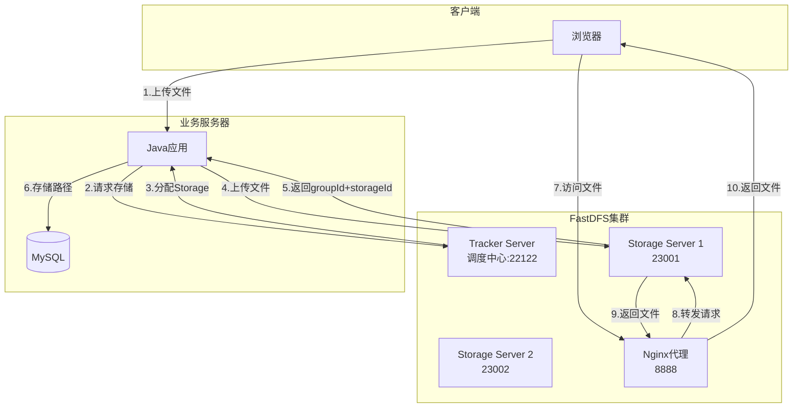
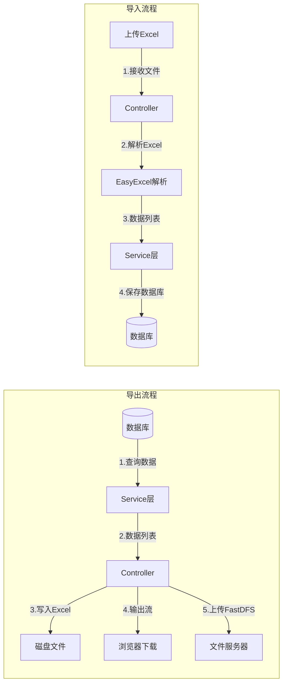
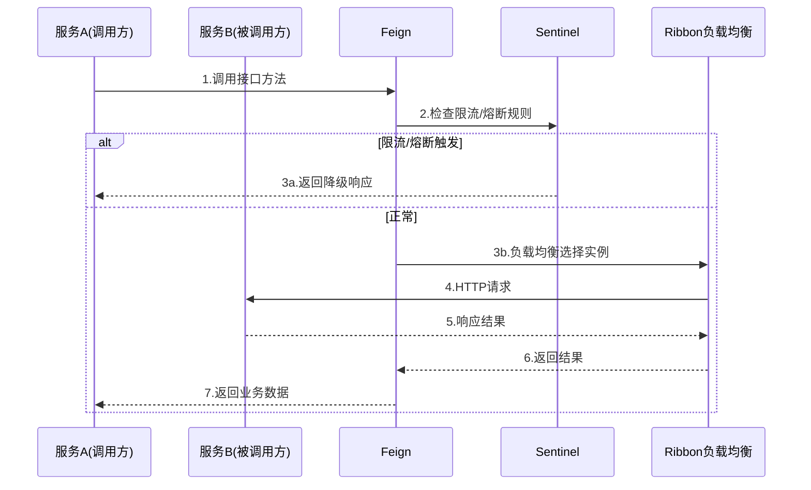
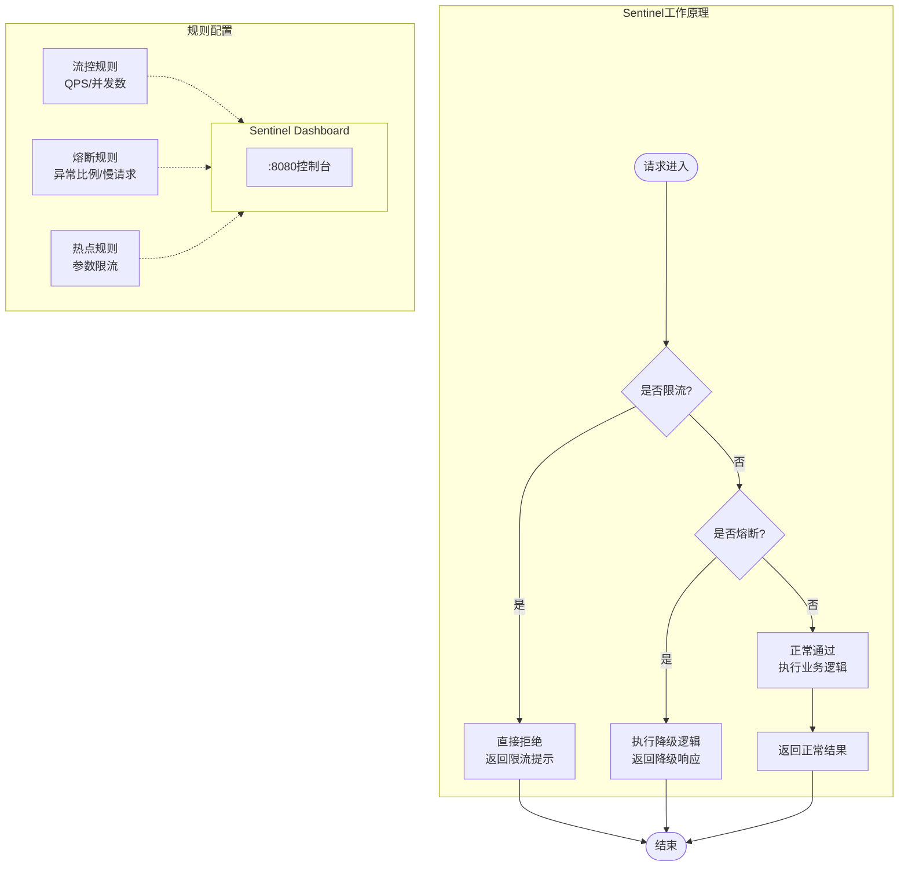
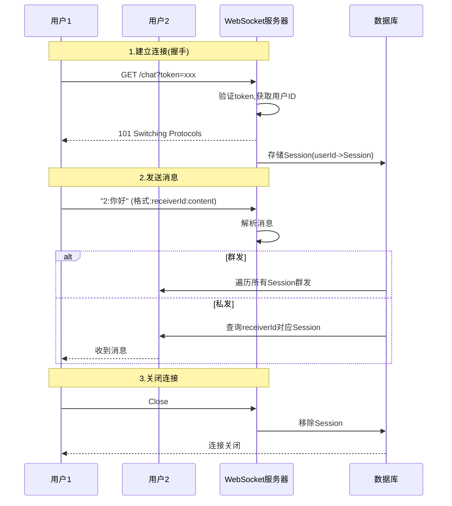
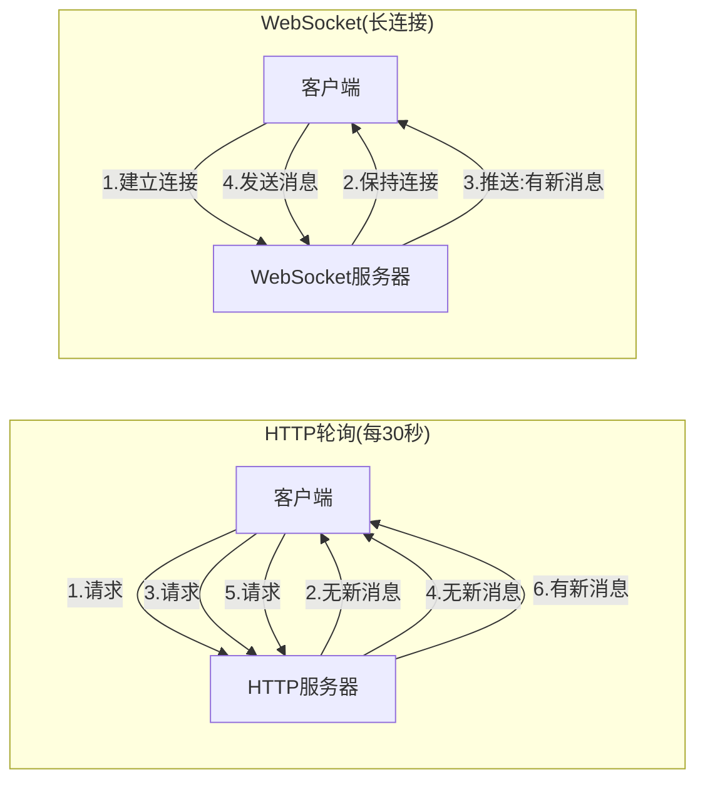
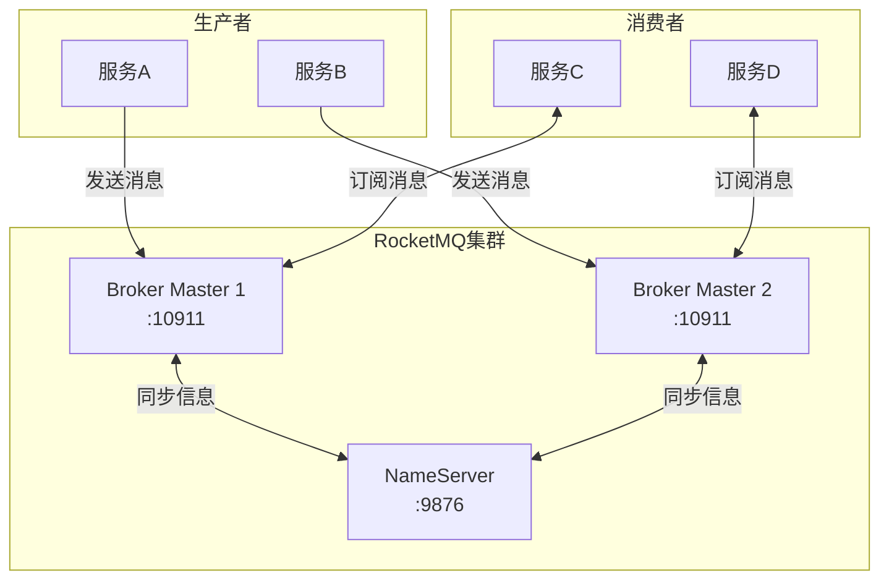
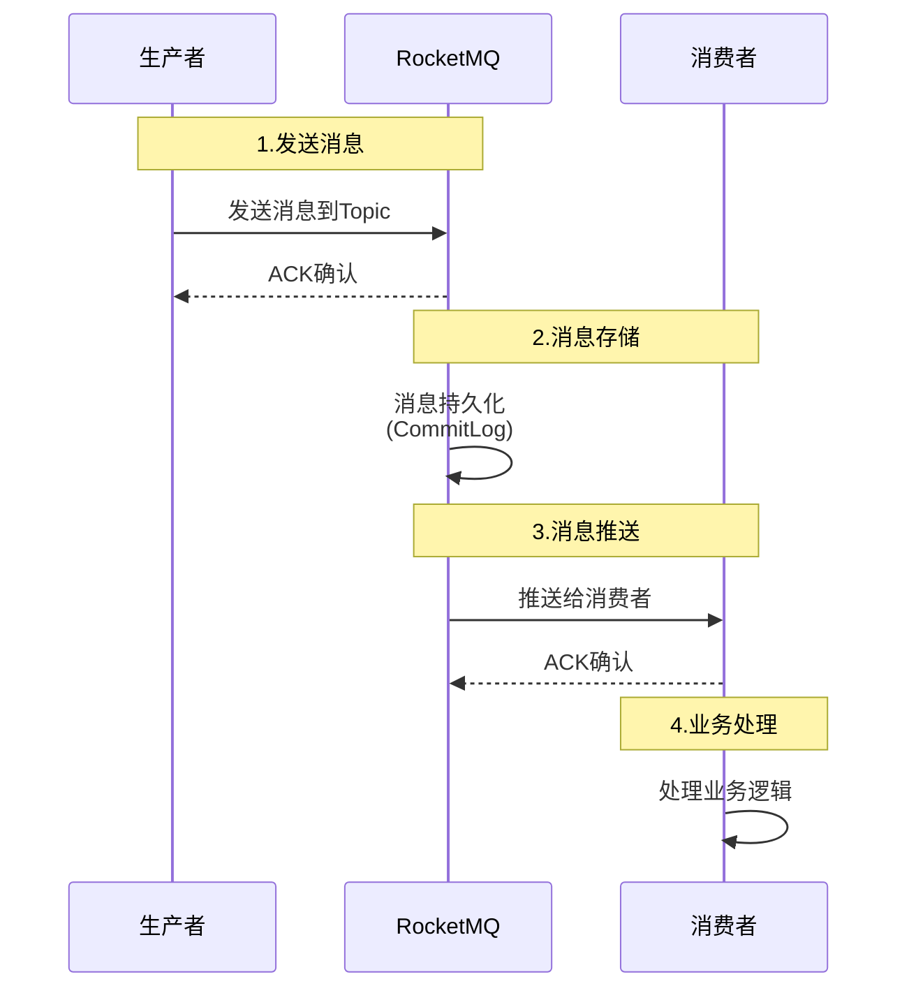
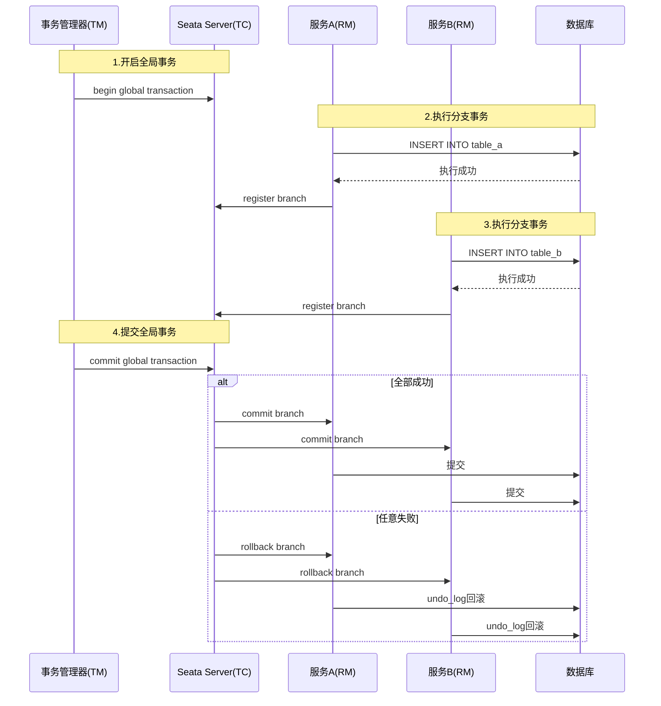

# Java组件使用（一）

## TL;DR

本期主要讲解6个Java组件：文件存储(FastDFS)、Excel导入导出(EasyExcel)、声明式服务(OpenFeign+Sentinel)、WebSocket即时通讯、消息中间件(RocketMQ)、分布式事务(Seata)。

---

## 一、文件存储 - FastDFS

### 1.1 为什么要用文件服务器

单体架构下文件存储在应用服务器磁盘，但存在以下问题：
- 集群环境下文件需要复制多份
- 占用大量磁盘空间
- 文件同步消耗带宽
- 影响业务服务器性能

文件服务器专门处理文件存储，职责分离，更利于扩展。

### 1.2 FastDFS简介

分布式文件系统，提供文件存储、下载、上传功能。

**组件**：
- Tracker Server：调度中心
- Storage Server：存储节点
- Nginx：提供HTTP访问

### 1.3 FastDFS架构图



### 1.4 文件存储流程

```
1. 前端上传文件 → 业务服务器
2. 业务服务器 → FastDFS存储
3. FastDFS返回groupId + storageId
4. 业务服务器 → 数据库（存储groupId + storageId）
5. 前端访问时：组装的URL + groupId + storageId
```

### 1.4 核心代码

```java
// 文件上传
@PostMapping("/upload")
public JsonVO<String> upload(MultipartFile file) {
    // 获取文件后缀
    String extName = file.getOriginalFilename()
        .substring(file.getOriginalFilename().lastIndexOf(".") + 1);

    // 上传到FastDFS
    FileInfo info = dfs.upload(file.getBytes(), extName);

    // 返回文件访问地址
    String url = fastdfsConfig.getUrlPrefix() + info.getFullPath();
    return JsonVO.success(url);
}

// 文件下载
@GetMapping("/download")
public ResponseEntity<byte[]> download(String groupId, String storageId) {
    byte[] data = dfs.download(groupId, storageId);

    HttpHeaders headers = new HttpHeaders();
    headers.setContentDispositionFormData("attachment",
        "image_" + System.currentTimeMillis() + ".jpg");
    headers.setContentType(MediaType.IMAGE_JPEG);

    return new ResponseEntity<>(data, headers, HttpStatus.OK);
}

// 文件删除
@DeleteMapping("/delete")
public JsonVO<Void> delete(String groupId, String storageId) {
    int result = dfs.deleteFile(groupId, storageId);
    if (result == 0) {
        return JsonVO.success();
    }
    return JsonVO.fail("删除失败");
}
```

### 1.5 数据库存储

数据库只存储关键路径信息：
- group名称（如：group1）
- storageId（如：M00/00/00/xxx.jpg）

访问地址在获取时动态组装，不存入数据库。

---

## 二、Excel导入导出 - EasyExcel

### 2.1 依赖引入

```xml
<dependency>
    <groupId>com.alibaba</groupId>
    <artifactId>easyexcel</artifactId>
</dependency>
```

### 2.2 Excel导入导出流程



### 2.3 实体类定义

```java
@Data
@ExcelProperty(value = "编号", index = 0)
private Integer id;

@ExcelProperty(value = "用户名", index = 1)
private String name;

@ExcelProperty(value = "手机号", index = 2)
private String phone;
```

### 2.3 导出到磁盘

```java
// 导出到磁盘
List<User> users = userService.list();
EasyExcel.write("test.xlsx")
    .sheet("用户")
    .head(User.class)
    .doWrite(users);
```

### 2.4 导出到输出流（响应前端）

```java
@GetMapping("/export")
public ResponseEntity<byte[]> export() {
    List<User> users = userService.list();

    ByteArrayOutputStream out = new ByteArrayOutputStream();
    EasyExcel.write(out)
        .sheet("用户")
        .head(User.class)
        .doWrite(users);

    HttpHeaders headers = new HttpHeaders();
    headers.setContentDispositionFormData("attachment", "users.xlsx");
    headers.setContentType(MediaType.APPLICATION_OCTET_STREAM);

    return new ResponseEntity<>(out.toByteArray(), headers, HttpStatus.OK);
}
```

### 2.5 导入解析

```java
@PostMapping("/import")
public JsonVO<Void> importExcel(MultipartFile file) {
    EasyExcel.read(file.getInputStream())
        .head(User.class)
        .sheet()
        .doRead();

    return JsonVO.success();
}
```

### 2.6 导出到FastDFS

```java
// 导出并上传到FastDFS
ByteArrayOutputStream out = new ByteArrayOutputStream();
EasyExcel.write(out)
    .sheet("用户")
    .head(User.class)
    .doWrite(users);

// 上传到FastDFS
FileInfo info = dfs.upload(out.toByteArray(), "xlsx");
```

---

## 三、声明式服务 - OpenFeign

### 3.1 简介

声明式HTTP客户端，用于服务间调用。

### 3.2 OpenFeign调用流程



### 3.3 依赖引入

```xml
<dependency>
    <groupId>org.springframework.cloud</groupId>
    <artifactId>spring-cloud-starter-openfeign</artifactId>
</dependency>
```

### 3.3 服务接口定义

```java
@FeignClient(name = "cpp-simple", url = "${thirdparty.cpp-simple.url}")
public interface SimpleService {

    @GetMapping("/simple")
    JsonVO<PageVO<SimpleDTO>> get(@RequestParam Map<String, Object> params);

    @PostMapping("/simple")
    JsonVO<SimpleDTO> post(@RequestBody AddSimpleDTO dto);

    @PutMapping("/simple")
    JsonVO<Void> put(@RequestBody UpdateSimpleDTO dto);

    @DeleteMapping("/simple")
    JsonVO<Void> delete(@RequestBody List<String> ids);
}
```

### 3.4 降级处理

```java
@Component
public class SimpleServiceFallback implements SimpleService {

    @Override
    public JsonVO<PageVO<SimpleDTO>> get(Map<String, Object> params) {
        return JsonVO.fail("服务调用失败");
    }

    // 其他方法类似...
}
```

### 3.5 FallbackFactory

```java
@Component
public class SimpleServiceFallbackFactory
    implements FallbackFactory<SimpleService> {

    @Override
    public SimpleService create(Throwable cause) {
        return new SimpleService() {
            @Override
            public JsonVO<PageVO<SimpleDTO>> get(Map<String, Object> params) {
                return JsonVO.fail(cause.getMessage());
            }
            // 其他方法...
        };
    }
}
```

### 3.6 配置启用

```java
@EnableFeignClients(basePackages = "com.zerotask.eams.**.feign")
```

---

## 四、服务限流与熔断 - Sentinel

### 4.1 简介

Sentinel提供流量控制、熔断降级功能，保护系统稳定性。

### 4.2 Sentinel工作原理



### 4.3 依赖引入

```xml
<dependency>
    <groupId>com.alibaba.cloud</groupId>
    <artifactId>spring-cloud-starter-alibaba-sentinel</artifactId>
</dependency>
```

### 4.3 配置

```yaml
spring:
  cloud:
    sentinel:
      transport:
        dashboard: localhost:8080
      eager: true
```

### 4.4 流控规则

```java
// 流控规则
FlowRule rule = new FlowRule();
rule.setResource("cpp-simple-query");
rule.setGrade(RuleConstant.FLOW_GRADE_QPS);
rule.setCount(1);  // 每秒1次
rule.setControlBehavior(RuleConstant.CONTROL_BEHAVIOR_DEFAULT);
```

### 4.5 熔断降级规则

```java
// 熔断规则
DegradeRule rule = new DegradeRule();
rule.setResource("cpp-simple-query");
rule.setGrade(RuleConstant.DEGRADE_GRADE_EXCEPTION_RATIO);
rule.setCount(0.5);  // 异常比例50%
rule.setTimeWindow(10);  // 熔断10秒
```

### 4.6 规则类型

| 类型 | 说明 |
|------|------|
| 流控 | 限制请求速率，防止刷屏 |
| 熔断降级 | 异常时快速失败，提升体验 |
| 热点参数限流 | 针对特定参数限流 |
| 系统自适应 | 根据系统负载自动限流 |

---

## 五、WebSocket即时通讯

### 5.1 简介

WebSocket实现双向通讯，解决HTTP轮询带宽占用问题。

### 5.2 WebSocket通讯流程



### 5.3 HTTP轮询 vs WebSocket



### 5.4 依赖引入

```xml
<dependency>
    <groupId>org.springframework.boot</groupId>
    <artifactId>spring-boot-starter-websocket</artifactId>
</dependency>
```

### 5.3 配置类

```java
@Configuration
public class WebSocketConfig
    extends ServerEndpointConfig.Configurator {

    @Bean
    public ServerEndpointExporter serverEndpointExporter() {
        return new ServerEndpointExporter();
    }
}
```

### 5.4 握手拦截器

```java
@Component
public class AuthHandler extends ServerEndpointConfig.Configurator {

    @Override
    public void modifyHandshake(
            ServerEndpointConfig sec,
            HandshakeRequest request,
            HandshakeResponse response) {
        // 获取token
        String token = request.getHeader("token");

        // 解析JWT获取用户ID
        // 省略解析逻辑...

        // 设置用户ID到session
        sec.getUserProperties().put("uid", userId);
    }
}
```

### 5.5 服务端点

```java
@ServerEndpoint(value = "/chat", configurator = AuthHandler.class)
@Component
public class ChatServer {

    // 在线用户池
    private static Map<String, Session> sessions = new ConcurrentHashMap<>();

    @OnOpen
    public void onOpen(Session session) {
        String uid = (String) session.getUserProperties().get("uid");
        sessions.put(uid, session);
    }

    @OnMessage
    public void onMessage(String message, Session session) {
        // 格式：receiverId:content
        String[] parts = message.split(":");
        String receiverId = parts[0];
        String content = parts[1];

        if ("all".equals(receiverId)) {
            // 群发
            sessions.values().forEach(s -> s.getAsyncRemote().sendText(content));
        } else {
            // 私发
            Session receiver = sessions.get(receiverId);
            if (receiver != null) {
                receiver.getAsyncRemote().sendText(content);
            }
        }
    }

    @OnClose
    public void onClose(Session session) {
        String uid = (String) session.getUserProperties().get("uid");
        sessions.remove(uid);
    }
}
```

### 5.6 前端示例

```javascript
const ws = new WebSocket("ws://localhost:8080/chat");

ws.onopen = () => console.log("连接成功");
ws.onmessage = (event) => console.log("收到消息:", event.data);
ws.send("2:你好");  // 给用户2发送消息
ws.send("all:大家好");  // 群发
```

---

## 六、消息中间件 - RocketMQ

### 6.1 简介

用于分布式系统间消息传递，实现服务解耦、异步通信。

### 6.2 RocketMQ架构



### 6.3 消息流程



### 6.4 常见场景

- 异步处理（如导出Excel后通知下载）
- 消息推送（如WebSocket消息）
- 数据同步（如多系统数据一致性）

### 6.5 依赖引入

```xml
<dependency>
    <groupId>com.alibaba.cloud</groupId>
    <artifactId>spring-cloud-starter-stream-rocketmq</artifactId>
</dependency>
```

### 6.4 生产者配置

```yaml
spring:
  cloud:
    stream:
      rocketmq:
        binder:
          name-server: localhost:9876
      bindings:
        output:
          destination: test-topic
          content-type: application/json
```

### 6.5 消息发送

```java
@Autowired
private Source source;

public void publish(NotifyMessage message) {
    source.output()
        .send(MessageBuilder.withPayload(message).build());
}
```

### 6.6 消费者配置

```yaml
spring:
  cloud:
    stream:
      rocketmq:
        binder:
          name-server: localhost:9876
      bindings:
        input:
          destination: test-topic
          content-type: application/json
          group: consumer-group
```

### 6.7 消息接收

```java
@Component
public class NotifyListener {

    @StreamListener("input")
    public void onMessage(NotifyMessage message) {
        // 收到消息后推送给WebSocket客户端
        chatServer.sendMessage(message.getReceiverId(),
            message.getContent());
    }
}
```

---

## 七、分布式事务 - Seata

### 7.1 简介

Seata提供分布式事务解决方案，保证跨服务数据一致性。

### 7.2 Seata架构

```mermaid
flowchart TB
    subgraph Client["Seata Client"]
        TM["TM<br/>事务管理器<br/>(发起方)"]
        RM1["RM1<br/>资源管理器<br/>(服务A)"]
        RM2["RM2<br/>资源管理器<br/>(服务B)"]
    end

    subgraph Server["Seata Server"]
        TC["TC<br/>事务协调器<br/>:8091"]
    end

    subgraph DB["数据库"]
        DB1[(服务A数据库)]
        DB2[(服务B数据库)]
        Undo["undo_log<br/>(回滚日志)]
    end

    TM -->|"1.开启全局事务"| TC
    TC -->|"2.注册分支事务"| RM1
    TC -->|"3.注册分支事务"| RM2
    RM1 -->|"4.执行SQL<br/>记录undo_log"| DB1
    RM2 -->|"5.执行SQL<br/>记录undo_log"| DB2
    DB1 -->|"6.报告分支状态"| TC
    DB2 -->|"7.报告分支状态"| TC
    TC -->|"8.提交/回滚"| TM
    Undo -.->|"回滚时使用"| RM1
    Undo -.->|"回滚时使用"| RM2
```

### 7.3 AT模式流程



### 7.4 角色

- TC：事务协调器（Seata Server）
- TM：事务管理器（发起方）
- RM：资源管理器（参与方）

### 7.5 依赖引入

```xml
<dependency>
    <groupId>com.alibaba.cloud</groupId>
    <artifactId>spring-cloud-starter-alibaba-seata</artifactId>
</dependency>
```

### 7.4 配置

```yaml
seata:
  tx-service-group: my_test_tx_group
  service:
    vgroup-mapping:
      my_test_tx_group: seata-server
  registry:
    type: nacos
    nacos:
      server-addr: localhost:8848
```

### 7.5 使用方式

```java
@Service
public class OrderService {

    @Autowired
    private JdbcTemplate jdbcTemplate;

    @Autowired
    private RemoteService remoteService;

    @GlobalTransactional
    public void testSeata() {
        // 1. 本地服务保存
        jdbcTemplate.update(
            "UPDATE simple SET name = ? WHERE id = ?",
            "测试", "1"
        );

        // 2. 远程服务保存
        remoteService.testSave();
    }
}
```

### 7.6 事务模式

| 模式 | 说明 |
|------|------|
| AT | 自动补偿（推荐） |
| TCC | 两阶段提交 |
| SAGA | 长事务 |
| XA | 强一致性 |

---

## 常见问题

### 1. FastDFS

- 上传失败：检查Nginx和Storage服务是否正常
- 文件无法访问：检查防火墙端口是否放行

### 2. EasyExcel

- 导入失败：检查实体类注解与Excel列是否匹配
- 文件过大：使用分批导出

### 3. OpenFeign

- 服务调用超时：检查超时配置
- 降级不生效：检查FallbackFactory是否正确注入

### 4. Sentinel

- 规则不生效：检查客户端IP是否正确配置
- dashboard无法连接：检查端口是否放行

### 5. WebSocket

- 连接失败：检查协议是否为ws://
- 消息丢失：检查Session池中用户是否在线

### 6. RocketMQ

- 消息积压：检查消费者是否正常
- 消息重复：业务端做好幂等处理

### 7. Seata

- 无法回滚：检查undo_log表是否配置
- TC连接失败：检查Seata Server是否注册到Nacos

---

## References

- [FastDFS](https://github.com/happyfish100/fastdfs)
- [EasyExcel](https://github.com/alibaba/easyexcel)
- [Sentinel](https://github.com/alibaba/Sentinel)
- [RocketMQ](https://rocketmq.apache.org/)
- [Seata](https://seata.io/)
- [[20-知识库/架构与工程实践/02-Java项目架构实战]]
