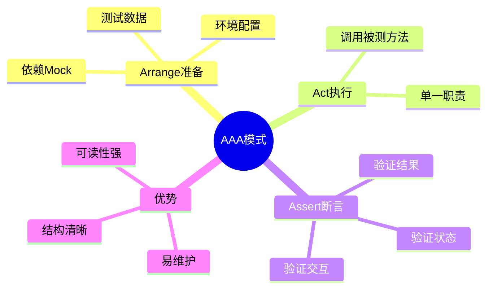

# AAA测试模式（Arrange-Act-Assert）



## 核心问题
**面试问法**：单元测试的AAA模式是什么？为什么要使用这种模式？

## 3行结论
1. **是什么**：AAA模式是单元测试的标准结构，分为Arrange（准备）、Act（执行）、Assert（断言）三个阶段
2. **为什么**：让测试逻辑清晰可读，每个测试只验证一个行为，降低维护成本
3. **怎么用**：每个测试方法按顺序包含三部分：准备测试数据 → 执行被测方法 → 验证结果是否符合预期

## 核心要点
1. **Arrange（准备）**：初始化对象、配置依赖、准备输入数据
2. **Act（执行）**：调用被测方法，通常只有一行代码（单一职责原则）
3. **Assert（断言）**：验证执行结果、对象状态或方法调用是否符合预期
4. **结构清晰**：三段式结构让测试意图一目了然，降低阅读成本
5. **可维护性**：当业务逻辑变化时，只需修改对应阶段的代码

## 示例
```java
// 测试用户注册功能
@Test
@DisplayName("用户注册 - 正常情况")
void shouldRegisterUserSuccessfully() {
    // Arrange：准备测试数据和依赖
    String username = "testuser";
    String email = "test@example.com";
    UserService userService = new UserService();

    // Act：执行被测方法
    User result = userService.register(username, email);

    // Assert：验证结果
    assertNotNull(result);
    assertEquals(username, result.getUsername());
    assertEquals(email, result.getEmail());
    assertTrue(result.getId() > 0);
}
```
**预期现象**：测试通过，用户对象被正确创建并包含正确的用户名、邮箱和ID

## 自测题
1. **Q**: AAA模式中，Act阶段通常应该有多少行代码？为什么？
   **A**: 通常只有1行代码，因为一个测试应该只验证一个行为（单一职责原则）。如果需要多行代码，可能说明被测方法职责不清晰或测试粒度过粗。

2. **Q**: 如果测试需要Mock外部依赖（如数据库），应该在AAA的哪个阶段完成？
   **A**: Arrange阶段。所有的测试准备工作（包括Mock对象创建、行为定义）都应该在Arrange阶段完成。

3. **Q**: AAA模式与Given-When-Then模式有什么关系？
   **A**: 它们是等价的，Given-When-Then常用于BDD（行为驱动开发）场景。Given对应Arrange，When对应Act，Then对应Assert。

4. **Q**: 如果一个测试方法中有多个Assert，是否违反AAA模式？
   **A**: 不违反。Assert阶段可以有多个断言，只要它们验证的是同一个Act操作的不同方面。但如果断言验证完全不同的行为，应该拆分为多个测试。

5. **Q**: 在Assert阶段发现问题后，应该如何定位是Arrange还是Act的问题？
   **A**: 通过断点调试或日志，先检查Arrange阶段的数据是否正确准备，再检查Act阶段的执行是否符合预期。结构化的AAA模式让问题定位更容易。

## 相关链接
- [[JUnit5单元测试-AAA模式示例]]
- [[Java-MOC]]
- [[单元测试最佳实践]]
