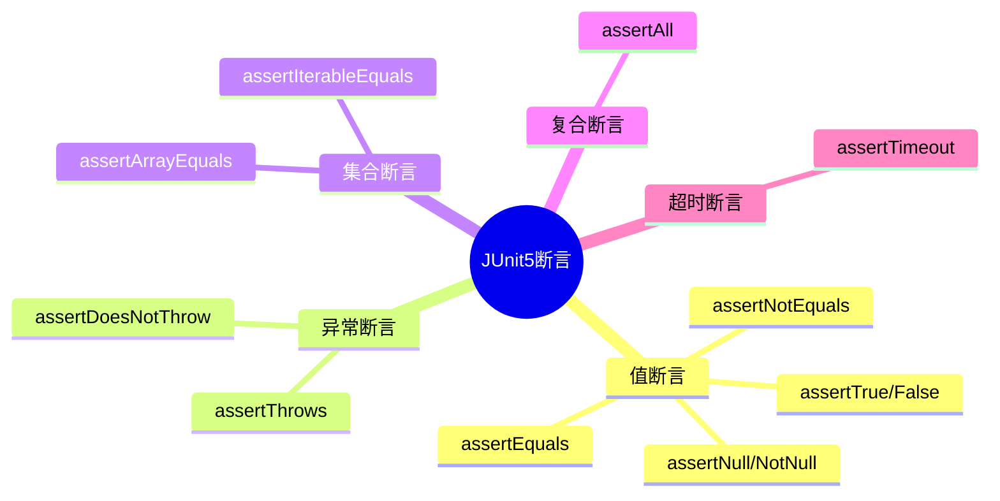

# JUnit5 断言方法详解



## 核心问题
**面试问法**：JUnit5中如何验证方法抛出了预期的异常？assertEquals和assertThrows的使用场景有什么区别？

## 3行结论
1. **是什么**：JUnit5提供了丰富的断言方法，用于验证代码执行结果是否符合预期，包括值断言、异常断言、集合断言等
2. **为什么**：不同断言方法针对不同验证场景，`assertEquals`验证返回值，`assertThrows`验证异常行为，使用正确的断言方法能提高测试的可读性和精确性
3. **怎么用**：正常业务逻辑用assertEquals验证结果，边界条件和异常场景用assertThrows验证异常类型

## 核心要点
1. **assertEquals(expected, actual)**：验证两个值相等，参数顺序是"期望值在前，实际值在后"
2. **assertThrows(ExceptionClass.class, executable)**：验证执行代码块时抛出指定类型的异常
3. **参数顺序很重要**：assertEquals中expected在前，失败时错误信息才准确
4. **异常类型要精确**：避免使用泛化的Exception.class，应使用具体的异常类型（如NullPointerException.class）
5. **可选的失败消息**：所有断言方法都支持最后一个参数传入失败时的提示信息

## 示例
```java
// assertEquals 示例：验证计算结果
@Test
@DisplayName("计算器加法测试")
void testAddition() {
    Calculator calc = new Calculator();

    // assertEquals(期望值, 实际值, 失败提示)
    assertEquals(5, calc.add(2, 3), "2+3应该等于5");
}

// assertThrows 示例：验证异常
@Test
@DisplayName("除以零应抛出异常")
void testDivisionByZero() {
    Calculator calc = new Calculator();

    // assertThrows(异常类型, 可执行代码)
    ArithmeticException exception = assertThrows(
        ArithmeticException.class,
        () -> calc.divide(10, 0)
    );

    // 还可以验证异常消息
    assertEquals("/ by zero", exception.getMessage());
}

// 错误示例：参数顺序错误
@Test
void badExample() {
    String result = processData();
    // ❌ 错误：实际值在前，期望值在后
    assertEquals(result, "expected");

    // ✅ 正确：期望值在前
    assertEquals("expected", result);
}
```
**预期现象**：
- assertEquals测试通过，2+3确实等于5
- assertThrows捕获到ArithmeticException，异常消息为"/ by zero"
- 参数顺序错误时，测试失败信息会反过来，难以理解

## 自测题
1. **Q**: assertEquals的正确参数顺序是什么？为什么这个顺序很重要？
   **A**: assertEquals(expected, actual) - 期望值在前，实际值在后。这个顺序很重要，因为测试失败时，错误信息会显示"期望X但得到Y"，如果顺序反了，错误信息就会混淆。

2. **Q**: 如何验证某个方法调用时抛出了NullPointerException？
   **A**: 使用assertThrows(NullPointerException.class, () -> methodCall())。第一个参数是期望的异常类型，第二个参数是lambda表达式包裹的方法调用。

3. **Q**: assertThrows返回什么？有什么用途？
   **A**: 返回捕获到的异常对象。可以用来进一步验证异常的消息内容、原因等属性，例如：`Exception ex = assertThrows(...); assertEquals("error", ex.getMessage());`

4. **Q**: 为什么不应该用assertThrows(Exception.class, ...)来验证异常？
   **A**: 因为Exception是所有异常的父类，太宽泛了。如果代码抛出了任何异常都会通过测试，无法精确验证是否抛出了预期的特定异常类型。应该使用具体的异常类如NullPointerException.class。

5. **Q**: 如何同时验证多个断言，并确保所有断言都被执行（即使前面的失败了）？
   **A**: 使用assertAll()方法。例如：`assertAll(() -> assertEquals(1, a), () -> assertEquals(2, b))`。这样即使第一个断言失败，第二个也会执行，最后汇总报告所有失败的断言。

## 相关链接
- [[JUnit5单元测试-AAA模式示例]]
- [[AAA测试模式-Arrange-Act-Assert]]
- [[Java-MOC]]
- [[单元测试最佳实践]]
