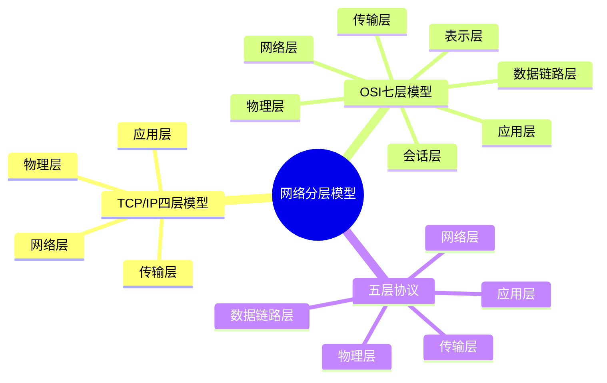

# 计算机网络分层模型-OSI与TCP-IP

## 知识导图



## 结论

1. **TCP/IP 四层模型**是实际应用的标准，简洁高效
2. **OSI 七层模型**是理论参考模型，便于理解网络通信原理
3. **五层协议**是教学中常用的折中方案，兼顾理论与实践

## 核心要点

- **TCP/IP 四层**：应用层、传输层、网络层、网络接口层（物理层）
- **OSI 七层**：应用层、表示层、会话层、传输层、网络层、数据链路层、物理层
- **五层协议**：在 TCP/IP 基础上将网络接口层拆分为数据链路层和物理层
- **应用层**：HTTP、FTP、DNS 等应用协议
- **传输层**：TCP（可靠）、UDP（快速）
- **网络层**：IP 协议，负责路由和寻址

## 对比分析

| 模型 | 层数 | 优点 | 缺点 | 适用场景 |
|------|------|------|------|---------|
| **TCP/IP 四层** | 4层 | 简洁实用，实际应用广泛 | 层次划分不够细致 | 实际网络开发 |
| **OSI 七层** | 7层 | 理论完整，便于教学 | 过于复杂，实际应用少 | 理论学习、网络设计 |
| **五层协议** | 5层 | 兼顾理论与实践 | 非官方标准 | 教学、考试 |

## 深入原理

### TCP/IP 四层模型

```
应用层 (Application)
   ↓
传输层 (Transport)     - TCP/UDP 端到端通信
   ↓
网络层 (Internet)      - IP 路由与寻址
   ↓
网络接口层 (Link)      - 以太网、WiFi 物理传输
```

### OSI 七层模型

- **应用层 (L7)**：用户接口，提供网络服务（HTTP、FTP）
- **表示层 (L6)**：数据格式转换、加密解密
- **会话层 (L5)**：建立、管理、终止会话
- **传输层 (L4)**：端到端可靠传输（TCP）
- **网络层 (L3)**：路由选择、IP 寻址
- **数据链路层 (L2)**：帧封装、MAC 地址
- **物理层 (L1)**：比特流传输、物理介质

### 网络、互联网、因特网的区别

- **网络 (Network)**：广义的计算机网络，任何互联的设备集合
- **互联网 (internet，小写)**：多个网络互联形成的网络系统
- **因特网 (Internet，大写)**：全球最大的互联网，使用 TCP/IP 协议

## 易错点

> [!warning] 常见陷阱
> 1. **混淆层数**：TCP/IP 实际是 4 层，不要说成 5 层或 7 层
> 2. **物理层位置**：OSI 物理层在最底层（L1），TCP/IP 中归入网络接口层
> 3. **应用层范围**：TCP/IP 应用层包含了 OSI 的应用层、表示层、会话层
> 4. **Internet 大小写**：大写 Internet 特指因特网，小写 internet 指一般互联网

## 自测题

1. **问**：TCP/IP 模型有几层？每层的名称是什么？
   > **答**：4 层。从上到下：应用层、传输层、网络层、网络接口层（物理层）

2. **问**：OSI 七层模型中，负责路由选择的是哪一层？
   > **答**：网络层（第 3 层），主要协议是 IP 协议

3. **问**：为什么实际开发中多用 TCP/IP 四层模型而非 OSI 七层？
   > **答**：TCP/IP 模型更简洁实用，符合实际网络协议实现；OSI 模型理论完整但过于复杂，实际应用较少

4. **问**：五层协议是在哪个模型基础上改进的？
   > **答**：在 TCP/IP 四层模型基础上，将网络接口层拆分为数据链路层和物理层

5. **问**：TCP 协议工作在哪一层？
   > **答**：传输层（OSI 第 4 层，TCP/IP 第 2 层）

## 相关链接

### 项目内部链接
- [[TCP三次握手与四次挥手]]
- [[HTTP协议详解]]
- [[IP地址与子网划分]]

### 外部参考资料
- [小林coding - 图解网络](https://www.xiaolincoding.com/network/) - 网络分层模型图解
- [RFC 1122 - Requirements for Internet Hosts](https://datatracker.ietf.org/doc/html/rfc1122) - TCP/IP 协议标准
- [计算机网络（谢希仁第8版）](https://book.douban.com/subject/35212495/) - 经典教材
