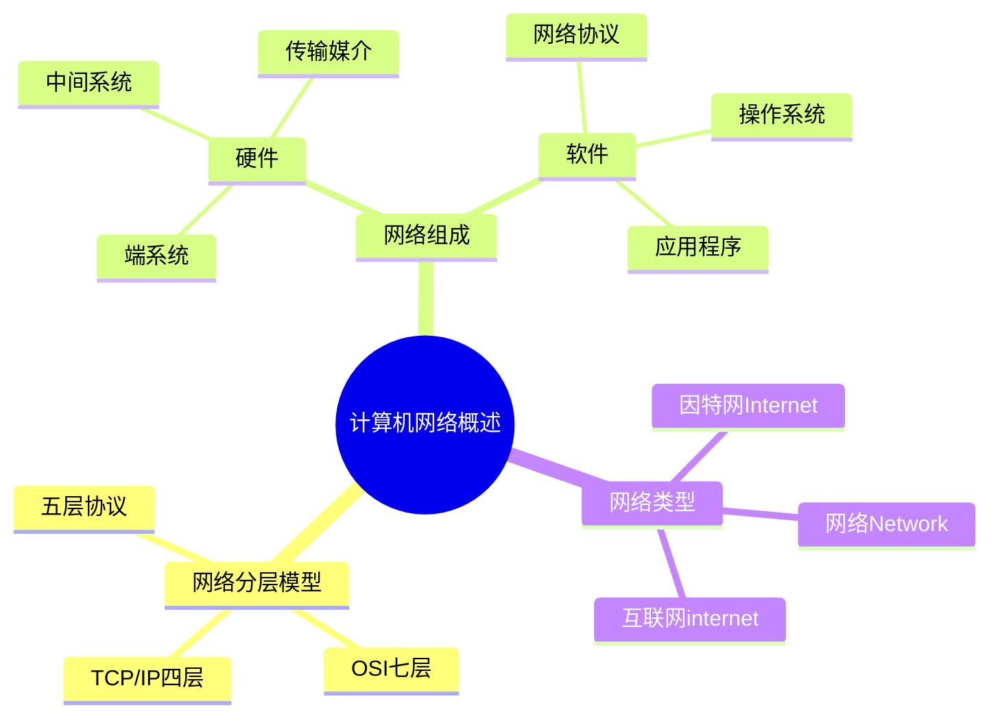

# 计算机网络概述-分层模型与端系统

## 知识导图



## 结论

1. **网络分层设计**是计算机网络的核心思想，TCP/IP四层是实际标准，OSI七层是理论参考
2. **端系统（计算机/主机）**是网络的边缘设备，运行应用程序；分为客户端（请求服务）和服务器（提供服务）
3. **客户端-服务器模型**是最常见的网络架构，客户端主动请求，服务器被动响应，协同完成网络通信

## 核心要点

- **TCP/IP 四层模型**：应用层、传输层、网络层、网络接口层，是实际应用标准
- **OSI 七层模型**：应用层、表示层、会话层、传输层、网络层、数据链路层、物理层，是理论参考
- **计算机网络组成**：硬件（端系统、中间系统、传输媒介）+ 软件（协议、操作系统、应用程序）
- **端系统（End System）**：网络边缘的计算机/主机，运行应用程序（如浏览器、邮件客户端）
- **中间系统**：路由器、交换机等网络核心设备，负责数据包转发，不运行用户应用
- **客户端-服务器模型**：最常见的网络架构，端系统分为客户端（请求服务）和服务器（提供服务）

## 深入原理

### 网络分层模型对比

#### TCP/IP 四层模型（实用标准）

```
┌─────────────────────────┐
│   应用层 (Application)   │ ← HTTP, FTP, DNS, SMTP
├─────────────────────────┤
│   传输层 (Transport)     │ ← TCP, UDP 端到端通信
├─────────────────────────┤
│   网络层 (Internet)      │ ← IP 路由与寻址
├─────────────────────────┤
│  网络接口层 (Link)       │ ← 以太网, WiFi 物理传输
└─────────────────────────┘
```

#### OSI 七层模型（理论参考）

- **L7 应用层**：用户接口，提供网络服务（HTTP、FTP）
- **L6 表示层**：数据格式转换、加密解密
- **L5 会话层**：建立、管理、终止会话
- **L4 传输层**：端到端可靠传输（TCP）
- **L3 网络层**：路由选择、IP 寻址
- **L2 数据链路层**：帧封装、MAC 地址
- **L1 物理层**：比特流传输、物理介质

#### 五层协议（教学常用）

在 TCP/IP 基础上将网络接口层拆分为：
- 数据链路层（逻辑链路控制）
- 物理层（物理信号传输）

### 计算机网络的组成：软件与硬件

计算机网络由**硬件**和**软件**两大部分组成，缺一不可。

#### 硬件组成

1. **端系统（主机）**
   - 个人计算机、服务器、智能手机、平板电脑
   - 物联网设备（智能家居、传感器）
   - 工作站、超级计算机

2. **中间系统（网络设备）**
   - **路由器**：连接不同网络，实现跨网络通信
   - **交换机**：同一网络内设备互联
   - **网关**：协议转换、网络边界控制
   - **中继器/集线器**：信号放大与转发

3. **传输媒介**
   - **有线**：双绞线、同轴电缆、光纤
   - **无线**：WiFi、蓝牙、5G、卫星

4. **网络接口卡（NIC）**
   - 网卡：实现计算机与网络的物理连接
   - 提供 MAC 地址，处理数据链路层协议

#### 软件组成

1. **网络协议**
   - TCP/IP 协议族（TCP、UDP、IP、HTTP、FTP、DNS等）
   - 定义数据格式、传输规则、错误处理

2. **网络操作系统**
   - Windows Server、Linux、Unix
   - 提供网络管理、资源共享、安全控制

3. **网络应用软件**
   - 浏览器（Chrome、Firefox）
   - 邮件客户端（Outlook、Thunderbird）
   - 即时通讯（微信、钉钉）
   - 文件传输工具（FTP客户端）

4. **网络管理软件**
   - 防火墙软件
   - 网络监控工具
   - 路由配置软件

**硬件是基础，软件是灵魂**：
- 硬件提供物理连接和数据传输能力
- 软件（协议和应用）定义如何使用硬件、如何通信

### 网络架构：端系统与中间系统

```
┌──────────────┐                           ┌──────────────┐
│  端系统A      │                           │  端系统B      │
│ (客户端)      │                           │ (服务器)      │
│              │                           │              │
│ [浏览器应用] │                           │ [Web服务器]  │
└──────┬───────┘                           └──────┬───────┘
       │                                          │
       │  应用层：HTTP请求/响应                    │
       │                                          │
       └───►路由器───►路由器───►交换机───►路由器◄──┘
          (中间系统)  (中间系统)  (中间系统)
```

**端系统（End System / Host）特征**：
- 位于网络边缘
- 运行应用程序（浏览器、邮件、游戏等）
- 包括：个人电脑、服务器、智能手机、物联网设备
- 拥有完整的网络协议栈（应用层到物理层）

**中间系统（Intermediate System）特征**：
- 位于网络核心
- 负责数据包转发和路由
- 包括：路由器、交换机、网关
- 不运行用户应用程序
- 只实现部分网络层次（如路由器工作在网络层）

### 网络、互联网、因特网的区别

| 术语 | 英文 | 含义 | 示例 |
|------|------|------|------|
| **网络** | Network | 任何互联的设备集合 | 家庭局域网、公司内网 |
| **互联网** | internet（小写） | 多个网络互联形成的网络系统 | 多个局域网连接 |
| **因特网** | Internet（大写） | 全球最大的互联网，使用TCP/IP | 你现在访问的全球网络 |

### 客户端与服务器详解

#### 客户端（Client）

**定义**：客户端是网络中**请求服务**的端系统，主动发起连接和请求。

**特征**：
- 主动发起通信（请求服务）
- 通常由用户直接操作
- 可以断线或临时在线
- 数量众多，分散在网络各处

**常见客户端类型**：
1. **Web 客户端**：浏览器（Chrome、Firefox、Safari）
2. **邮件客户端**：Outlook、Thunderbird、手机邮件 App
3. **数据库客户端**：MySQL Workbench、Navicat
4. **即时通讯客户端**：微信、QQ、钉钉
5. **游戏客户端**：LOL客户端、Steam客户端
6. **移动应用**：各种手机 App

#### 服务器（Server）

**定义**：服务器是网络中**提供服务**的端系统，被动等待并响应客户端请求。

**特征**：
- 被动等待客户端连接（监听端口）
- 24小时不间断运行
- 性能强大，配置高
- 可同时为多个客户端提供服务
- 拥有固定 IP 地址或域名

**常见服务器类型**：
1. **Web 服务器**：Apache、Nginx、IIS（提供网页）
2. **数据库服务器**：MySQL Server、PostgreSQL、Oracle（存储数据）
3. **邮件服务器**：Exchange Server、Postfix（收发邮件）
4. **文件服务器**：FTP Server、NAS（文件存储与共享）
5. **应用服务器**：Tomcat、JBoss（运行业务逻辑）
6. **游戏服务器**：处理游戏逻辑、玩家数据同步

#### 客户端-服务器通信示例

**场景：用户浏览网页**

```
┌─────────────────┐                      ┌─────────────────┐
│   客户端         │                      │   Web 服务器     │
│  (浏览器)        │                      │  (Nginx)        │
├─────────────────┤                      ├─────────────────┤
│ 1. 输入网址      │                      │ 1. 监听 80 端口  │
│    www.abc.com  │                      │    等待请求      │
│                 │                      │                 │
│ 2. DNS 解析     │                      │                 │
│    获取 IP      │                      │                 │
│                 │                      │                 │
│ 3. 发起连接     │─────TCP 三次握手────►│ 2. 接受连接      │
│                 │                      │                 │
│ 4. 发送 HTTP    │                      │                 │
│    GET 请求     │────GET /index.html──►│ 3. 接收请求      │
│                 │                      │                 │
│                 │                      │ 4. 处理请求      │
│                 │                      │    读取文件      │
│                 │                      │                 │
│ 5. 接收响应     │◄───返回 HTML 页面────│ 5. 发送响应      │
│                 │                      │                 │
│ 6. 渲染页面     │                      │ 6. 继续监听      │
│    展示给用户    │                      │    下一个请求    │
└─────────────────┘                      └─────────────────┘
```

#### 客户端-服务器模型 vs P2P模型

| 对比项 | 客户端-服务器模型 (C/S) | 对等网络模型 (P2P) |
|--------|------------------------|-------------------|
| **角色** | 明确分为客户端和服务器 | 每个节点既是客户端又是服务器 |
| **通信方式** | 客户端请求，服务器响应 | 节点间直接通信 |
| **服务器依赖** | 依赖中心服务器 | 无中心服务器，去中心化 |
| **扩展性** | 服务器成为瓶颈 | 节点越多，资源越丰富 |
| **管理** | 集中管理，易于控制 | 分散管理，难以控制 |
| **可靠性** | 服务器故障影响全局 | 单节点故障影响小 |
| **应用场景** | Web浏览、邮件、数据库 | BT下载、区块链、文件共享 |
| **示例** | 浏览网页、网购、在线游戏 | 迅雷下载、比特币、IPFS |

## 对比分析

### 三种分层模型对比

| 模型 | 层数 | 优点 | 缺点 | 适用场景 |
|------|------|------|------|---------|
| **TCP/IP 四层** | 4层 | 简洁实用，实际应用广泛 | 层次划分不够细致 | 实际网络开发 |
| **OSI 七层** | 7层 | 理论完整，便于教学 | 过于复杂，实际应用少 | 理论学习、网络设计 |
| **五层协议** | 5层 | 兼顾理论与实践 | 非官方标准 | 教学、考试 |

## 易错点

> [!warning] 常见陷阱
> 1. **混淆端系统和中间系统**：路由器不是端系统，是中间系统；你的电脑、手机才是端系统
> 2. **TCP/IP 层数混淆**：TCP/IP 实际是 4 层，不要说成 5 层或 7 层
> 3. **Internet 大小写**：大写 Internet 特指因特网，小写 internet 指一般互联网
> 4. **客户端和服务器角色不是固定的**：同一台电脑可以既做客户端（访问网页）又做服务器（开启文件共享）

## 自测题

1. **问**：什么是端系统？请举例说明。
   > **答**：端系统是位于网络边缘、运行应用程序的计算机或设备。包括：个人电脑、服务器、智能手机、平板、物联网设备等。端系统 = 主机（Host）。

2. **问**：路由器是端系统吗？为什么？
   > **答**：不是。路由器是中间系统，位于网络核心，主要负责数据包转发和路由选择，不运行用户应用程序。只有网络边缘运行应用的设备才是端系统。

3. **问**：TCP/IP 模型有几层？每层的名称是什么？
   > **答**：4 层。从上到下：应用层、传输层、网络层、网络接口层（物理层）

4. **问**：OSI 七层模型中，负责路由选择的是哪一层？
   > **答**：网络层（第 3 层），主要协议是 IP 协议

5. **问**：客户端-服务器模型中，客户端和服务器都是端系统吗？
   > **答**：是的。客户端（如浏览器）和服务器（如Web服务器）都是端系统，都位于网络边缘并运行应用程序。区别在于角色：客户端请求服务，服务器提供服务。

6. **问**：为什么实际开发中多用 TCP/IP 四层模型而非 OSI 七层？
   > **答**：TCP/IP 模型更简洁实用，符合实际网络协议实现；OSI 模型理论完整但过于复杂，实际应用较少

7. **问**：计算机网络由哪两大部分组成？各包含什么？
   > **答**：硬件和软件。硬件包括：端系统（电脑、服务器）、中间系统（路由器、交换机）、传输媒介（光纤、WiFi）；软件包括：网络协议（TCP/IP）、操作系统、应用程序（浏览器、邮件）

8. **问**：客户端和服务器的主要区别是什么？
   > **答**：客户端主动发起请求，请求服务，数量众多且可临时在线；服务器被动等待请求，提供服务，24小时运行，拥有固定IP。两者都是端系统，角色可以互换。

9. **问**：当你在浏览器输入网址访问网页时，浏览器和Web服务器分别扮演什么角色？
   > **答**：浏览器是客户端，主动发起HTTP请求；Web服务器是服务器，监听端口等待请求，接收后处理并返回HTML页面。这是典型的客户端-服务器模型。

## 相关链接

### 项目内部链接
- [[TCP三次握手与四次挥手]]
- [[HTTP协议详解]]
- [[IP地址与子网划分]]
- [[客户端服务器架构详解]]

### 外部参考资料
- [小林coding - 图解网络](https://www.xiaolincoding.com/network/) - 网络分层模型和端系统图解
- [RFC 1122 - Requirements for Internet Hosts](https://datatracker.ietf.org/doc/html/rfc1122) - TCP/IP 协议标准
- [计算机网络（谢希仁第8版）](https://book.douban.com/subject/35212495/) - 经典教材第1章
- [Computer Networking: A Top-Down Approach](https://gaia.cs.umass.edu/kurose_ross/index.php) - Kurose & Ross 经典教材
