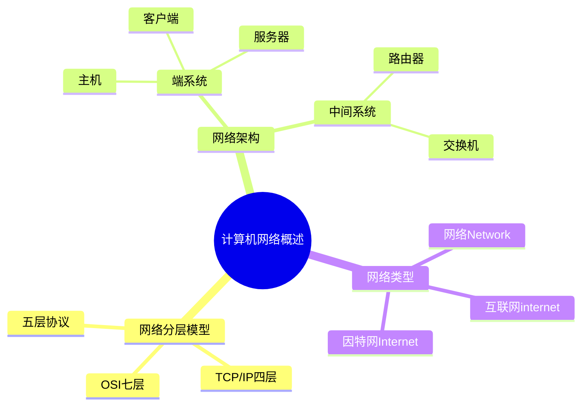

# 计算机网络概述-分层模型与端系统

## 知识导图



## 结论

1. **网络分层设计**是计算机网络的核心思想，TCP/IP四层是实际标准，OSI七层是理论参考
2. **端系统（计算机/主机）**是网络的边缘设备，运行应用程序；中间系统负责数据转发
3. **因特网（Internet）**是全球最大的互联网，所有连接到因特网的计算机都是端系统

## 核心要点

- **TCP/IP 四层模型**：应用层、传输层、网络层、网络接口层，是实际应用标准
- **OSI 七层模型**：应用层、表示层、会话层、传输层、网络层、数据链路层、物理层，是理论参考
- **端系统（End System）**：网络边缘的计算机/主机，运行应用程序（如浏览器、邮件客户端）
- **中间系统**：路由器、交换机等网络核心设备，负责数据包转发，不运行用户应用
- **客户端-服务器模型**：最常见的网络架构，端系统分为客户端（请求服务）和服务器（提供服务）
- **主机 = 端系统**：在网络术语中，主机和端系统是同义词

## 深入原理

### 网络分层模型对比

#### TCP/IP 四层模型（实用标准）

```
┌─────────────────────────┐
│   应用层 (Application)   │ ← HTTP, FTP, DNS, SMTP
├─────────────────────────┤
│   传输层 (Transport)     │ ← TCP, UDP 端到端通信
├─────────────────────────┤
│   网络层 (Internet)      │ ← IP 路由与寻址
├─────────────────────────┤
│  网络接口层 (Link)       │ ← 以太网, WiFi 物理传输
└─────────────────────────┘
```

#### OSI 七层模型（理论参考）

- **L7 应用层**：用户接口，提供网络服务（HTTP、FTP）
- **L6 表示层**：数据格式转换、加密解密
- **L5 会话层**：建立、管理、终止会话
- **L4 传输层**：端到端可靠传输（TCP）
- **L3 网络层**：路由选择、IP 寻址
- **L2 数据链路层**：帧封装、MAC 地址
- **L1 物理层**：比特流传输、物理介质

#### 五层协议（教学常用）

在 TCP/IP 基础上将网络接口层拆分为：
- 数据链路层（逻辑链路控制）
- 物理层（物理信号传输）

### 网络架构：端系统与中间系统

```
┌──────────────┐                           ┌──────────────┐
│  端系统A      │                           │  端系统B      │
│ (客户端)      │                           │ (服务器)      │
│              │                           │              │
│ [浏览器应用] │                           │ [Web服务器]  │
└──────┬───────┘                           └──────┬───────┘
       │                                          │
       │  应用层：HTTP请求/响应                    │
       │                                          │
       └───►路由器───►路由器───►交换机───►路由器◄──┘
          (中间系统)  (中间系统)  (中间系统)
```

**端系统（End System / Host）特征**：
- 位于网络边缘
- 运行应用程序（浏览器、邮件、游戏等）
- 包括：个人电脑、服务器、智能手机、物联网设备
- 拥有完整的网络协议栈（应用层到物理层）

**中间系统（Intermediate System）特征**：
- 位于网络核心
- 负责数据包转发和路由
- 包括：路由器、交换机、网关
- 不运行用户应用程序
- 只实现部分网络层次（如路由器工作在网络层）

### 网络、互联网、因特网的区别

| 术语 | 英文 | 含义 | 示例 |
|------|------|------|------|
| **网络** | Network | 任何互联的设备集合 | 家庭局域网、公司内网 |
| **互联网** | internet（小写） | 多个网络互联形成的网络系统 | 多个局域网连接 |
| **因特网** | Internet（大写） | 全球最大的互联网，使用TCP/IP | 你现在访问的全球网络 |

### 客户端-服务器模型 vs P2P模型

| 模型 | 端系统角色 | 特点 | 应用场景 |
|------|-----------|------|---------|
| **客户端-服务器 (C/S)** | 明确分为客户端和服务器 | 服务器集中管理，客户端发起请求 | Web浏览、邮件、数据库 |
| **对等网络 (P2P)** | 每个端系统既是客户端又是服务器 | 去中心化，资源共享 | BT下载、区块链 |

## 对比分析

### 三种分层模型对比

| 模型 | 层数 | 优点 | 缺点 | 适用场景 |
|------|------|------|------|---------|
| **TCP/IP 四层** | 4层 | 简洁实用，实际应用广泛 | 层次划分不够细致 | 实际网络开发 |
| **OSI 七层** | 7层 | 理论完整，便于教学 | 过于复杂，实际应用少 | 理论学习、网络设计 |
| **五层协议** | 5层 | 兼顾理论与实践 | 非官方标准 | 教学、考试 |

## 易错点

> [!warning] 常见陷阱
> 1. **混淆端系统和中间系统**：路由器不是端系统，是中间系统；你的电脑、手机才是端系统
> 2. **TCP/IP 层数混淆**：TCP/IP 实际是 4 层，不要说成 5 层或 7 层
> 3. **Internet 大小写**：大写 Internet 特指因特网，小写 internet 指一般互联网
> 4. **主机 = 端系统**：这两个术语在网络中是同义词，都指网络边缘的计算设备

## 自测题

1. **问**：什么是端系统？请举例说明。
   > **答**：端系统是位于网络边缘、运行应用程序的计算机或设备。包括：个人电脑、服务器、智能手机、平板、物联网设备等。端系统 = 主机（Host）。

2. **问**：路由器是端系统吗？为什么？
   > **答**：不是。路由器是中间系统，位于网络核心，主要负责数据包转发和路由选择，不运行用户应用程序。只有网络边缘运行应用的设备才是端系统。

3. **问**：TCP/IP 模型有几层？每层的名称是什么？
   > **答**：4 层。从上到下：应用层、传输层、网络层、网络接口层（物理层）

4. **问**：OSI 七层模型中，负责路由选择的是哪一层？
   > **答**：网络层（第 3 层），主要协议是 IP 协议

5. **问**：客户端-服务器模型中，客户端和服务器都是端系统吗？
   > **答**：是的。客户端（如浏览器）和服务器（如Web服务器）都是端系统，都位于网络边缘并运行应用程序。区别在于角色：客户端请求服务，服务器提供服务。

6. **问**：为什么实际开发中多用 TCP/IP 四层模型而非 OSI 七层？
   > **答**：TCP/IP 模型更简洁实用，符合实际网络协议实现；OSI 模型理论完整但过于复杂，实际应用较少

## 相关链接

### 项目内部链接
- [[TCP三次握手与四次挥手]]
- [[HTTP协议详解]]
- [[IP地址与子网划分]]
- [[客户端服务器架构详解]]

### 外部参考资料
- [小林coding - 图解网络](https://www.xiaolincoding.com/network/) - 网络分层模型和端系统图解
- [RFC 1122 - Requirements for Internet Hosts](https://datatracker.ietf.org/doc/html/rfc1122) - TCP/IP 协议标准
- [计算机网络（谢希仁第8版）](https://book.douban.com/subject/35212495/) - 经典教材第1章
- [Computer Networking: A Top-Down Approach](https://gaia.cs.umass.edu/kurose_ross/index.php) - Kurose & Ross 经典教材
