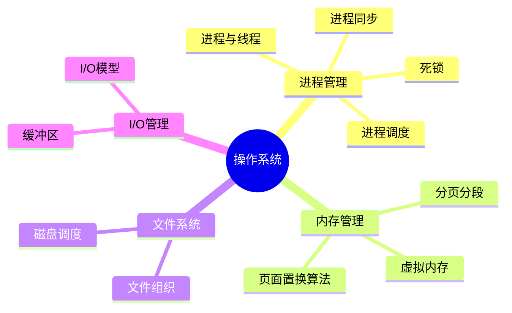

# 操作系统

> [!summary] TL;DR
> - 一句话定义：操作系统是管理计算机硬件与软件资源的系统软件。
> - 面试一句话结论：进程/线程管理、内存管理、文件系统、I/O 是核心考点。
> - 关键点：进程与线程、死锁、虚拟内存、页面置换、文件系统。

> [!tip]
> **工程师思维自检**：
> 1. 我能解释进程和线程的区别吗？
> 2. 我能说出死锁的四个必要条件吗？

---

## 知识体系总览

---

## 核心模块导航

### 1. 进程管理

| 主题 | 核心内容 | 面试频率 |
| :--- | :--- | :--- |
| 进程与线程 | 区别、PCB、TCB | ⭐⭐⭐⭐⭐ |
| 进程调度 | FCFS/SJF/RR/优先级 | ⭐⭐⭐ |
| 进程同步 | 信号量/互斥锁/条件变量 | ⭐⭐⭐⭐ |
| 死锁 | 四个条件/预防/避免/检测 | ⭐⭐⭐⭐⭐ |

### 2. 内存管理

| 主题 | 核心内容 | 面试频率 |
| :--- | :--- | :--- |
| 虚拟内存 | 地址转换/页表/TLB | ⭐⭐⭐⭐⭐ |
| 分页与分段 | 原理与对比 | ⭐⭐⭐⭐ |
| 页面置换算法 | LRU/FIFO/OPT/Clock | ⭐⭐⭐⭐ |

### 3. 文件系统与 I/O

| 主题 | 核心内容 | 面试频率 |
| :--- | :--- | :--- |
| 文件系统 | inode/目录结构 | ⭐⭐⭐ |
| 磁盘调度 | FCFS/SSTF/SCAN | ⭐⭐ |
| I/O 模型 | 阻塞/非阻塞/多路复用 | ⭐⭐⭐⭐ |

---

## 高频面试题速查

### 基础题

1. 进程和线程的区别？
2. 什么是死锁？如何避免？
3. 什么是虚拟内存？

### 进阶题

1. LRU 页面置换算法如何实现？
2. 用户态和内核态的区别？
3. 进程间通信方式有哪些？

### 深入题

1. Linux 进程调度算法？
2. 写时复制（COW）原理？
3. 零拷贝技术原理？

---

## 学习路线建议

1. **第一阶段**：进程与线程基础
2. **第二阶段**：进程同步与死锁
3. **第三阶段**：内存管理与虚拟内存
4. **第四阶段**：文件系统与 I/O

---

## 待创建笔记

- [ ] 进程与线程
- [ ] 死锁
- [ ] 虚拟内存
- [ ] 页面置换算法
- [ ] 进程间通信
- [ ] I/O 模型
