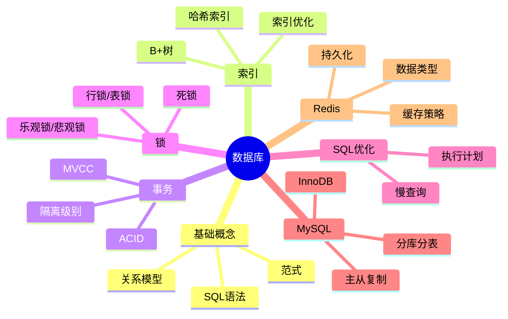

# 数据库

> [!summary] TL;DR
> - 一句话定义：数据库是按照数据结构组织、存储和管理数据的仓库。
> - 面试一句话结论：索引/事务/锁/SQL优化是核心考点；MySQL 是重点。
> - 关键点：索引原理、事务 ACID、隔离级别、锁机制、SQL 优化。

> [!tip]
> **工程师思维自检**：
> 1. 我能解释 B+树索引的原理吗？
> 2. 我能说出事务的四个隔离级别吗？

---

## 知识体系总览

---

## 核心模块导航

### 1. 索引

| 主题 | 核心内容 | 面试频率 |
| :--- | :--- | :--- |
| B+树索引 | 结构/原理/优势 | ⭐⭐⭐⭐⭐ |
| 索引类型 | 主键/唯一/联合/覆盖 | ⭐⭐⭐⭐ |
| 索引失效 | 常见场景 | ⭐⭐⭐⭐⭐ |

### 2. 事务

| 主题 | 核心内容 | 面试频率 |
| :--- | :--- | :--- |
| ACID | 原子性/一致性/隔离性/持久性 | ⭐⭐⭐⭐⭐ |
| 隔离级别 | RU/RC/RR/Serializable | ⭐⭐⭐⭐⭐ |
| MVCC | 多版本并发控制 | ⭐⭐⭐⭐ |

### 3. 锁

| 主题 | 核心内容 | 面试频率 |
| :--- | :--- | :--- |
| 锁类型 | 共享锁/排他锁/意向锁 | ⭐⭐⭐⭐ |
| 行锁与表锁 | InnoDB/MyISAM | ⭐⭐⭐⭐ |
| 死锁 | 原因/检测/解决 | ⭐⭐⭐⭐ |

### 4. SQL 优化

| 主题 | 核心内容 | 面试频率 |
| :--- | :--- | :--- |
| 执行计划 | EXPLAIN 解读 | ⭐⭐⭐⭐ |
| 慢查询 | 定位与优化 | ⭐⭐⭐⭐ |
| 分库分表 | 垂直/水平拆分 | ⭐⭐⭐ |

### 5. Redis

| 主题 | 核心内容 | 面试频率 |
| :--- | :--- | :--- |
| 数据类型 | String/List/Set/Hash/ZSet | ⭐⭐⭐⭐⭐ |
| 持久化 | RDB/AOF | ⭐⭐⭐⭐ |
| 缓存问题 | 穿透/击穿/雪崩 | ⭐⭐⭐⭐⭐ |

---

## 高频面试题速查

### 基础题

1. 什么是索引？为什么用 B+树？
2. 事务的 ACID 特性？
3. 四个隔离级别及解决的问题？

### 进阶题

1. MVCC 实现原理？
2. 索引失效的场景有哪些？
3. InnoDB 和 MyISAM 的区别？

### 深入题

1. MySQL 主从复制原理？
2. 分库分表方案？
3. Redis 集群模式？

---

## 学习路线建议

1. **第一阶段**：SQL 基础与索引原理
2. **第二阶段**：事务与锁机制
3. **第三阶段**：SQL 优化与执行计划
4. **第四阶段**：MySQL 高级特性
5. **第五阶段**：Redis 缓存

---

## 待创建笔记

- [ ] B+树索引
- [ ] 事务与ACID
- [ ] 隔离级别
- [ ] MVCC
- [ ] 锁机制
- [ ] SQL优化
- [ ] Redis数据类型
- [ ] 缓存穿透/击穿/雪崩
