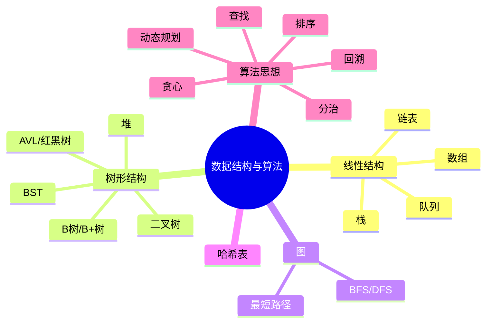

# 数据结构与算法

> [!summary] TL;DR
> - 一句话定义：数据结构是数据的组织方式，算法是解决问题的步骤。
> - 面试一句话结论：数组/链表/栈/队列/树/图是基础；排序/查找/动态规划是高频算法。
> - 关键点：时间复杂度、空间复杂度、常见数据结构特性、经典算法思想。

> [!tip]
> **工程师思维自检**：
> 1. 我能分析算法的时间复杂度吗？
> 2. 我能根据场景选择合适的数据结构吗？

---

## 知识体系总览

---

## 核心模块导航

### 1. 线性数据结构

| 主题 | 核心内容 | 面试频率 |
| :--- | :--- | :--- |
| 数组 | 连续存储/随机访问 | ⭐⭐⭐⭐ |
| 链表 | 单链表/双链表/反转/环检测 | ⭐⭐⭐⭐⭐ |
| 栈 | LIFO/单调栈 | ⭐⭐⭐⭐ |
| 队列 | FIFO/单调队列/优先队列 | ⭐⭐⭐⭐ |

### 2. 树与图

| 主题 | 核心内容 | 面试频率 |
| :--- | :--- | :--- |
| 二叉树 | 遍历/递归/层序 | ⭐⭐⭐⭐⭐ |
| BST | 查找/插入/删除 | ⭐⭐⭐⭐ |
| 红黑树 | 平衡原理/应用场景 | ⭐⭐⭐ |
| 堆 | 大顶堆/小顶堆/堆排序 | ⭐⭐⭐⭐ |
| B+树 | 数据库索引 | ⭐⭐⭐⭐ |

### 3. 哈希表

| 主题 | 核心内容 | 面试频率 |
| :--- | :--- | :--- |
| 哈希原理 | 哈希函数/冲突解决 | ⭐⭐⭐⭐ |
| HashMap | Java 实现原理 | ⭐⭐⭐⭐⭐ |

### 4. 算法思想

| 主题 | 核心内容 | 面试频率 |
| :--- | :--- | :--- |
| 排序 | 快排/归并/堆排序 | ⭐⭐⭐⭐⭐ |
| 二分查找 | 变体/边界处理 | ⭐⭐⭐⭐⭐ |
| 动态规划 | 状态转移/背包问题 | ⭐⭐⭐⭐⭐ |
| 贪心 | 局部最优 | ⭐⭐⭐ |
| 回溯 | 全排列/子集 | ⭐⭐⭐⭐ |
| DFS/BFS | 图/树遍历 | ⭐⭐⭐⭐ |

---

## 复杂度速查

### 常见数据结构

| 结构 | 查找 | 插入 | 删除 |
| :--- | :--- | :--- | :--- |
| 数组 | O(1) | O(n) | O(n) |
| 链表 | O(n) | O(1) | O(1) |
| 哈希表 | O(1) | O(1) | O(1) |
| BST | O(log n) | O(log n) | O(log n) |
| 红黑树 | O(log n) | O(log n) | O(log n) |

### 常见排序算法

| 算法 | 平均 | 最好 | 最坏 | 空间 | 稳定 |
| :--- | :--- | :--- | :--- | :--- | :--- |
| 快排 | O(nlogn) | O(nlogn) | O(n²) | O(logn) | ❌ |
| 归并 | O(nlogn) | O(nlogn) | O(nlogn) | O(n) | ✅ |
| 堆排 | O(nlogn) | O(nlogn) | O(nlogn) | O(1) | ❌ |

---

## 高频面试题速查

### 基础题

1. 数组和链表的区别？
2. 栈和队列的区别？
3. 快速排序的原理？

### 进阶题

1. HashMap 底层原理？
2. 红黑树的特性？
3. LRU 缓存如何实现？

### 算法题

1. 反转链表
2. 二叉树层序遍历
3. 最长递增子序列（DP）

---

## 待创建笔记

- [ ] 链表
- [ ] 二叉树
- [ ] 红黑树
- [ ] 堆
- [ ] 哈希表
- [ ] 快速排序
- [ ] 动态规划
