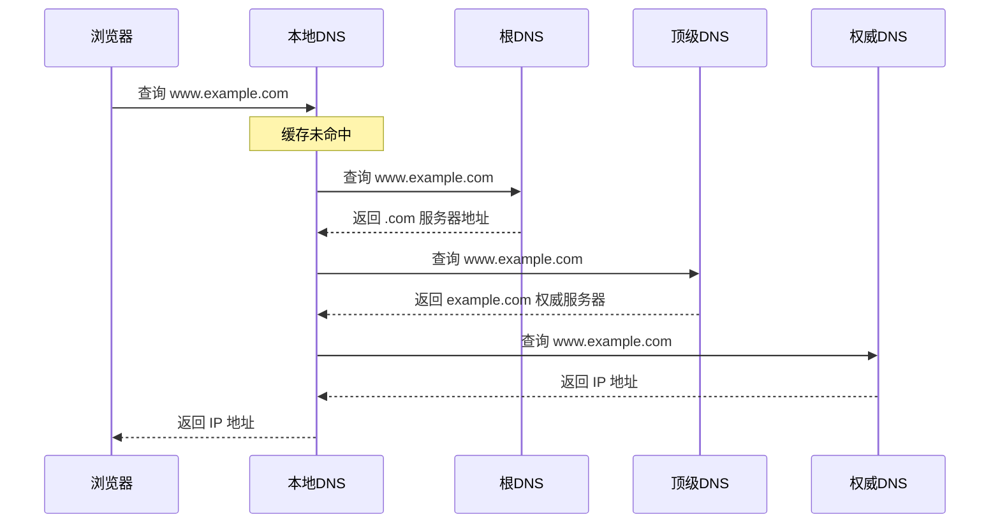

# DNS

> [!summary] TL;DR（3-5 行）
> - 一句话定义：DNS 是将域名解析为 IP 地址的分布式命名系统。
> - 面试一句话结论：本地缓存→递归查询→迭代查询，层级结构：根→顶级→权威。
> - 关键点：解析流程、记录类型、缓存机制。
> - 常见坑：混淆递归与迭代查询、不清楚 DNS 缓存层级。

> [!tip]
> **工程师思维自检**：
> 1. 我能说出 DNS 解析的完整流程吗？
> 2. 我能解释为什么 DNS 使用 UDP 吗？

---

## 1. 定义与定位

- **它是什么**：Domain Name System，应用层协议，端口 53。
- **解决什么问题**：将人类可读的域名转换为机器可识别的 IP 地址。
- **体系中的位置**：应用层，是互联网基础设施。[[计算机网络]]

---

## 2. DNS 层级结构

```mermaid
flowchart TB
    A[根域名服务器 "."] --> B[顶级域名服务器 ".com"]
    B --> C[权威域名服务器 "example.com"]
    C --> D[主机 "www.example.com"]
```

| 层级 | 说明 | 示例 |
| :--- | :--- | :--- |
| 根域名服务器 | 全球 13 组 | a.root-servers.net |
| 顶级域名 (TLD) | .com, .cn, .org | 管理顶级域 |
| 权威域名服务器 | 管理具体域名 | ns1.example.com |

---

## 3. DNS 解析流程



### 查询方式

| 类型 | 说明 | 使用场景 |
| :--- | :--- | :--- |
| 递归查询 | 客户端→本地 DNS，要求返回最终结果 | 客户端请求 |
| 迭代查询 | 本地 DNS→各级 DNS，逐级查询 | DNS 服务器间 |

---

## 4. DNS 记录类型

| 类型 | 含义 | 示例 |
| :--- | :--- | :--- |
| A | 域名→IPv4 地址 | www.example.com → 1.2.3.4 |
| AAAA | 域名→IPv6 地址 | www.example.com → 2001:db8::1 |
| CNAME | 别名记录 | blog.example.com → www.example.com |
| MX | 邮件服务器 | example.com → mail.example.com |
| NS | 域名服务器 | example.com → ns1.example.com |
| TXT | 文本记录 | SPF/DKIM 验证 |
| SOA | 起始授权记录 | 域的主服务器信息 |

---

## 5. DNS 缓存层级


| 层级 | 位置 | TTL 控制 |
| :--- | :--- | :--- |
| 浏览器缓存 | Chrome/Firefox | 约 1 分钟 |
| 操作系统缓存 | hosts 文件/DNS Cache | 系统配置 |
| 本地 DNS | ISP/企业 DNS | 记录 TTL |

---

## 6. 关键细节（高频考点）

- 考点 1：DNS 使用 UDP 还是 TCP？→ 通常 UDP，大报文用 TCP。
- 考点 2：DNS 端口号？→ 53。
- 考点 3：递归与迭代查询的区别。
- 考点 4：DNS 劫持与 DNS 污染。

---

## 7. 易错点与陷阱

1) 认为 DNS 只用 UDP（大于 512 字节用 TCP）。
2) 不清楚 CNAME 和 A 记录的区别。
3) 忽视 DNS 缓存对排障的影响。
4) 混淆递归查询与迭代查询。
5) 不理解 TTL 的作用。

---

## 8. 标准面试回答

### 8.1 30 秒版本

> [!quote]
> DNS 是域名解析系统，将域名转换为 IP 地址。解析流程：浏览器缓存→系统缓存→本地 DNS→递归/迭代查询各级服务器。使用 UDP 协议，端口 53。常见记录类型有 A（IPv4）、AAAA（IPv6）、CNAME（别名）。

### 8.2 深挖追问

- 追问 1：为什么 DNS 用 UDP？→ 快速、无连接开销，小查询适合。
- 追问 2：DNS 污染是什么？→ 中间节点返回假 IP，解决方法是 DoH/DoT。
- 追问 3：CDN 与 DNS 的关系？→ DNS 返回最近节点 IP，实现就近访问。

---

## 9. 代码示例

```java
// 目标：Java 中进行 DNS 解析
// 注意：展示基本的域名→IP 解析
import java.net.InetAddress;

public class DnsDemo {
    public static void main(String[] args) throws Exception {
        // 解析域名获取 IP 地址
        String domain = "www.baidu.com";
        InetAddress[] addresses = InetAddress.getAllByName(domain);

        // 一个域名可能对应多个 IP（负载均衡）
        for (InetAddress addr : addresses) {
            System.out.println(domain + " -> " + addr.getHostAddress());
        }
    }
}
```

---

## 10. 复习 Checklist

- [ ] 我能说出 DNS 解析的完整流程。
- [ ] 我能区分递归和迭代查询。
- [ ] 我能说出常见 DNS 记录类型。
- [ ] 我能解释 DNS 缓存层级。
- [ ] 我能说明 DNS 使用 UDP 的原因。

---

## 相关笔记（双向链接）

- [[计算机网络]]
- [[HTTP]]
- [[TCP]]
- [[UDP]]
