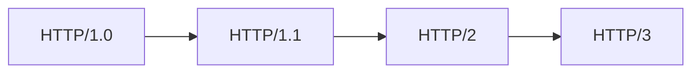

# HTTP

> [!summary] TL;DR（3-5 行）
> - 一句话定义：HTTP 是应用层的超文本传输协议，用于客户端与服务器之间的请求-响应通信。
> - 面试一句话结论：无状态、基于 TCP、请求-响应模型；版本演进：1.0→1.1→2.0→3.0。
> - 关键点：请求方法、状态码、头部字段、版本差异。
> - 常见坑：混淆 GET/POST 区别、不清楚状态码含义。

> [!tip]
> **工程师思维自检**：
> 1. 我能说出常用状态码的含义吗？
> 2. 我能解释 HTTP/1.1 和 HTTP/2 的区别吗？

---

## 1. 定义与定位

- **它是什么**：HyperText Transfer Protocol，应用层协议。
- **解决什么问题**：定义客户端与服务器之间的通信规则。
- **体系中的位置**：应用层，基于 TCP（HTTP/3 基于 QUIC/UDP）。[[计算机网络]] [[TCP]]

---

## 2. 请求方法

| 方法 | 语义 | 幂等 | 安全 | 常用场景 |
| :--- | :--- | :--- | :--- | :--- |
| GET | 获取资源 | ✅ | ✅ | 查询数据 |
| POST | 提交数据 | ❌ | ❌ | 创建资源 |
| PUT | 替换资源 | ✅ | ❌ | 更新资源 |
| DELETE | 删除资源 | ✅ | ❌ | 删除资源 |
| PATCH | 部分更新 | ❌ | ❌ | 局部修改 |
| HEAD | 获取头部 | ✅ | ✅ | 检查资源 |
| OPTIONS | 查询支持的方法 | ✅ | ✅ | CORS 预检 |

### GET vs POST

| 维度 | GET | POST |
| :--- | :--- | :--- |
| 参数位置 | URL | Body |
| 长度限制 | 有（URL 长度） | 无 |
| 缓存 | 可缓存 | 不可缓存 |
| 幂等性 | 幂等 | 非幂等 |
| 安全性 | 参数暴露在 URL | 相对安全 |

---

## 3. 状态码

### 状态码分类

| 类别 | 含义 | 示例 |
| :--- | :--- | :--- |
| 1xx | 信息性 | 100 Continue |
| 2xx | 成功 | 200 OK, 201 Created |
| 3xx | 重定向 | 301, 302, 304 |
| 4xx | 客户端错误 | 400, 401, 403, 404 |
| 5xx | 服务端错误 | 500, 502, 503 |

### 高频状态码

| 状态码 | 含义 | 场景 |
| :--- | :--- | :--- |
| 200 | OK | 请求成功 |
| 201 | Created | 资源创建成功 |
| 204 | No Content | 成功但无返回内容 |
| 301 | Moved Permanently | 永久重定向 |
| 302 | Found | 临时重定向 |
| 304 | Not Modified | 缓存命中 |
| 400 | Bad Request | 请求参数错误 |
| 401 | Unauthorized | 未认证 |
| 403 | Forbidden | 无权限 |
| 404 | Not Found | 资源不存在 |
| 500 | Internal Server Error | 服务器内部错误 |
| 502 | Bad Gateway | 网关错误 |
| 503 | Service Unavailable | 服务不可用 |

---

## 4. HTTP 版本演进

| 版本 | 特性 | 改进 |
| :--- | :--- | :--- |
| 1.0 | 短连接 | - |
| 1.1 | 持久连接、管道化 | 复用连接 |
| 2.0 | 多路复用、头部压缩、服务器推送 | 解决队头阻塞 |
| 3.0 | 基于 QUIC/UDP | 更快建连、0-RTT |

### HTTP/1.1 vs HTTP/2

| 特性 | HTTP/1.1 | HTTP/2 |
| :--- | :--- | :--- |
| 连接 | 持久连接 | 多路复用 |
| 队头阻塞 | 存在 | 解决（应用层） |
| 头部 | 文本、重复 | 二进制、压缩 |
| 服务器推送 | 不支持 | 支持 |

---

## 5. 重要头部字段

### 请求头

| 头部 | 作用 |
| :--- | :--- |
| Host | 指定服务器域名 |
| User-Agent | 客户端标识 |
| Accept | 期望的响应格式 |
| Content-Type | 请求体格式 |
| Authorization | 认证信息 |
| Cookie | 客户端 Cookie |

### 响应头

| 头部 | 作用 |
| :--- | :--- |
| Content-Type | 响应体格式 |
| Content-Length | 响应体长度 |
| Set-Cookie | 设置 Cookie |
| Cache-Control | 缓存策略 |
| Location | 重定向地址 |

---

## 6. 易错点与陷阱

1) 认为 GET 绝对安全（参数在 URL 会被记录）。
2) 不清楚 301 和 302 的区别。
3) 混淆 401 和 403。
4) 认为 HTTP/2 完全解决了队头阻塞（TCP 层仍存在）。
5) 不理解 Cookie 与 Session 的关系。

---

## 7. 标准面试回答

### 7.1 30 秒版本

> [!quote]
> HTTP 是应用层的无状态协议，采用请求-响应模型，基于 TCP。常用方法有 GET（获取）、POST（提交）。状态码 2xx 表示成功，3xx 重定向，4xx 客户端错误，5xx 服务器错误。HTTP/2 通过多路复用和头部压缩提升性能。

### 7.2 深挖追问

- 追问 1：GET 和 POST 本质区别？→ 语义不同，GET 幂等安全，POST 非幂等。
- 追问 2：HTTP/2 如何解决队头阻塞？→ 多路复用，一个连接并行多个流。
- 追问 3：HTTPS 与 HTTP 的区别？→ HTTPS = HTTP + TLS，加密传输。

---

## 8. 复习 Checklist

- [ ] 我能说出常用请求方法及区别。
- [ ] 我能解释常见状态码含义。
- [ ] 我能说出 HTTP 版本演进及改进。
- [ ] 我能区分 HTTP 和 HTTPS。
- [ ] 我能解释 Cookie 的作用。

---

## 相关笔记（双向链接）

- [[计算机网络]]
- [[TCP]]
- [[HTTPS]]
- [[DNS]]
