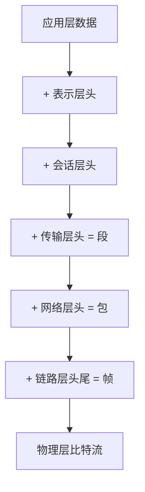

# OSI 七层模型

> [!summary] TL;DR（3-5 行）
> - 一句话定义：OSI 七层模型是国际标准化组织提出的网络体系结构理论框架。
> - 面试一句话结论：从下到上：物理层→数据链路层→网络层→传输层→会话层→表示层→应用层。
> - 关键点：分层职责、封装解封装、每层协议。
> - 常见坑：混淆 OSI 与 TCP/IP 模型、不清楚每层职责边界。

> [!tip]
> **工程师思维自检**：
> 1. 我能背出七层及其核心职责吗？
> 2. 我能解释数据在各层如何封装吗？

---

## 1. 定义与定位

- **它是什么**：OSI（Open Systems Interconnection）是 ISO 提出的网络分层理论模型。
- **解决什么问题**：提供标准化的网络通信框架，使不同厂商设备能够互联。
- **体系中的位置**：网络体系结构的理论基础。[[计算机网络]]

---

## 2. 七层详解

### 对比表

| 层次 | 名称 | 职责 | 典型协议/设备 | PDU |
| :--- | :--- | :--- | :--- | :--- |
| 7 | 应用层 | 为用户提供网络服务 | HTTP/FTP/SMTP/DNS | 数据 |
| 6 | 表示层 | 数据格式转换/加密压缩 | SSL/TLS/JPEG | 数据 |
| 5 | 会话层 | 建立/管理/终止会话 | RPC/NetBIOS | 数据 |
| 4 | 传输层 | 端到端可靠传输 | TCP/UDP | 段/数据报 |
| 3 | 网络层 | 路由选择与转发 | IP/ICMP/路由器 | 包 |
| 2 | 数据链路层 | 相邻节点可靠传输 | Ethernet/交换机 | 帧 |
| 1 | 物理层 | 比特流传输 | 网线/光纤/集线器 | 比特 |

---

## 3. 核心原理（面试够用版）

> [!note] 先给结论，再解释"怎么做到"

- **核心机制**（5-7 条要点）：
  1) 每层只与相邻层交互，向上提供服务，向下使用服务。
  2) 数据发送时逐层封装，接收时逐层解封装。
  3) 每层有自己的协议数据单元（PDU）。
  4) 分层使各层可独立演进。
  5) 上四层面向应用，下三层面向网络。

### 3.1 封装与解封装流程

### 3.2 费曼类比

> [!tip] 用人话解释
> 像寄快递：你写好信（应用层），装入信封（表示层），贴上收发信息（会话层），交给快递公司分拣（传输层），选择运输路线（网络层），装上卡车（链路层），最终在公路上跑（物理层）。

---

## 4. 关键细节清单（高频考点）

- 考点 1：七层顺序及每层职责。
- 考点 2：TCP/UDP 属于传输层。
- 考点 3：路由器工作在网络层，交换机工作在数据链路层。
- 考点 4：HTTP/DNS 属于应用层。

---

## 5. 易错点与陷阱（至少 5 条）

1) 把 OSI 当成实际使用的协议栈（实际用 TCP/IP）。
2) 混淆表示层与应用层职责。
3) 不清楚会话层在实际中很少独立实现。
4) 把 IP 地址当作链路层概念。
5) 认为 OSI 七层与 TCP/IP 四层完全对应。

---

## 6. 对比与扩展

### OSI 七层 vs TCP/IP 四层

| 特性 | OSI 七层 | TCP/IP 四层 |
| :--- | :--- | :--- |
| 层数 | 7 层 | 4 层 |
| 定位 | 理论参考模型 | 工程实现模型 |
| 使用 | 教学/理论 | 实际互联网 |
| 会话/表示层 | 独立分层 | 合并到应用层 |

---

## 7. 标准面试回答（可直接背）

### 7.1 30 秒版本（电梯回答）

> [!quote]
> OSI 七层模型从下到上是：物理层、数据链路层、网络层、传输层、会话层、表示层、应用层。每层负责特定职责，数据发送时逐层封装，接收时逐层解封装。这是网络通信的理论框架，实际使用 TCP/IP 四层模型。

### 7.2 深挖追问

- 追问 1：为什么需要分层？→ 职责分离，便于独立演进与排障。
- 追问 2：OSI 与 TCP/IP 的区别？→ OSI 是理论模型，TCP/IP 是工程实现。
- 追问 3：哪些层面向应用，哪些面向网络？→ 上四层面向应用，下三层面向网络。

---

## 8. 复习 Checklist（可勾选）

- [ ] 我能背出 OSI 七层顺序。
- [ ] 我能说出每层的核心职责。
- [ ] 我能区分 OSI 与 TCP/IP 模型。
- [ ] 我能解释封装与解封装过程。
- [ ] 我能说出典型设备工作在哪一层。

---

## 相关笔记（双向链接）

- [[计算机网络]]
- [[TCP-IP 四层]]
- [[TCP]]
- [[HTTP]]
