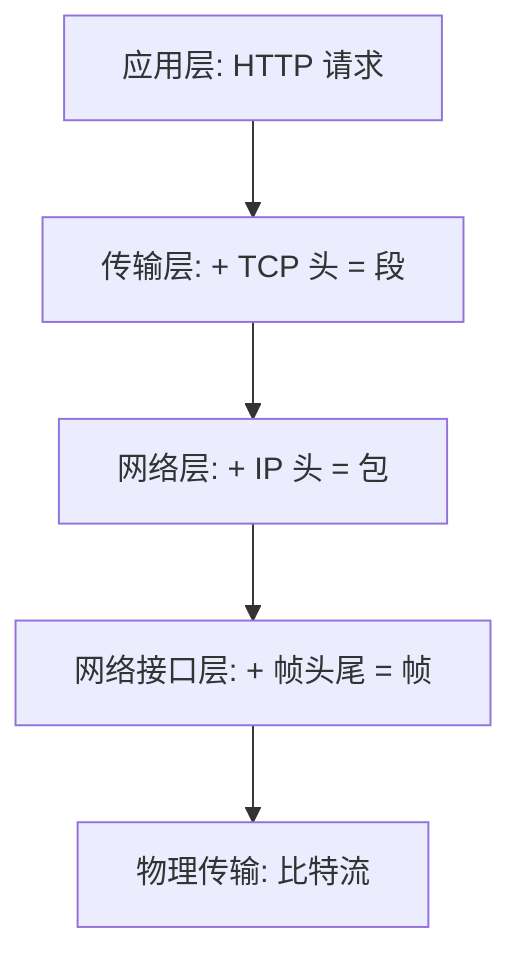
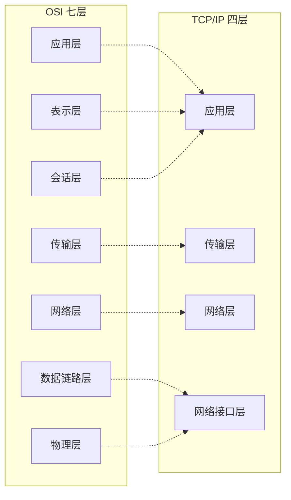

# TCP/IP 四层模型

> [!summary] TL;DR（3-5 行）
> - 一句话定义：TCP/IP 四层模型是互联网实际使用的网络体系结构。
> - 面试一句话结论：从下到上：网络接口层→网络层→传输层→应用层。
> - 关键点：与 OSI 的对应关系、每层核心协议。
> - 常见坑：把 TCP/IP 四层与 OSI 七层混为一谈。

> [!tip]
> **工程师思维自检**：
> 1. 我能说出四层及其核心协议吗？
> 2. 我能解释 TCP/IP 与 OSI 的映射关系吗？

---

## 1. 定义与定位

- **它是什么**：TCP/IP 是互联网的实际协议栈，分为四层。
- **解决什么问题**：提供可工程实现的网络通信标准。
- **体系中的位置**：互联网的基础架构。[[计算机网络]]

---

## 2. 四层详解

### 对比表

| 层次 | 名称 | 职责 | 典型协议 | 对应 OSI |
| :--- | :--- | :--- | :--- | :--- |
| 4 | 应用层 | 为用户提供网络应用 | HTTP/FTP/DNS/SMTP | 应用+表示+会话 |
| 3 | 传输层 | 端到端通信 | TCP/UDP | 传输层 |
| 2 | 网络层 | 路由与转发 | IP/ICMP/ARP | 网络层 |
| 1 | 网络接口层 | 物理传输 | Ethernet/WiFi | 链路+物理 |

---

## 3. 核心原理（面试够用版）

> [!note] 先给结论，再解释"怎么做到"

- **核心机制**：
  1) 应用层：处理应用程序间的通信（HTTP、DNS）。
  2) 传输层：提供端到端的通信服务（TCP 可靠、UDP 快速）。
  3) 网络层：负责数据包的路由与转发（IP 地址寻址）。
  4) 网络接口层：处理物理网络的数据传输。

### 3.1 数据封装流程

### 3.2 费曼类比

> [!tip] 用人话解释
> 像寄包裹：你准备好物品（应用层），交给快递员确认收发地址（传输层），快递公司规划路线（网络层），最终用卡车运输（网络接口层）。

---

## 4. TCP/IP vs OSI 对照

---

## 5. 关键细节清单（高频考点）

- 考点 1：四层顺序及每层核心协议。
- 考点 2：TCP/IP 应用层 = OSI 上三层。
- 考点 3：ARP 协议的位置（网络层与链路层之间）。
- 考点 4：为什么 TCP/IP 更实用（工程导向）。

---

## 6. 易错点与陷阱

1) 把 TCP/IP 当成只有 TCP 和 IP 两个协议。
2) 混淆网络接口层与 OSI 的链路层。
3) 不清楚 ARP 的层级归属（跨层）。
4) 认为 TCP/IP 四层与 OSI 七层一一对应。
5) 忽视 ICMP 属于网络层。

---

## 7. 标准面试回答（可直接背）

### 7.1 30 秒版本（电梯回答）

> [!quote]
> TCP/IP 四层模型从下到上是：网络接口层、网络层、传输层、应用层。它是互联网实际使用的协议栈，比 OSI 更简洁实用。应用层对应 OSI 上三层，网络接口层对应 OSI 下两层。

### 7.2 深挖追问

- 追问 1：为什么 TCP/IP 比 OSI 更流行？→ 工程实践先于标准，简洁高效。
- 追问 2：ARP 属于哪一层？→ 严格说跨越网络层和链路层。
- 追问 3：五层模型是什么？→ 教学用，把网络接口层拆成链路层和物理层。

---

## 8. 复习 Checklist（可勾选）

- [ ] 我能背出 TCP/IP 四层顺序。
- [ ] 我能说出每层的核心协议。
- [ ] 我能画出 TCP/IP 与 OSI 的对应图。
- [ ] 我能解释为什么 TCP/IP 更实用。

---

## 相关笔记（双向链接）

- [[计算机网络]]
- [[OSI 七层]]
- [[TCP]]
- [[UDP]]
- [[HTTP]]
