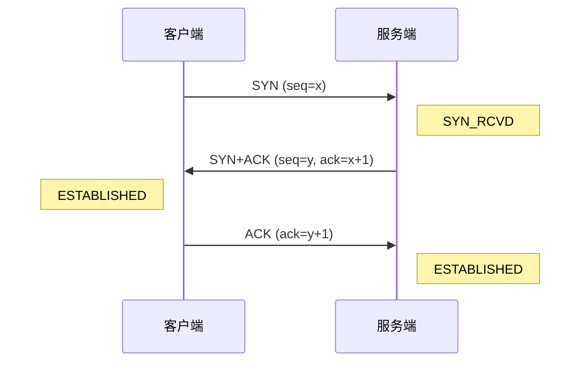
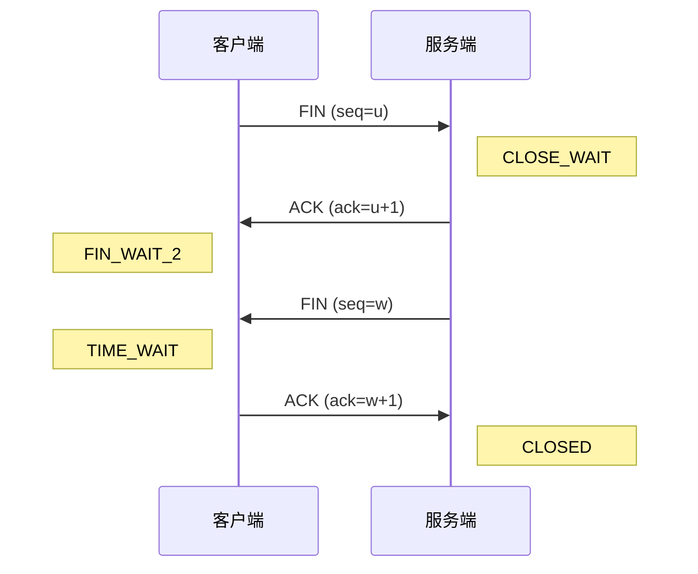

# TCP

> [!summary] TL;DR（3-5 行）
> - 一句话定义：TCP 是面向连接的、可靠的、基于字节流的传输层协议。
> - 面试一句话结论：三次握手建连、四次挥手断连、滑动窗口保证可靠与流控、拥塞控制避免网络过载。
> - 关键点：可靠传输、流量控制、拥塞控制、连接管理。
> - 常见坑：混淆流量控制与拥塞控制、不清楚为什么是三次/四次。

> [!tip]
> **工程师思维自检**：
> 1. 我能画出三次握手和四次挥手的时序图吗？
> 2. 我能解释"为什么是三次握手而不是两次"吗？

---

## 1. 定义与定位

- **它是什么**：Transmission Control Protocol，传输层核心协议。
- **解决什么问题**：在不可靠的 IP 网络上提供可靠的、有序的数据传输。
- **体系中的位置**：传输层，位于 IP 之上、应用层之下。[[计算机网络]] [[TCP-IP 四层]]

---

## 2. 应用场景

- 场景 1：HTTP/HTTPS 网页请求（需要可靠传输）。
- 场景 2：文件传输 FTP、邮件 SMTP。
- 场景 3：数据库连接。
- 不适用：实时音视频、游戏（UDP 更合适）。

---

## 3. 核心原理（面试够用版）

### 3.1 三次握手



**为什么是三次？**
1) 防止历史重复连接请求造成错误。
2) 同步双方的初始序列号。
3) 两次无法确认客户端的接收能力。

### 3.2 四次挥手



**为什么是四次？**
- TCP 是全双工，每个方向需要单独关闭。
- 服务端收到 FIN 后可能还有数据要发，不能立即发 FIN。

### 3.3 可靠传输机制

| 机制 | 作用 |
| :--- | :--- |
| 序列号 | 保证数据有序 |
| 确认应答 | 确认数据已收到 |
| 超时重传 | 丢包后自动重发 |
| 滑动窗口 | 提高传输效率 |
| 校验和 | 检测数据损坏 |

### 3.4 流量控制 vs 拥塞控制

| 特性 | 流量控制 | 拥塞控制 |
| :--- | :--- | :--- |
| 目的 | 匹配收发速率 | 防止网络过载 |
| 机制 | 接收窗口 rwnd | 拥塞窗口 cwnd |
| 反馈来源 | 接收方 | 网络拥塞信号 |

### 3.5 拥塞控制四大算法

1) **慢启动**：指数增长探测带宽。
2) **拥塞避免**：线性增长稳定传输。
3) **快重传**：三次重复 ACK 立即重传。
4) **快恢复**：重传后不从 1 开始。

---

## 4. 关键细节清单（高频考点）

- 考点 1：三次握手过程及每一步的意义。
- 考点 2：四次挥手过程及 TIME_WAIT 的作用。
- 考点 3：TCP 如何保证可靠传输。
- 考点 4：流量控制与拥塞控制的区别。
- 考点 5：TCP 首部结构（20 字节固定 + 可选）。

---

## 5. 易错点与陷阱

1) 把三次握手说成"三次请求"。
2) 混淆 SYN/ACK/FIN 标志位的含义。
3) 不理解 TIME_WAIT 存在的原因（2MSL）。
4) 把流量控制和拥塞控制混为一谈。
5) 认为 TCP 一定比 UDP 慢。

---

## 6. 对比：TCP vs UDP

| 特性 | TCP | UDP |
| :--- | :--- | :--- |
| 连接 | 面向连接 | 无连接 |
| 可靠性 | 可靠（确认重传） | 不可靠 |
| 顺序 | 保证有序 | 可能乱序 |
| 首部开销 | 20 字节+ | 8 字节 |
| 速度 | 相对较慢 | 快 |
| 适用场景 | 文件/网页 | 音视频/游戏 |

---

## 7. 标准面试回答（可直接背）

### 7.1 30 秒版本（电梯回答）

> [!quote]
> TCP 是面向连接的可靠传输协议。通过三次握手建立连接、四次挥手断开连接。可靠性靠序列号、确认应答、超时重传实现。流量控制匹配收发速率，拥塞控制防止网络过载。

### 7.2 深挖追问

- 追问 1：为什么是三次握手？→ 防止历史连接、同步序列号、确认双方收发能力。
- 追问 2：TIME_WAIT 有什么用？→ 等待延迟的报文消失、确保最后 ACK 到达。
- 追问 3：TCP 粘包怎么解决？→ 定长/分隔符/长度字段。

---

## 8. 代码示例

```java
// 目标：演示 TCP Socket 基本通信
// 注意：展示连接/发送/接收的基本流程
import java.io.*;
import java.net.*;

public class TcpDemo {
    public static void main(String[] args) throws Exception {
        // 客户端：三次握手建立连接
        Socket socket = new Socket("localhost", 8080);

        // 发送数据
        OutputStream out = socket.getOutputStream();
        out.write("Hello TCP".getBytes());

        // 接收响应
        InputStream in = socket.getInputStream();
        byte[] buf = new byte[1024];
        int len = in.read(buf);
        System.out.println(new String(buf, 0, len));

        // 四次挥手关闭连接
        socket.close();
    }
}
```

---

## 9. 复习 Checklist（可勾选）

- [ ] 我能画出三次握手时序图。
- [ ] 我能画出四次挥手时序图。
- [ ] 我能解释 TCP 可靠传输机制。
- [ ] 我能区分流量控制与拥塞控制。
- [ ] 我能说出 TCP 与 UDP 的区别。
- [ ] 我能解释 TIME_WAIT 的作用。

---

## 相关笔记（双向链接）

- [[计算机网络]]
- [[TCP-IP 四层]]
- [[UDP]]
- [[HTTP]]
