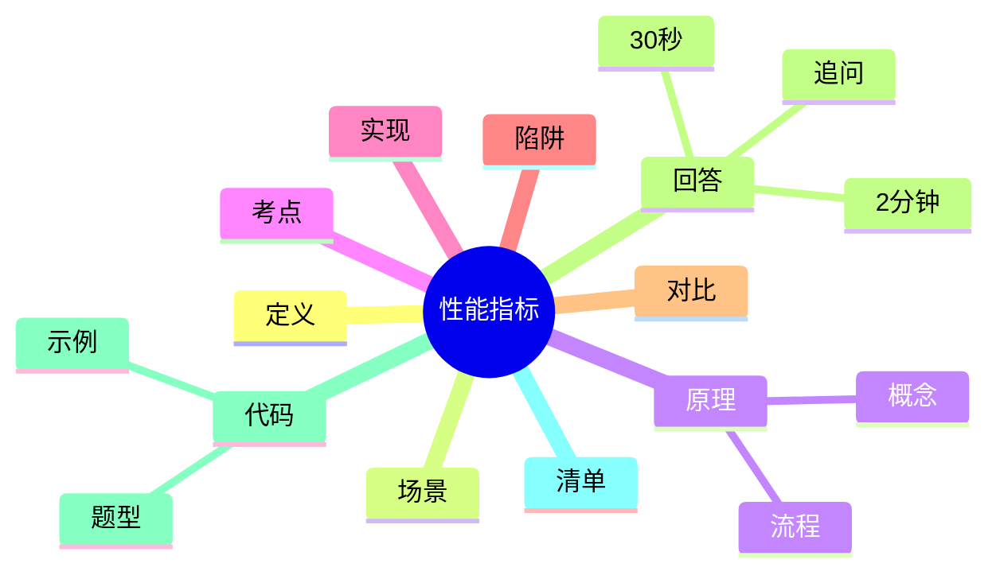

---
title: "性能指标与体系结构"
aliases: ["性能指标与体系结构 八股", "性能指标与体系结构 面试"]
tags: [Net, 八股, Interview/高频, 性能指标, 体系结构]
created: 2026-01-21
level: interview
status: draft
---

# 性能指标与体系结构

> [!summary] TL;DR（3-5 行）
> - 一句话定义：性能指标衡量网络质量，体系结构用于组织协议与功能。
> - 面试一句话结论：带宽、时延、吞吐量与丢包率是核心指标。
> - 关键点：指标定义与关系、分层体系结构、瓶颈定位。
> - 常见坑：把带宽当吞吐、忽视排队时延。

> [!tip]
> **工程师思维自检**：
> 1. 我能解释“高带宽但低吞吐”的原因吗？
> 2. 我能用分层定位性能瓶颈吗？

---

## 1. 定义与定位

- **它是什么**：网络性能指标与分层体系结构的总览。
- **解决什么问题**：评价网络质量，定位瓶颈。
- **体系中的位置**：网络性能分析基础。[[计算机网络]]

---

## 2. 应用场景

- 场景 1：网络排障与优化。
- 场景 2：系统设计与性能评估。
- 不适用：只关注协议细节的单点优化。

---

## 3. 核心原理（面试够用版）

> [!note] 先给结论，再解释“怎么做到”

- **核心机制**（5-7 条要点）：
  1) 带宽是理论容量，吞吐量是实际传输速率。
  2) 时延由处理/排队/传输/传播组成。
  3) 丢包率与重传成本影响吞吐。
  4) 体系结构分层，便于定位瓶颈。

### 3.1 关键流程（步骤）

1. 明确指标定义。
2. 测量端到端数据。
3. 按层定位瓶颈。

### 3.2 关键概念

- **带宽**：单位时间可传输的最大比特数。
- **吞吐量**：实际成功传输速率。

### 3.3 费曼类比

> [!tip] 用人话解释
> 带宽像水管粗细，吞吐像实际流量，时延像水流到达时间。

---

## 4. 关键细节清单（高频考点）

- 考点 1：带宽与吞吐的差异。
- 考点 2：排队时延在高负载下最关键。
- 考点 3：丢包率与重传会放大时延。
- 考点 4：分层体系结构与性能指标关联。

---

## 5. 源码/实现要点（不装行号，只抓关键）

> [!tip] 目标：回答“性能指标如何落地测量”

- **关键组件**：监控指标（RTT、吞吐、丢包率）。
- **关键流程**：采样 → 统计 → 归因分析。
- **关键策略**：分层定位与瓶颈隔离。
- **面试话术**：性能指标需要结合分层定位才能解释差异。

---

## 6. 易错点与陷阱（至少 5 条）

1) 把带宽当成吞吐量。
2) 只关注平均时延忽视尾延迟。
3) 忽略重传对吞吐的影响。
4) 把应用层延迟误判为网络层问题。
5) 忽视排队时延。

---

## 7. 对比与扩展（至少 2 组）

- **带宽 vs 吞吐**：容量 vs 实际效率。
- **平均时延 vs P99**：整体体验 vs 尾延迟。
- 扩展问题：如何评估 CDN 对时延的改善？

### 对比表

| 特性 | 带宽 | 吞吐 |
| :--- | :--- | :--- |
| 含义 | 理论上限 | 实际速度 |
| 影响因素 | 物理介质 | 丢包/重传 |

---

## 8. 标准面试回答（可直接背）

### 8.1 30 秒版本（电梯回答）

> [!quote]
> 网络性能指标主要看带宽、吞吐量、时延和丢包率。带宽是理论上限，吞吐量是实际可达速率；时延由处理、排队、传输和传播组成。通过分层体系结构可以快速定位性能瓶颈。

### 8.2 2 分钟版本（结构化展开）

> [!quote]
> 1) 定义与定位：指标衡量质量，体系结构帮助定位。 
> 2) 场景：性能评估与排障。 
> 3) 原理：指标定义与分层定位结合。 
> 4) 易错点：混淆带宽与吞吐。 
> 5) 扩展：尾延迟与 CDN 影响。

### 8.3 深挖追问（面试官继续问什么）

- 追问 1：高带宽低吞吐可能原因？→ 丢包、重传、拥塞。
- 追问 2：如何量化排队时延？→ 采样队列长度与等待时间。
- 追问 3：P99 时延意义？→ 反映尾部体验。

---

## 9. 代码题与代码示例（必须有详注）

> [!important] 要求：注释解释“为什么这样写”，不是解释语法

### 9.1 面试代码题（2-3 题）

- 题 1：计算吞吐量（传输字节/耗时）。
- 题 2：计算平均时延与 P99 时延。
- 题 3：估算带宽利用率。

### 9.2 参考代码（Java）

```java
// 目标：根据字节数与耗时计算吞吐量
// 注意：这里只做基础计算，单位需统一
public class ThroughputDemo {
    public static void main(String[] args) {
        long bytes = 50 * 1024 * 1024; // 为什么用固定值：模拟传输 50MB
        double seconds = 4.0;          // 假设耗时 4 秒

        // 吞吐量 = 传输字节 / 时间，结果换算为 MB/s
        double mbps = (bytes / 1024.0 / 1024.0) / seconds;
        System.out.println("Throughput: " + mbps + " MB/s");
    }
}
```

---

## 10. 复习 Checklist（可勾选）

- [ ] 我能区分带宽与吞吐量。
- [ ] 我能解释 4 类时延。
- [ ] 我能说明丢包对吞吐的影响。
- [ ] 我能用分层思路定位瓶颈。
- [ ] 我能解释 P99 的意义。

---

## 11. Mermaid 思维导图（Obsidian 可渲染）



---

## Net 额外要求（分层视角）

- 分层视角：TCP/IP 四层或 OSI 七层。
- 性能指标需结合层次定位（应用/传输/网络/链路）。

---

## 相关笔记（双向链接）

- [[计算机网络]]
- [[TCP]]
- [[HTTP]]
- [[OSI 七层]]
