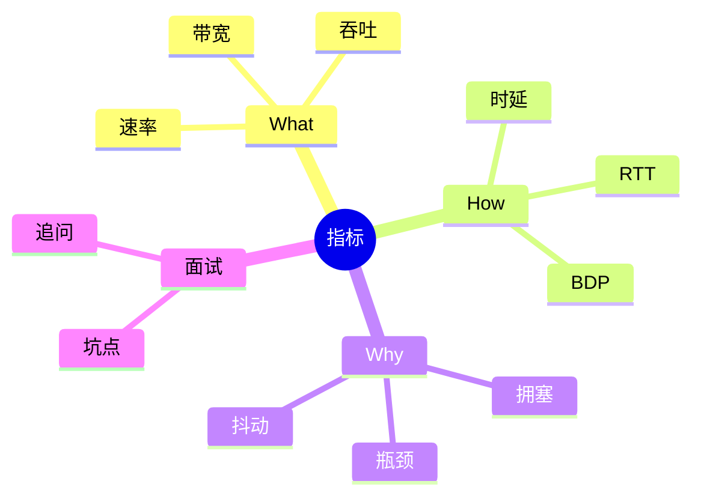
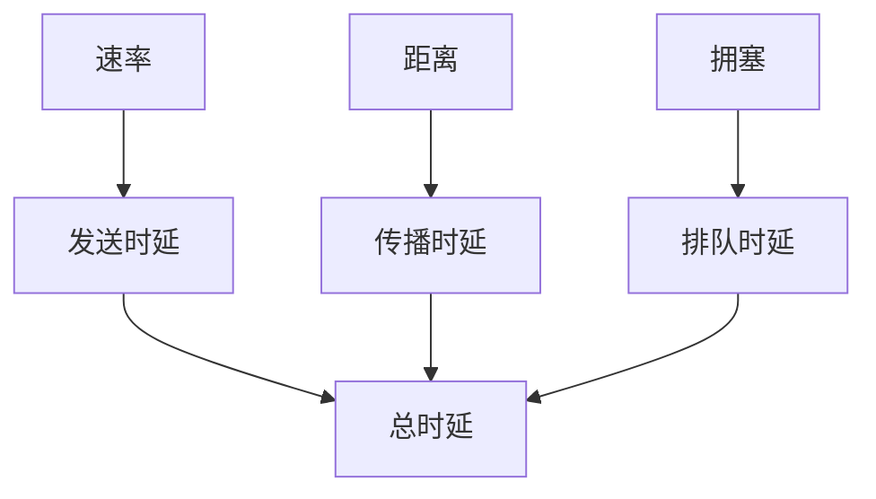

# 面试笔记｜Net｜性能指标



## What — 费曼解释

类比：带宽像车道数，吞吐量像实际车流。

- 速率：单位时间可传比特。
- 带宽：链路能力上限。
- 吞吐：实际可达速度。
- 分层视角：指标受链路与上层拥塞共同影响。

## How — 机制流程

1) 发送时延=包大小/带宽。
2) 传播时延=距离/介质速度。
3) 排队时延随拥塞波动。
4) RTT=往返传播+处理。
5) BDP=带宽×RTT。



## How — 工业级代码 (可运行)

```java
public class NetworkMetricsDemo {
    static double downloadTimeSeconds(double sizeBytes, double bandwidthBps) {
        // 为什么：统一单位避免 b/B 混淆；底层：传输时延=比特数/带宽
        return (sizeBytes * 8) / bandwidthBps;
    }

    static double bdpBits(double bandwidthBps, double rttSeconds) {
        // 为什么：用 BDP 估算链路容量；底层：RTT 内在途比特数
        return bandwidthBps * rttSeconds;
    }

    public static void main(String[] args) {
        double bandwidth = 100_000_000; // 为什么：链路速率；底层：限制单位时间比特
        double fileSize = 100 * 1024 * 1024; // 为什么：文件大小；底层：决定总比特量
        double rtt = 0.05; // 为什么：往返时延；底层：影响窗口与在途数据

        System.out.printf("Download time: %.2f s%n", downloadTimeSeconds(fileSize, bandwidth));
        System.out.printf("BDP: %.2f Mb%n", bdpBits(bandwidth, rtt) / 1_000_000);
    }
}
```

## Why & Interview — 机制复盘

步骤复盘：
1) 吞吐量受最慢链路或服务端限制。
2) 排队时延在高利用率下暴涨。
3) BDP 决定窗口规模与链路利用率。

对比表：

| 指标 | 关注问题 | 决定因素 |
| --- | --- | --- |
| 速率 | 传多快 | 设备能力 |
| 带宽 | 路多宽 | 链路能力 |
| 吞吐 | 实际多快 | 负载/瓶颈 |
| RTT | 来回多久 | 距离 |

### ✅ 面试怎么问
- 带宽和吞吐量区别？
- 四类时延分别由什么决定？
- RTT 的含义？
- 带宽提升能否降时延？

### ⚠️ 坑点/误区
- 把带宽当实际下载速度。
- 忽略传播时延对长距离影响。
- 不区分重排队列抖动。

### 🔍 递进追问链路
1. 为什么吞吐量常小于带宽？
2. 短板效应如何形成瓶颈？
3. BDP 在工程上如何应用？
4. 排队时延为何暴涨？
5. RTT 与 TCP 拥塞控制关系？

## 一分钟背诵版

1. 速率是单位时间比特数。
2. 带宽是链路上限。
3. 吞吐是实际可达。
4. 时延由传输/传播/处理/排队构成。
5. 传播时延取决距离和介质速度。
6. 排队时延最不稳定。
7. RTT 表示往返时间。
8. BDP=带宽×RTT。
9. 带宽提升只降发送时延。
10. 拥塞导致时延抖动。

## 面试 Checklist

- [ ] 能区分速率/带宽/吞吐
- [ ] 能列出四类时延
- [ ] 能解释 RTT
- [ ] 能说明 BDP
- [ ] 能说明短板效应
- [ ] 能解释拥塞影响
- [ ] 能描述排队抖动
- [ ] 能给出应用场景

[[时延]] [[RTT]] [[带宽]] [[吞吐量]] [[拥塞控制]] [[TCP]]
