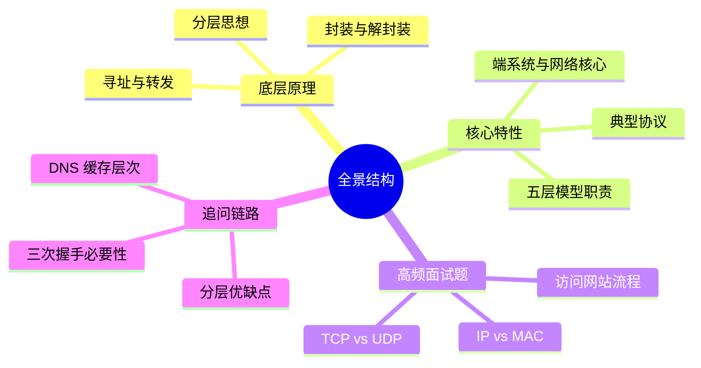

# Java 八股｜计算机网络-全景结构



## 核心概念

- 分层是复杂网络系统的抽象分工方式。
- 五层模型：应用、传输、网络、链路、物理。
- 协议栈通过封装/解封装传递数据。
- 端系统产生数据，网络核心负责转发。
- IP 负责寻址，MAC 负责本地交付。

## 源码/机制复盘（文字流程）

1) 应用层产生消息，交给传输层做端到端控制。
2) 传输层为可靠或快速传输选择 TCP/UDP。
3) 网络层为分组选择目的 IP 与路由路径。
4) 链路层完成局域网内的 MAC 交付。
5) 物理层把比特映射为电/光/无线信号。
6) 数据在每一层完成封装，发送端逐层加头。
7) 接收端逐层解封装，最终交给应用。
8) 访问网站流程：DNS 解析 -> TCP 握手 -> HTTP 请求/响应 -> 浏览器渲染。

## 对比表

| 维度 | TCP | UDP |
| --- | --- | --- |
| 连接 | 面向连接 | 无连接 |
| 可靠性 | 可靠、有序 | 不保证 |
| 速度 | 较慢 | 较快 |
| 场景 | 文件、网页 | 实时音视频 |

## 可运行 Java 示例

```java
public class LayeringDemo {
    static String encapsulate(String data, String layer) {
        // 逐层封装，体现分层设计的清晰边界
        return layer + "[" + data + "]";
    }

    public static void main(String[] args) {
        String data = "HTTP GET /";
        String[] layers = {"APP", "TCP", "IP", "ETH", "PHY"};

        for (String layer : layers) {
            data = encapsulate(data, layer);
        }

        System.out.println("Encapsulated: " + data);
    }
}
```

## 面试专栏

### ✅ 面试怎么问
- 五层模型每层的职责分别是什么？
- TCP 与 UDP 的核心区别？
- IP 与 MAC 的区别与联系？
- 输入网址后发生了什么？

### ⚠️ 坑点/误区
- 把 OSI 七层与 TCP/IP 五层混淆。
- 认为 MAC 地址是全网唯一且可路由。
- 只会背分层名称，不理解封装流程。

### 追问链路
- 为什么需要三次握手？两次行不行？
- DNS 缓存有哪些层级？
- MTU 对分片与性能有什么影响？
- NAT 对端到端连接有什么影响？
- HTTP 建立在 TCP 之上带来什么权衡？

## 一分钟背诵版

1. 分层是把复杂通信任务拆成可管理模块。
2. 应用层定义数据语义，传输层保证端到端。
3. 网络层负责寻址与路由，链路层负责下一跳。
4. 物理层把比特映射成信号传到介质。
5. 封装是逐层加头，解封装是逐层拆头。
6. TCP 可靠但开销高，UDP 轻量但不保证。
7. IP 定位终点，MAC 只负责局域网交付。
8. 访问网站需要 DNS 解析与 TCP 建连。
9. 路由器工作在网络层，交换机工作在链路层。
10. 分层提升可扩展性，但会带来额外开销。

## 面试 Checklist

- [ ] 能说清五层模型职责
- [ ] 能解释封装与解封装
- [ ] 能对比 TCP/UDP
- [ ] 能对比 IP/MAC
- [ ] 能描述访问网站的流程
- [ ] 能解释路由器与交换机职责
- [ ] 能说明分层的优缺点
- [ ] 能举例典型协议

[[TCP]] [[UDP]] [[IP]] [[MAC]] [[DNS]] [[路由器]] [[交换机]]
