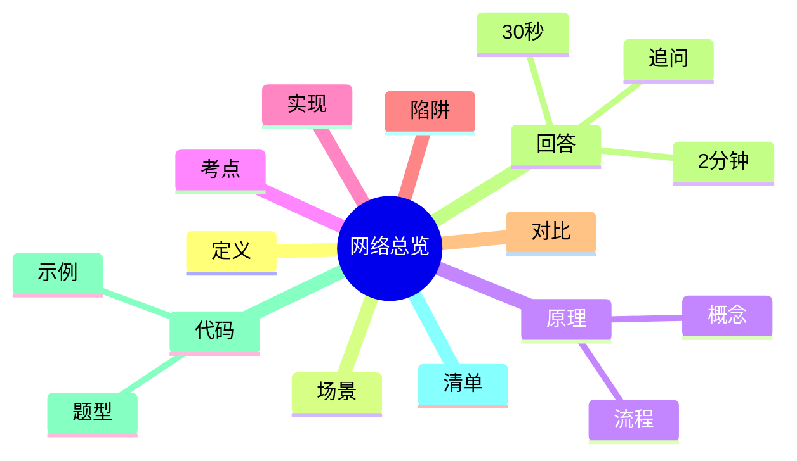

---
title: "计算机网络全局内容结构化梳理"
aliases: ["计算机网络全局内容结构化梳理 八股", "计算机网络全局内容结构化梳理 面试"]
tags: [Net, 八股, Interview/高频, 网络分层, 总览]
created: 2026-01-21
level: interview
status: draft
---

# 计算机网络全局内容结构化梳理

> [!summary] TL;DR（3-5 行）
> - 一句话定义：对计算机网络核心知识的分层与模块化总览。
> - 面试一句话结论：按层理解协议与问题，能快速定位故障与优化点。
> - 关键点：分层模型、协议族、性能指标、安全与实践。
> - 常见坑：不区分层次、混淆协议职责。

> [!tip]
> **工程师思维自检**：
> 1. 我能把一个网络问题定位到具体层吗？
> 2. 我能用分层视角解释一个请求的全链路吗？

---

## 1. 定义与定位

- **它是什么**：计算机网络知识的结构化框架，按层次组织内容。
- **解决什么问题**：避免碎片化记忆，方便检索与定位问题。
- **体系中的位置**：网络体系的总览入口。[[计算机网络]]

---

## 2. 应用场景

- 场景 1：面试复习总览。
- 场景 2：线上故障定位与学习路线规划。
- 不适用：只关注单一协议的深入调优。

---

## 3. 核心原理（面试够用版）

> [!note] 先给结论，再解释“怎么做到”

- **核心机制**（5-7 条要点）：
  1) 分层模型（OSI/TCP-IP）是组织网络知识的主线。
  2) 每层负责特定职责，向上提供抽象。
  3) 传输层解决端到端可靠性与拥塞控制。
  4) 网络层负责路由与转发。
  5) 应用层承载具体协议（HTTP/DNS/TLS）。

### 3.1 关键流程（步骤）

1. 识别问题发生在哪一层。
2. 依据层次定位对应协议与指标。
3. 做优化或排障。

### 3.2 关键概念

- **分层**：职责分离。
- **协议栈**：各层协议组合。

### 3.3 费曼类比

> [!tip] 用人话解释
> 像一栋楼：每层负责一类功能，电梯问题找电梯层，水管问题找设备层。

---

## 4. 关键细节清单（高频考点）

- 考点 1：OSI 七层与 TCP/IP 四层对照。
- 考点 2：TCP vs UDP 的适用场景。
- 考点 3：HTTP/HTTPS 的链路流程。
- 考点 4：DNS 的解析过程。

---

## 5. 源码/实现要点（不装行号，只抓关键）

> [!tip] 目标：回答“为什么协议设计成这样”

- **关键组件**：协议栈实现、系统内核网络栈。
- **关键流程**：数据从应用层封装到链路层再发送。
- **关键策略**：分层抽象降低复杂度。
- **面试话术**：分层让协议职责清晰，便于独立演进。

---

## 6. 易错点与陷阱（至少 5 条）

1) 把 TCP 当成应用层协议。
2) 认为所有应用层协议都基于 TCP。
3) 忽视 DNS 与 TLS 的成本。
4) 只背协议名不理解职责。
5) 把网络层与传输层职责混淆。

---

## 7. 对比与扩展（至少 2 组）

- **OSI 七层 vs TCP/IP 四层**：前者理论分层细，后者工程实现广。
- **TCP vs UDP**：可靠性 vs 延迟。
- 扩展问题：QUIC 为什么能提升性能？

### 对比表

| 特性 | OSI 七层 | TCP/IP 四层 |
| :--- | :--- | :--- |
| 分层数量 | 多 | 少 |
| 工程使用 | 低 | 高 |
| 学习用途 | 结构清晰 | 实践清晰 |

---

## 8. 标准面试回答（可直接背）

### 8.1 30 秒版本（电梯回答）

> [!quote]
> 计算机网络可以按分层模型组织：应用层承载业务协议，传输层解决端到端可靠性，网络层负责路由转发，链路/物理层负责比特传输。分层让协议职责清晰，有利于定位问题和系统设计。

### 8.2 2 分钟版本（结构化展开）

> [!quote]
> 1) 定义与定位：网络知识的结构化总览。 
> 2) 场景：面试复习与排障定位。 
> 3) 原理：按层次分责，协议栈协同工作。 
> 4) 易错点：混淆层次与职责。 
> 5) 扩展：新协议如 QUIC 的定位。

### 8.3 深挖追问（面试官继续问什么）

- 追问 1：HTTP 属于哪一层？→ 应用层。
- 追问 2：TCP 解决什么？→ 可靠传输与拥塞控制。
- 追问 3：DNS 在链路中的位置？→ 应用层，但影响整体延迟。

---

## 9. 代码题与代码示例（必须有详注）

> [!important] 要求：注释解释“为什么这样写”，不是解释语法

### 9.1 面试代码题（2-3 题）

- 题 1：用枚举表示 OSI 七层模型。
- 题 2：模拟数据封装流程。
- 题 3：统计一次请求的层级耗时占比。

### 9.2 参考代码（Java）

```java
// 目标：用枚举描述网络层次，强调“分层职责”
// 注意：示例用于结构化理解，不是协议实现
public class NetworkLayersDemo {
    enum OsiLayer {
        PHYSICAL, DATA_LINK, NETWORK, TRANSPORT, SESSION, PRESENTATION, APPLICATION
    }

    public static void main(String[] args) {
        // 为什么用枚举：层次是有限且固定的集合
        for (OsiLayer layer : OsiLayer.values()) {
            System.out.println(layer);
        }
    }
}
```

---

## 10. 复习 Checklist（可勾选）

- [ ] 我能背出 OSI 七层与 TCP/IP 四层。
- [ ] 我能区分 TCP/UDP 的场景。
- [ ] 我能讲清 HTTP 请求链路。
- [ ] 我能定位 DNS 在链路中的作用。
- [ ] 我能用分层定位问题。

---

## 11. Mermaid 思维导图（Obsidian 可渲染）



---

## Net 额外要求（分层视角）

- 分层视角：TCP/IP 四层（应用/传输/网络/链路）或 OSI 七层。
- 典型问题：应用层故障常被误认为网络层问题。

---

## 相关笔记（双向链接）

- [[OSI 七层]]
- [[TCP/IP 四层]]
- [[TCP]]
- [[HTTP]]
- [[DNS]]
