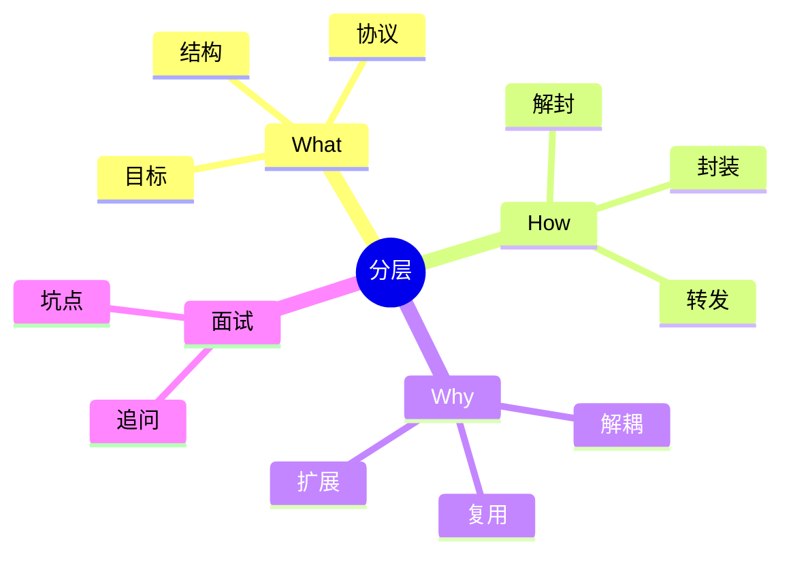
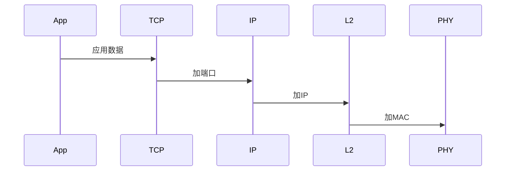

---
tags: [Net, Interview/高频, Code/Snippet, 分层模型]
aliases: ["五层模型", "协议栈"]
date: 2026-01-20
status: draft
---

# 面试笔记｜Net｜分层与协议栈



## What — 费曼解释

类比：分层像“流水线工位”，每个工位只做自己的事。

- 目标：让数据可靠、快速、可扩展传输。
- 结构：应用/传输/网络/链路/物理五层。
- 协议：每层用协议约定格式与行为。

## How — 机制流程

1) 应用层产出数据。
2) 传输层加端口与可靠性控制。
3) 网络层加 IP 与路由选择。
4) 链路层加 MAC 与局域网交付。
5) 物理层把比特变信号。



## How — 工业级代码 (可运行)

```java
public class LayeringDemo {
    static String encapsulate(String data, String layer) {
        // 为什么：用字符串模拟封装；底层：每层加首部/尾部形成新报文
        return layer + "[" + data + "]";
    }

    public static void main(String[] args) {
        String data = "HTTP GET /";
        // 为什么：按发送端封装顺序排列；底层：上层数据逐层加头
        String[] layers = {"APP", "TCP", "IP", "ETH", "PHY"};
        for (String layer : layers) {
            // 为什么：逐层调用封装函数；底层：形成多层报头比特流
            data = encapsulate(data, layer);
        }
        System.out.println("Encapsulated: " + data);
    }
}
```

## Why & Interview — 机制复盘

步骤复盘：
1) 分层降低复杂度，提升可维护性。
2) 封装与解封装保证边界清晰。
3) 路由器在网络层，交换机在链路层。
4) 分层带来额外开销但换来扩展性。

对比表：

| 维度 | TCP | UDP |
| --- | --- | --- |
| 连接 | 面向连接 | 无连接 |
| 可靠 | 有序可靠 | 不保证 |
| 延迟 | 较高 | 较低 |
| 场景 | 网页/文件 | 实时音视频 |

### ✅ 面试怎么问
- 五层模型各层职责？
- TCP/UDP 的核心差别？
- IP 与 MAC 的关系？
- 输入网址后的流程？

### ⚠️ 坑点/误区
- 混淆 OSI 七层与 TCP/IP 五层。
- 误以为 MAC 可全网路由。
- 只背层名不懂封装。

### 🔍 递进追问链路
1. 为什么要三次握手？
2. DNS 缓存有哪些层级？
3. MTU 与分片如何影响性能？
4. NAT 对端到端通信的影响？
5. HTTP 基于 TCP 的权衡？

## 一分钟背诵版

1. 分层把复杂网络拆成工位。
2. 应用层定义内容语义。
3. 传输层保证端到端。
4. 网络层负责寻址路由。
5. 链路层负责下一跳。
6. 物理层传递比特信号。
7. 封装是逐层加头。
8. 解封装逐层拆头。
9. TCP 可靠但开销大。
10. 分层提升扩展性。

## 面试 Checklist

- [ ] 能说清五层职责
- [ ] 能解释封装/解封装
- [ ] 能区分 TCP/UDP
- [ ] 能区分 IP/MAC
- [ ] 能描述访问网站流程
- [ ] 能说明设备分层
- [ ] 能解释分层优势
- [ ] 能举例协议

[[TCP]] [[UDP]] [[IP]] [[MAC]] [[DNS]] [[路由器]] [[交换机]]
