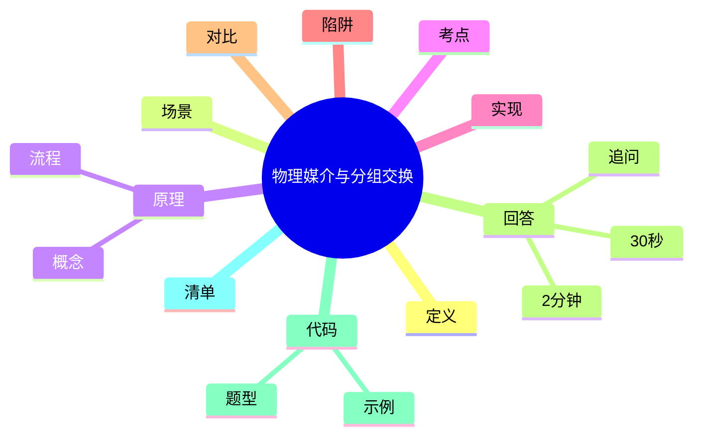

# 计算机网络物理媒介与分组交换原理

> [!summary] TL;DR（3-5 行）
> - 一句话定义：物理媒介是比特传输的载体，分组交换是把数据拆包后逐跳转发。
> - 面试一句话结论：分组交换以“统计复用+逐跳转发”提升带宽利用率。
> - 关键点：物理介质特性、交换方式对比、延迟组成。
> - 常见坑：把分组交换等同于电路交换、忽视排队时延。

> [!tip]
> **工程师思维自检**：
> 1. 我能解释“为什么分组交换更高效”吗？
> 2. 我能分清传输时延/传播时延/排队时延吗？

---

## 1. 定义与定位

- **它是什么**：物理媒介负责比特传输，分组交换负责数据在网络中的转发方式。
- **解决什么问题**：提高链路利用率、支持多用户共享带宽。
- **体系中的位置**：物理层与网络层基础概念。[[计算机网络]]

---

## 2. 应用场景

- 场景 1：互联网数据传输（典型分组交换）。
- 场景 2：局域网/广域网链路设计。
- 不适用：需要强实时且固定带宽保证的场景（电路交换更合适）。

---

## 3. 核心原理（面试够用版）

> [!note] 先给结论，再解释“怎么做到”

- **核心机制**（5-7 条要点）：
  1) 物理媒介包括双绞线、光纤、无线电波。
  2) 分组交换把数据分成包，逐跳转发。
  3) 统计复用提升链路利用率。
  4) 每个分组独立路由，可能走不同路径。
  5) 时延由处理/排队/传输/传播组成。

### 3.1 关键流程（步骤）

1. 源端把数据分段打包。
2. 路由器逐跳转发分组。
3. 目标端按序重组。

### 3.2 关键概念

- **传输时延**：发送比特耗时。
- **传播时延**：信号在介质上传播耗时。

### 3.3 费曼类比

> [!tip] 用人话解释
> 像快递包裹：把大件拆成多个包裹，走不同路线，最后再合并。

---

## 4. 关键细节清单（高频考点）

- 考点 1：**交换方式对比**：电路交换/分组交换/报文交换。
- 考点 2：**延迟构成**：处理+排队+传输+传播。
- 考点 3：**统计复用**优势与代价（可能乱序）。
- 考点 4：**介质差异**：光纤带宽大、抗干扰强。

---

## 5. 源码/实现要点（不装行号，只抓关键）

> [!tip] 目标：回答“系统实现为什么这么设计”

- **关键组件**：链路层设备、路由器转发。
- **关键流程**：分组 → 路由选择 → 逐跳转发 → 重组。
- **关键策略**：缓存队列处理突发流量。
- **面试话术**：分组交换依赖路由器逐跳缓存与转发。

---

## 6. 易错点与陷阱（至少 5 条）

1) 把分组交换等同于电路交换。
2) 忽略排队时延在高负载下的影响。
3) 认为所有分组都走同一路径。
4) 把传输时延与传播时延混淆。
5) 忽视丢包与重传成本。

---

## 7. 对比与扩展（至少 2 组）

- **分组交换 vs 电路交换**：前者共享带宽，后者独占资源。
- **光纤 vs 双绞线**：带宽、距离、抗干扰能力差异。
- 扩展问题：分组乱序如何保证可靠传输？

### 对比表

| 特性 | 分组交换 | 电路交换 |
| :--- | :--- | :--- |
| 带宽利用 | 高 | 低 |
| 延迟 | 可变 | 稳定 |
| 可靠性 | 需上层保证 | 固定链路 |

---

## 8. 标准面试回答（可直接背）

### 8.1 30 秒版本（电梯回答）

> [!quote]
> 物理媒介负责比特传输，分组交换把数据拆成分组逐跳转发，依靠统计复用提高带宽利用率。时延来自处理、排队、传输和传播，负载高时排队时延会显著增加。

### 8.2 2 分钟版本（结构化展开）

> [!quote]
> 1) 定义与定位：物理媒介是底层载体，分组交换是主流转发方式。 
> 2) 场景：互联网数据传输与共享链路。 
> 3) 原理：分组拆分、逐跳转发、统计复用。 
> 4) 易错点：把分组交换等同电路交换。 
> 5) 扩展：丢包与乱序由上层协议解决。

### 8.3 深挖追问（面试官继续问什么）

- 追问 1：为什么分组交换效率更高？→ 统计复用减少闲置带宽。
- 追问 2：时延最容易被忽视的是哪项？→ 排队时延。
- 追问 3：乱序如何处理？→ 传输层重排与重传。

---

## 9. 代码题与代码示例（必须有详注）

> [!important] 要求：注释解释“为什么这样写”，不是解释语法

### 9.1 面试代码题（2-3 题）

- 题 1：如何把大数据分片模拟分组传输？
- 题 2：如何估算传输时延与传播时延？
- 题 3：如何模拟分组乱序与重组？

### 9.2 参考代码（Java）

```java
// 目标：把字符串按固定大小切分，模拟分组
// 注意：这里只演示分组思想，不是实际网络协议
import java.util.*;

public class PacketizeDemo {
    public static void main(String[] args) {
        String data = "HelloNetworkPacket";
        int size = 5; // 为什么固定长度：模拟分组大小
        List<String> packets = new ArrayList<>();

        for (int i = 0; i < data.length(); i += size) {
            // 截取子串模拟分组
            int end = Math.min(i + size, data.length());
            packets.add(data.substring(i, end));
        }

        // 输出分组结果，用于理解“拆包/重组”
        System.out.println(packets);
    }
}
```

---

## 10. 复习 Checklist（可勾选）

- [ ] 我能区分电路交换与分组交换。
- [ ] 我能说出 4 类时延。
- [ ] 我能解释统计复用的意义。
- [ ] 我能举出常见物理媒介。
- [ ] 我能解释乱序与重传的关系。

---

## 11. Mermaid 思维导图（Obsidian 可渲染）



---

## Net 额外要求（分层视角）

- 分层视角：TCP/IP 四层（应用/传输/网络/链路）或 OSI 七层。
- 本主题主要在**物理层与链路层**，分组转发在**网络层**。

---

## 相关笔记（双向链接）

- [[计算机网络]]
- [[OSI 七层]]
- [[TCP/IP 四层]]
