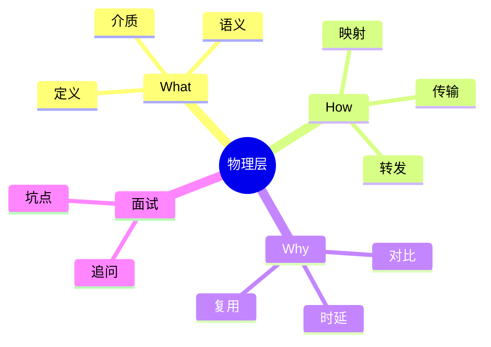
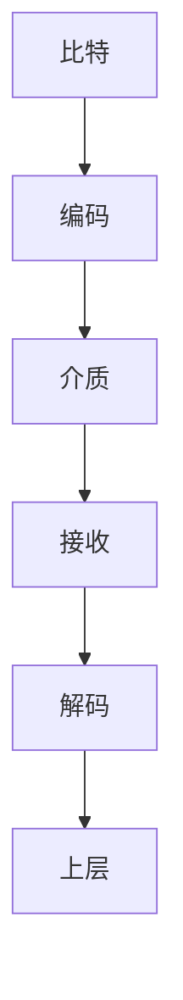

# 面试笔记｜Net｜物理层与交换



## What — 费曼解释

类比：物理层像“快递道路与车辆”，只负责把包裹搬上路，不关心包裹内容。

- 定义：把比特流映射为电/光/无线信号并在介质中传播。
- 介质：双绞线/同轴/光纤与无线电/微波/卫星/红外。
- 分层视角：物理层负责信号传输，上层负责语义与控制。

## How — 机制流程

1) 比特编码为信号（电平/光脉冲/射频）。
2) 信号沿介质传播，到达下游设备。
3) 电路交换：先建链路再独占传输。
4) 分组交换：分包 -> 存储转发 -> 路由转发。



## How — 工业级代码 (可运行)

```java
public class NetworkDelayDemo {
    static double transmissionDelay(double bits, double bandwidthBps) {
        // 为什么：统一单位避免 b/B 混淆；底层：发送时延=比特数/链路速率
        return bits / bandwidthBps;
    }

    static double propagationDelay(double distanceMeters, double signalSpeed) {
        // 为什么：用距离与传播速率建模；底层：传播时延=距离/介质传播速度
        return distanceMeters / signalSpeed;
    }

    static double storeAndForwardDelay(int hops, double bits, double bandwidthBps,
                                       double propPerHop, double procPerHop, double queuePerHop) {
        // 为什么：逐跳累加更贴合存储转发；底层：每跳收满分组再查表转发
        return hops * (transmissionDelay(bits, bandwidthBps) + propPerHop + procPerHop + queuePerHop);
    }

    public static void main(String[] args) {
        int hops = 3;
        double packetBits = 1_000_000; // 为什么：用比特便于公式；底层：决定发送时延
        double bandwidth = 100_000_000; // 为什么：链路速率；底层：发送时延上限
        double propPerHop = propagationDelay(100_000, 2.0e8); // 为什么：距离+速度；底层：传播时延
        double procPerHop = 0.0002; // 为什么：处理开销；底层：查表/校验耗时
        double queuePerHop = 0.001; // 为什么：队列等待；底层：拥塞导致排队

        double total = storeAndForwardDelay(hops, packetBits, bandwidth, propPerHop, procPerHop, queuePerHop);
        System.out.printf("Total delay: %.3f ms%n", total * 1000);
    }
}
```

## Why & Interview — 机制复盘

步骤复盘：
1) 端系统产出比特流并编码。
2) 信号在介质中传播并衰减/干扰。
3) 路由器存储转发并按路由表选择下一跳。
4) 统计复用让链路在多流之间共享。
5) 时延由处理/排队/传输/传播叠加。

对比表：

| 维度 | 电路交换 | 分组交换 |
| --- | --- | --- |
| 连接 | 先建路 | 先分包 |
| 带宽 | 独占 | 共享 |
| 时延 | 稳定 | 抖动 |
| 效率 | 低 | 高 |

### ✅ 面试怎么问
- 电路交换和分组交换的核心区别？
- 为什么存储转发会带来时延？
- 四类时延分别由什么决定？
- 无线介质和光纤的差别？

### ⚠️ 坑点/误区
- 传输时延与传播时延混淆。
- 认为带宽提升就能降低传播时延。
- 忽略拥塞导致排队时延暴涨。

### 🔍 递进追问链路
1. 为什么互联网采用分组交换？
2. 统计复用的收益与代价？
3. 存储转发对可靠性影响？
4. 哪些场景排队时延最突出？
5. 交换机与路由器在路径上的作用？

## 一分钟背诵版

1. 物理层只处理比特与信号映射。
2. 有线介质稳定高带宽，无线介质易干扰。
3. 电路交换先建链路再独占。
4. 分组交换拆包按路由转发。
5. 存储转发需要收满包再转发。
6. 统计复用提升链路利用率。
7. 时延由处理/排队/传输/传播构成。
8. 排队时延随拥塞上升。
9. 传播时延只与距离与介质速率相关。
10. 分层让职责边界清晰。

## 面试 Checklist

- [ ] 能解释物理层职责
- [ ] 能说清有线/无线差异
- [ ] 能对比电路/分组交换
- [ ] 能描述存储转发流程
- [ ] 能列出四类时延
- [ ] 能解释统计复用
- [ ] 能说明分层视角
- [ ] 能举例典型介质

[[物理层]] [[分组交换]] [[电路交换]] [[路由器]] [[时延]] [[带宽]]
