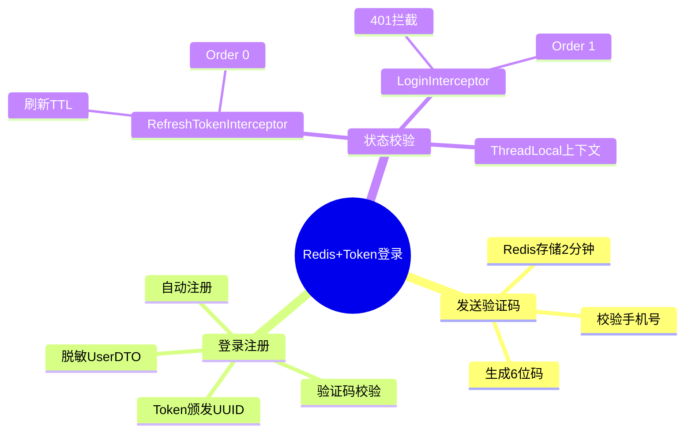

# 短信登录注册：Redis + Token 方案

## 知识导图



## 结论

1. **替代Session**：使用 Redis + Token 解决分布式环境下的 Session 共享问题
2. **双拦截器设计**：RefreshTokenInterceptor 续命 + LoginInterceptor 鉴权，保证持续活跃用户永不过期
3. **安全脱敏**：UserDTO 只保留非敏感字段（ID/昵称/头像），防止密码泄露

## 核心要点

- **验证码流程**：Redis存储 `login:code:{phone}`，TTL=2分钟，不返回前端
- **Token结构**：UUID作为Key，Hash存储UserDTO的Map形式，TTL=30分钟
- **拦截器优先级**：Order 0 先刷新所有请求的Token，Order 1 再校验受保护路径
- **ThreadLocal传递**：UserHolder 确保同线程内任意位置可获取当前用户
- **自动注册**：手机号不存在时自动创建用户（随机昵称、空密码）
- **前端存储**：Token 存入 sessionStorage，每次请求带 `authorization` Header

## 代码示例

```java
// 阶段一：发送验证码
@PostMapping("/code")
public Result sendCode(@RequestParam("phone") String phone) {
    // 1. 校验手机号
    if (RegexUtils.isPhoneInvalid(phone)) {
        return Result.fail("手机号格式错误");
    }
    // 2. 生成验证码
    String code = RandomUtil.randomNumbers(6);
    // 3. 保存到 Redis（Key: login:code:{phone}, TTL: 2分钟）
    stringRedisTemplate.opsForValue().set(
        "login:code:" + phone, code, 2, TimeUnit.MINUTES
    );
    // 4. 模拟发送（不返回验证码）
    log.debug("发送短信验证码：{}", code);
    return Result.ok();
}

// 阶段二：登录
@PostMapping("/login")
public Result login(@RequestBody LoginFormDTO loginForm) {
    // 1. 校验验证码
    String cacheCode = stringRedisTemplate.opsForValue()
        .get("login:code:" + loginForm.getPhone());
    if (!loginForm.getCode().equals(cacheCode)) {
        return Result.fail("验证码错误");
    }
    // 2. 查询/注册用户
    User user = query().eq("phone", loginForm.getPhone()).one();
    if (user == null) {
        user = createUserWithPhone(loginForm.getPhone()); // 自动注册
    }
    // 3. 脱敏 + 生成Token
    String token = UUID.randomUUID().toString(true);
    UserDTO userDTO = BeanUtil.copyProperties(user, UserDTO.class);
    Map<String, Object> userMap = BeanUtil.beanToMap(userDTO);
    // 4. 存入 Redis（Hash结构，TTL=30分钟）
    stringRedisTemplate.opsForHash().putAll("login:token:" + token, userMap);
    stringRedisTemplate.expire("login:token:" + token, 30, TimeUnit.MINUTES);
    return Result.ok(token);
}
```

## 易错点

> [!warning] 常见陷阱
> 1. **单拦截器陷阱**：若只用 LoginInterceptor，用户访问首页等公开路径时 Token 不刷新，导致30分钟后强制退出
> 2. **验证码泄露**：切勿将验证码返回给前端，应仅在后端对比
> 3. **敏感信息存储**：禁止将完整 User 对象存入 Redis，必须使用 UserDTO 脱敏
> 4. **ThreadLocal清理**：请求结束后需调用 `UserHolder.removeUser()` 防止内存泄漏（通常在拦截器 afterCompletion 中）

## 自测题

1. **问**：为什么要设计 RefreshTokenInterceptor 和 LoginInterceptor 两个拦截器？
   > **答**：RefreshTokenInterceptor（Order 0）拦截所有请求刷新 Token TTL，保证活跃用户永不过期；LoginInterceptor（Order 1）仅校验受保护路径，实现权限控制。若只用一个拦截器，访问公开路径时 Token 不刷新会导致超时。

2. **问**：Redis 中 Token 的 Key-Value 结构是什么？为什么用 Hash？
   > **答**：Key=`login:token:{uuid}`，Value=Hash结构存储 UserDTO 的 Map。使用 Hash 便于按字段更新（如只更新昵称），比存 JSON 字符串更灵活高效。

3. **问**：如果用户在第 29 分钟访问了首页，Token 会过期吗？
   > **答**：不会。RefreshTokenInterceptor 拦截所有请求（包括首页），只要有 Token 就刷新 TTL 为 30 分钟，因此任何操作都会续命。

4. **问**：为什么要将 User 转为 UserDTO？
   > **答**：User 实体包含密码等敏感字段，存入 Redis 或返回前端会造成安全风险。UserDTO 只保留 ID、昵称、头像等非敏感信息。

## 相关链接

- [[数据流向图]]
- [[数据库架构图]]
- [[Redis数据结构设计]]
