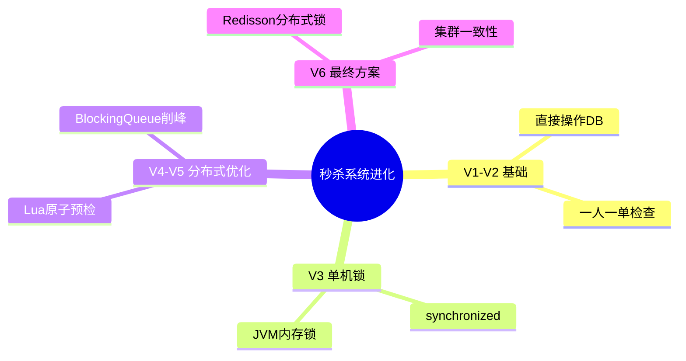

# 秒杀系统六步进化：从单机到分布式

## 知识导图



## 结论

1. **渐进式演进**：从V1到V6逐步解决超卖、重复购买、并发安全、性能瓶颈、分布式一致性问题
2. **核心技术栈**：Lua脚本保证原子性、消息队列削峰填谷、Redisson实现分布式锁
3. **架构升级**：单机JVM锁 → Redis预检 → 异步队列 → 分布式锁，适应从单体到集群的演进

## 核心要点

- **V1（裸奔版）**：直接操作数据库，存在超卖和重复购买问题
- **V2（业务校验）**：添加一人一单检查（`SELECT COUNT(*) WHERE user_id AND voucher_id`），防止多买但无并发控制
- **V3（单机锁）**：使用 `synchronized` 锁住用户ID，解决单机并发但无法应对集群
- **V4（原子预检）**：Lua脚本在Redis中原子性判断库存和userId去重，减少DB压力
- **V5（异步解耦）**：BlockingQueue异步处理订单入库，实现削峰填谷提升吞吐量
- **V6（分布式锁）**：Redisson分布式锁替代synchronized，解决集群环境下的并发问题

## 代码示例

### V2: 一人一单检查（无并发控制）

```java
public Result seckillVoucher(Long voucherId) {
    // 1. 查询优惠券
    SeckillVoucher voucher = seckillVoucherService.getById(voucherId);
    if (voucher.getStock() < 1) {
        return Result.fail("库存不足");
    }
    // 2. 一人一单检查（无并发控制 ⚠️）
    Long userId = UserHolder.getUser().getId();
    Long count = query().eq("user_id", userId)
                        .eq("voucher_id", voucherId).count();
    if (count > 0) {
        return Result.fail("用户已经购买过一次！");
    }
    // 3. 扣减库存（乐观锁 CAS）
    boolean success = seckillVoucherService.update()
        .setSql("stock = stock - 1")
        .eq("voucher_id", voucherId)
        .gt("stock", 0)  // WHERE stock > 0 防止超卖
        .update();
    if (!success) {
        return Result.fail("库存不足！");
    }
    // 4. 创建订单
    VoucherOrder order = new VoucherOrder();
    order.setId(redisIdWorker.nextId("order"));
    order.setUserId(userId);
    order.setVoucherId(voucherId);
    save(order);
    return Result.ok(order.getId());
}
```

### V3: synchronized 单机锁

```java
public Result seckillVoucher(Long voucherId) {
    // 前置校验...
    Long userId = UserHolder.getUser().getId();

    // 锁住用户ID（intern() 确保相同ID用同一个锁对象）
    synchronized (userId.toString().intern()) {
        // 获取代理对象（Spring事务在代理对象上生效）
        IVoucherOrderService proxy = (IVoucherOrderService) AopContext.currentProxy();
        return proxy.createVoucherOrder(voucherId);
    }
}

@Transactional
public Result createVoucherOrder(Long voucherId) {
    // 一人一单检查 + 扣库存 + 创建订单（同V2）
}
```

### V4: Redis Lua 脚本原子预检

**seckill.lua**（位于 resources 目录）
```lua
-- 1.参数列表
local voucherId = ARGV[1]  -- 优惠券ID
local userId = ARGV[2]      -- 用户ID

-- 2.数据key
local stockKey = 'seckill:stock:' .. voucherId    -- 库存key
local orderKey = 'seckill:order:' .. voucherId    -- 订单key

-- 3.脚本业务
-- 3.1.判断库存是否充足
if (tonumber(redis.call('get', stockKey)) <= 0) then
    return 1  -- 库存不足
end
-- 3.2.判断用户是否下单（Set 去重）
if (redis.call('sismember', orderKey, userId) == 1) then
    return 2  -- 重复下单
end
-- 3.3.扣库存
redis.call('incrby', stockKey, -1)
-- 3.4.下单（保存用户到Set）
redis.call('sadd', orderKey, userId)
return 0  -- 成功
```

**Java 调用 Lua**
```java
// 初始化Lua脚本
private static final DefaultRedisScript<Long> SECKILL_SCRIPT;
static {
    SECKILL_SCRIPT = new DefaultRedisScript<>();
    SECKILL_SCRIPT.setLocation(new ClassPathResource("seckill.lua"));
    SECKILL_SCRIPT.setResultType(Long.class);
}

public Result seckillVoucher(Long voucherId) {
    Long userId = UserHolder.getUser().getId();
    // 执行Lua脚本
    Long result = stringRedisTemplate.execute(
        SECKILL_SCRIPT,
        Collections.emptyList(),
        voucherId.toString(), userId.toString()
    );
    // 判断结果
    int r = result.intValue();
    if (r != 0) {
        return Result.fail(r == 1 ? "库存不足" : "不能重复下单");
    }
    // 有购买资格，创建订单（仍需操作DB）
    // ...
}
```

### V5: BlockingQueue 异步队列

```java
// 阻塞队列（内存队列，容量 1024*1024）
private BlockingQueue<VoucherOrder> orderTasks = new ArrayBlockingQueue<>(1024 * 1024);

// 单线程线程池
private static final ExecutorService SECKILL_ORDER_EXECUTOR = Executors.newSingleThreadExecutor();

// Spring启动后自动开启消费者线程
@PostConstruct
private void init() {
    SECKILL_ORDER_EXECUTOR.submit(new VoucherOrderHandler());
}

// 消费者线程
private class VoucherOrderHandler implements Runnable {
    @Override
    public void run() {
        while (true) {
            try {
                // 从队列中获取订单（阻塞等待）
                VoucherOrder voucherOrder = orderTasks.take();
                // 创建订单
                handleVoucherOrder(voucherOrder);
            } catch (Exception e) {
                log.error("处理订单异常", e);
            }
        }
    }
}

// 主线程：Lua预检 + 入队
public Result seckillVoucher(Long voucherId) {
    Long userId = UserHolder.getUser().getId();
    // 1. 执行Lua脚本
    Long result = stringRedisTemplate.execute(SECKILL_SCRIPT, ...);
    if (result != 0) {
        return Result.fail(...);
    }
    // 2. 有购买资格，订单信息放入队列
    VoucherOrder voucherOrder = new VoucherOrder();
    voucherOrder.setId(redisIdWorker.nextId("order"));
    voucherOrder.setUserId(userId);
    voucherOrder.setVoucherId(voucherId);
    orderTasks.add(voucherOrder);  // 入队（非阻塞）
    // 3. 返回订单ID
    return Result.ok(voucherOrder.getId());
}
```

### V6: Redisson 分布式锁（最终版）

```java
@Resource
private RedissonClient redissonClient;

// 异步处理订单时加分布式锁
private void handleVoucherOrder(VoucherOrder voucherOrder) {
    Long userId = voucherOrder.getUserId();

    // 1. 创建Redisson分布式锁对象
    RLock lock = redissonClient.getLock("lock:order:" + userId);

    // 2. 尝试获取锁（非阻塞，立即返回）
    boolean isLock = lock.tryLock();

    if (!isLock) {
        log.error("不允许重复下单");
        return;
    }

    try {
        // 3. 使用代理对象调用事务方法
        proxy.createVoucherOrder(voucherOrder);
    } finally {
        // 4. 释放锁（无论成功失败都要释放）
        lock.unlock();
    }
}

@Transactional
public void createVoucherOrder(VoucherOrder voucherOrder) {
    // 1. 一人一单
    Long userId = voucherOrder.getUserId();
    Long count = query().eq("user_id", userId)
                        .eq("voucher_id", voucherOrder.getVoucherId()).count();
    if (count > 0) {
        log.error("用户已经购买过一次！");
        return;
    }
    // 2. 扣减库存（乐观锁）
    boolean success = seckillVoucherService.update()
        .setSql("stock = stock - 1")
        .eq("voucher_id", voucherOrder.getVoucherId())
        .gt("stock", 0)
        .update();
    if (!success) {
        log.error("库存不足！");
        return;
    }
    // 3. 创建订单
    save(voucherOrder);
}
```

## 易错点

> [!warning] 常见陷阱
> 1. **V2陷阱**：一人一单检查和创建订单之间无原子性，高并发下仍会重复购买
> 2. **V3局限**：`synchronized` 只在单JVM有效，部署多实例时失效
> 3. **V4遗留问题**：Lua脚本预检通过后，若直接操作DB仍有延迟，需配合异步队列
> 4. **V6锁粒度**：Redisson锁应锁 `userId:voucherId`，避免锁整个方法导致性能下降

## 版本对比表

| 版本 | 特性 | 解决的问题 | 遗留问题 |
|------|------|-----------|---------|
| V1 | 直接操作数据库 | - | 超卖 + 重复购买 |
| V2 | 一人一单检查 | 防止用户多买 | 并发下检查失效 |
| V3 | synchronized 锁 | 单机并发安全 | 集群环境失效 |
| V4 | Redis Lua 脚本 | 分布式原子预检 | DB仍是瓶颈 |
| V5 | BlockingQueue | 异步解耦，削峰填谷 | 单机队列不可靠 |
| V6 | Redisson 分布式锁 | 集群环境下的最终一致性 | 需考虑锁超时/续期 |

## 自测题

1. **问**：为什么V3的 `synchronized` 在集群环境下会失效？
   > **答**：`synchronized` 是JVM级别的锁，只能锁住当前进程内的线程。当部署多个服务实例时，每个实例的JVM独立，锁无法跨实例生效，导致不同实例的请求仍可能并发创建订单。

2. **问**：V4的Lua脚本解决了什么问题？为什么要用Lua而不是多次Redis命令？
   > **答**：Lua脚本保证了"判断库存 → 判断重复 → 扣库存 → 记录用户"的**原子性**。如果用多次Redis命令，中间可能被其他线程插入，导致超卖或重复购买。Redis保证Lua脚本执行期间不会被其他命令打断。

3. **问**：V5的BlockingQueue如何实现削峰填谷？
   > **答**：高并发请求瞬间涌入时，通过Lua脚本快速预判断后将订单信息放入队列，立即返回"排队中"。后台异步线程慢慢从队列取订单写入DB，避免DB被瞬时流量打垮，实现流量削峰。

4. **问**：V6使用Redisson分布式锁时，如何避免死锁？
   > **答**：Redisson内置**看门狗机制**（WatchDog），默认锁过期时间30秒，若业务未执行完会自动续期。同时支持**可重入**特性（同一线程可多次获取锁）。释放锁时使用 `try-finally` 确保异常情况下也能解锁。

## 深入原理（参考小林coding）

### Redis 数据结构底层实现

#### String（SDS - Simple Dynamic String）
- **O(1) 获取长度**：SDS 结构内置 `len` 字段，无需遍历
- **防止缓冲区溢出**：`alloc` 字段预分配空间
- **二进制安全**：可存储非文本数据（如图片、序列化对象）
- **应用场景**：本项目中用于存储库存计数器 `seckill:stock:{id}`

#### Set（整数集合 / 哈希表）
- **小数据量优化**：纯整数且元素少时使用整数集合（连续内存，节省空间）
- **去重特性**：本项目用于 `seckill:order:{id}` 存储已购买用户ID
- **时间复杂度**：`SISMEMBER` 判断用户是否下单为 O(1)

#### ZSet（跳表 + 哈希表）
- **跳表**：平均 O(logN) 复杂度的节点查找，支持高效范围查询
- **哈希表**：O(1) 获取元素权重（score）
- **选择理由**：比平衡树实现更简单、调试更容易、内存更灵活
- **应用扩展**：可用于排行榜、延迟队列（按时间戳排序）

### 分布式锁核心问题

#### 1. 锁误删问题
**问题**：线程A的锁过期后被线程B删除
**解决**：Redisson 使用 UUID + ThreadID 作为锁标识，释放时先校验

#### 2. 原子性问题
**问题**：校验锁标识和删除锁不是原子操作
**解决**：Redisson 内部使用 Lua 脚本保证原子性

#### 3. 锁续期问题
**问题**：业务执行时间超过锁过期时间
**解决**：Redisson WatchDog 机制，默认每 10 秒续期一次（锁过期时间 30 秒）

#### 4. 主从一致性问题
**问题**：主节点宕机导致锁丢失
**解决**：RedLock 算法（多个独立 Redis 节点，过半成功才算获取锁）

### 消息队列选型对比

| 方案 | 优点 | 缺点 | 适用场景 |
|------|------|------|---------|
| JDK BlockingQueue | 简单易用、无需中间件 | 内存队列、JVM崩溃丢消息 | 单机、低可靠性要求 |
| Redis List | 持久化、支持集群 | 无ACK机制、消费确认较弱 | 轻量级消息队列 |
| Redis Stream | ACK、消费组、持久化 | 功能比专业MQ弱 | 中等规模、Redis技术栈 |
| RabbitMQ/Kafka | 企业级、高可靠 | 运维成本高、重量级 | 大规模分布式系统 |

**本项目演进建议**：V5 使用 BlockingQueue → 生产环境建议升级为 Redis Stream 或 RabbitMQ

## 相关链接

### 项目内部链接
- [[短信登录注册-Redis+Token方案]]
- [[数据流向图]]
- [[数据库架构图]]

### 外部参考资料
- [小林coding - 图解Redis](https://www.xiaolincoding.com/) - Redis数据结构、持久化、高可用
- [小林coding - 分布式锁](https://www.xiaolincoding.com/redis/cluster/distributed_lock.html) - 分布式锁核心问题
- [Redisson 官方文档](https://github.com/redisson/redisson/wiki) - 分布式锁实现细节
