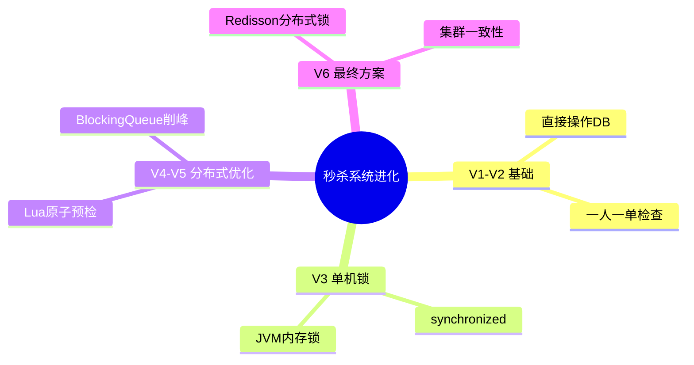

# 秒杀系统六步进化：从单机到分布式

## 知识导图



## 结论

1. **渐进式演进**：从V1到V6逐步解决超卖、重复购买、并发安全、性能瓶颈、分布式一致性问题
2. **核心技术栈**：Lua脚本保证原子性、消息队列削峰填谷、Redisson实现分布式锁
3. **架构升级**：单机JVM锁 → Redis预检 → 异步队列 → 分布式锁，适应从单体到集群的演进

## 核心要点

- **V1（裸奔版）**：直接操作数据库，存在超卖和重复购买问题
- **V2（业务校验）**：添加一人一单检查（`SELECT COUNT(*) WHERE user_id AND voucher_id`），防止多买但无并发控制
- **V3（单机锁）**：使用 `synchronized` 锁住用户ID，解决单机并发但无法应对集群
- **V4（原子预检）**：Lua脚本在Redis中原子性判断库存和userId去重，减少DB压力
- **V5（异步解耦）**：BlockingQueue异步处理订单入库，实现削峰填谷提升吞吐量
- **V6（分布式锁）**：Redisson分布式锁替代synchronized，解决集群环境下的并发问题

## 代码示例

```java
// ========== V2: 一人一单检查 ==========
public Result seckillVoucher(Long voucherId) {
    // 1. 查询优惠券
    SeckillVoucher voucher = seckillVoucherService.getById(voucherId);
    if (voucher.getStock() < 1) {
        return Result.fail("库存不足");
    }
    // 2. 一人一单检查（无并发控制）
    Long userId = UserHolder.getUser().getId();
    int count = query().eq("user_id", userId)
                       .eq("voucher_id", voucherId).count();
    if (count > 0) {
        return Result.fail("您已购买过该券");
    }
    // 3. 扣减库存 + 创建订单
    boolean success = seckillVoucherService.update()
        .setSql("stock = stock - 1").eq("voucher_id", voucherId).update();
    if (success) {
        VoucherOrder order = new VoucherOrder();
        order.setUserId(userId).setVoucherId(voucherId);
        save(order);
        return Result.ok(order.getId());
    }
    return Result.fail("库存不足");
}

// ========== V3: synchronized 单机锁 ==========
public Result seckillVoucher(Long voucherId) {
    // ... 前置校验 ...
    Long userId = UserHolder.getUser().getId();
    synchronized (userId.toString().intern()) { // 锁用户ID
        // 一人一单检查 + 创建订单（同V2）
    }
}

// ========== V4: Redis Lua 脚本原子预检 ==========
-- seckill.lua
local voucherId = ARGV[1]
local userId = ARGV[2]
local stockKey = 'seckill:stock:' .. voucherId
local orderKey = 'seckill:order:' .. voucherId

-- 1. 判断库存
if (tonumber(redis.call('get', stockKey)) <= 0) then
    return 1 -- 库存不足
end
-- 2. 判断用户是否已购买
if (redis.call('sismember', orderKey, userId) == 1) then
    return 2 -- 重复下单
end
-- 3. 扣库存 + 记录用户
redis.call('incrby', stockKey, -1)
redis.call('sadd', orderKey, userId)
return 0 -- 成功
```

## 易错点

> [!warning] 常见陷阱
> 1. **V2陷阱**：一人一单检查和创建订单之间无原子性，高并发下仍会重复购买
> 2. **V3局限**：`synchronized` 只在单JVM有效，部署多实例时失效
> 3. **V4遗留问题**：Lua脚本预检通过后，若直接操作DB仍有延迟，需配合异步队列
> 4. **V6锁粒度**：Redisson锁应锁 `userId:voucherId`，避免锁整个方法导致性能下降

## 版本对比表

| 版本 | 特性 | 解决的问题 | 遗留问题 |
|------|------|-----------|---------|
| V1 | 直接操作数据库 | - | 超卖 + 重复购买 |
| V2 | 一人一单检查 | 防止用户多买 | 并发下检查失效 |
| V3 | synchronized 锁 | 单机并发安全 | 集群环境失效 |
| V4 | Redis Lua 脚本 | 分布式原子预检 | DB仍是瓶颈 |
| V5 | BlockingQueue | 异步解耦，削峰填谷 | 单机队列不可靠 |
| V6 | Redisson 分布式锁 | 集群环境下的最终一致性 | 需考虑锁超时/续期 |

## 自测题

1. **问**：为什么V3的 `synchronized` 在集群环境下会失效？
   > **答**：`synchronized` 是JVM级别的锁，只能锁住当前进程内的线程。当部署多个服务实例时，每个实例的JVM独立，锁无法跨实例生效，导致不同实例的请求仍可能并发创建订单。

2. **问**：V4的Lua脚本解决了什么问题？为什么要用Lua而不是多次Redis命令？
   > **答**：Lua脚本保证了"判断库存 → 判断重复 → 扣库存 → 记录用户"的**原子性**。如果用多次Redis命令，中间可能被其他线程插入，导致超卖或重复购买。Redis保证Lua脚本执行期间不会被其他命令打断。

3. **问**：V5的BlockingQueue如何实现削峰填谷？
   > **答**：高并发请求瞬间涌入时，通过Lua脚本快速预判断后将订单信息放入队列，立即返回"排队中"。后台异步线程慢慢从队列取订单写入DB，避免DB被瞬时流量打垮，实现流量削峰。

4. **问**：V6使用Redisson分布式锁时，如何避免死锁？
   > **答**：Redisson内置**看门狗机制**（WatchDog），默认锁过期时间30秒，若业务未执行完会自动续期。同时支持**可重入**特性（同一线程可多次获取锁）。释放锁时使用 `try-finally` 确保异常情况下也能解锁。

## 相关链接

- [[短信登录注册-Redis+Token方案]]
- [[数据流向图]]
- [[数据库架构图]]
