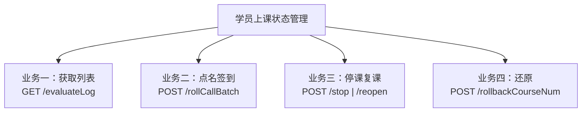
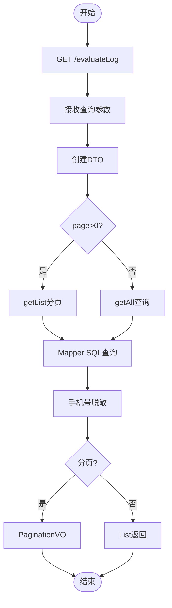
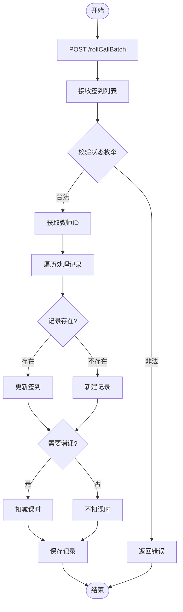
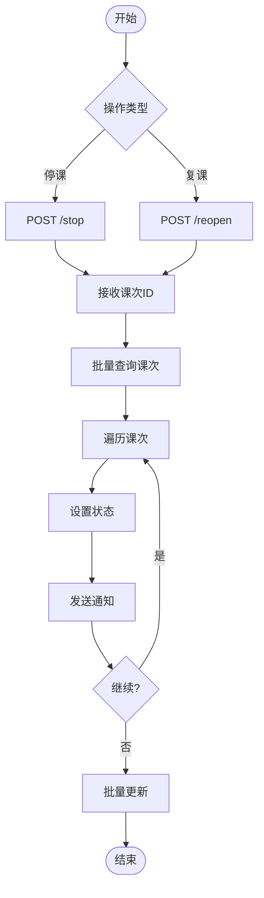
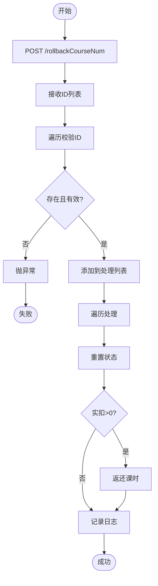

# 学员上课状态管理流程

## TL;DR

教育管理系统中学员上课状态的四种核心业务流程：获取列表、点名签到、停课复课、还原消课。

---

## 一、功能总览

| 业务 | API | 核心操作 | 数据表 |
|------|-----|----------|--------|
| 业务一 | GET /evaluateLog | 条件查询+分页 | lesson_student |
| 业务二 | POST /rollCallBatch | 批量签到+消课 | lesson_student |
| 业务三 | POST /stop/reopen | 状态变更+通知 | lesson |
| 业务四 | POST /rollbackCourseNum | 状态重置+返还 | lesson_student |

---

## 二、业务一：获取列表流程

### API

`GET /common/lessonStudent/evaluateLog`

### 查询参数

- lessonId - 课次ID
- studentId - 学员ID
- teacherId - 老师ID
- keyword - 关键词
- startDate/endDate - 日期范围
- onlyEvaluate - 仅查询有点评的记录

### 流程图

---

## 三、业务二：点名签到流程

### API

`POST /common/lesson/rollCallBatch`

### 签到状态枚举（SignStateEnum）

| 值 | 含义 |
|----|------|
| 0 | 未签到 (NONE) |
| 1 | 已签到 (NORMAL) |
| 2 | 补签 (LATE) |
| 3 | 请假 (LEAVE) |
| 4 | 旷课 (ABSENT) |

### 流程图

### 核心逻辑

1. 批量接收签到记录
2. 校验签到状态枚举合法性
3. 判断学员记录是否存在 → 更新或新建
4. 根据签到状态决定是否消课
5. 调用 `decLessonCount` 扣减学员课时

---

## 四、业务三：停课/复课流程

### API

- 停课：`POST /common/lesson/stop`
- 复课：`POST /common/lesson/reopen`

### 课次状态枚举（LessonStateEnum）

| 值 | 含义 |
|----|------|
| 0 | 已停课 (STOPPED) |
| 1 | 进行中 (UNDERWAY) |
| 2 | 已结课 (COMPLETE) |

### 流程图

---

## 五、业务四：还原流程（消课返还）

### API

`POST /common/lessonStudent/rollbackCourseNum`

### 流程图

### 核心逻辑

1. 校验签到记录是否存在且有效
2. 重置签到状态为 NONE（未签到）
3. 清零消课数 decLessonCount
4. 如果实扣次数 > 0，调用 `rollcallCancel` 返还课时

---

## 六、常见坑与边界

> [!warning]
> - 分页参数不存在时走全量查询，需注意大数据量性能
> - 签到状态为 NONE 时不消课，请假/旷课需根据业务规则决定
> - 还原操作只能还原有点评记录的签到状态
> - 停课/复课需发送通知告知学员家长

---

## References

- Spring Boot REST API 设计规范
- MyBatis Plus 分页插件
- 教育管理系统业务规范
