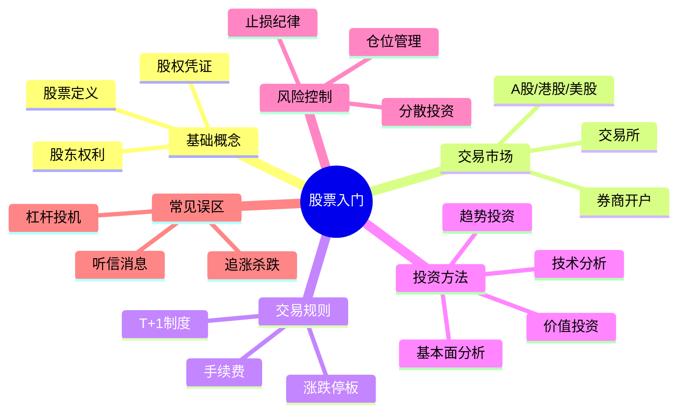

## TL;DR

- 股票是公司所有权的凭证，买股票即成为股东
- 股票市场是上市公司股权交易的场所
- 杠杆可放大收益也放大风险，新手慎用

---

## 背景与问题

**为什么需要了解股票？**
- 股票是资产配置的重要工具
- 理解公司治理和商业模式的基础
- 被动收入和财富增值的途径之一

**核心问题：**
- 如何选择有价值的股票？
- 如何评估股票的风险和收益？
- 如何建立自己的投资体系？

---

## 核心概念

### 1. 什么是股票

股票是公司整体"建筑"的一块"砖"，购买股票相当于获得公司的一部分所有权，成为公司股东。

### 2. 股票市场

各种"砖块"交易的市场。公司必须**上市**后，其股票才能在公开市场交易。

交易完成后，股价会实时更新。

### 3. 杠杆

以小博大的工具，用较低本金控制较高价值的股票。

> [!warning] 风险提示
> 杠杆放大收益的同时也放大亏损，不建议新手使用。

---

## 投资提示

> [!tip] 价值投资思路
> 如果公司盈利能力没变，股价却下跌：
> 1. 查看财务报表等数据
> 2. 如果公司盈利能力强但股价低，可能是价值被低估
> 3. 这可能是买入机会（需结合其他分析）

---

## 常见坑与边界

> [!warning] 新手常见误区
> - ❌ 盲目追涨杀跌，听信小道消息
> - ❌ 把全部资金投入单一股票
> - ❌ 使用杠杆进行投机
> - ❌ 频繁交易，忽视手续费成本
> - ❌ 只看股价涨跌，不研究公司基本面

**边界提醒：**
- 投资有风险，入市需谨慎
- 建议用闲钱投资，不要影响生活
- 分散投资，不要把鸡蛋放在一个篮子里

---

## 面试回答（投资理财相关岗位）

### 30 秒版本

> 股票是公司所有权的凭证，投资股票就是投资公司的未来。我认为价值投资的核心理念是找到被低估的优质公司，长期持有。

### 2 分钟版本

> 1) 股票本质：公司所有权的凭证，代表对公司的剩余索取权
> 2) 股票价值：取决于公司的盈利能力、资产价值、成长性
> 3) 投资方法：我倾向价值投资，研究公司财务报表、行业竞争格局、管理层能力
> 4) 风险控制：分散投资、设置止损、不用杠杆

---

## Checklist

- [ ] 理解股票的定义和本质
- [ ] 了解 A 股交易基本规则（T+1）
- [ ] 理解风险提示，不盲目使用杠杆
- [ ] 了解价值投资的基本思路
- [ ] 知道如何获取股票行情和财报数据

---

## Mermaid 思维导图

---

## 下一步学习

- [ ] 了解 A 股交易规则（T+1制度与复权计算 待补充）
- [ ] 学习财务报表基础
- [ ] 了解技术分析入门

---

> [!warning] 推测内容（需验证）
> 以下内容为基于公开资料整理的入门级概念，部分细节未经严格核实
> 核验关键词：A股交易规则、财报分析方法

## References

1. 《证券分析》- 书籍引用
2. [雪球 - 股票入门教程](https://xueqiu.com) - 外部来源
3. [东方财富网](https://eastmoney.com) - 行情数据
