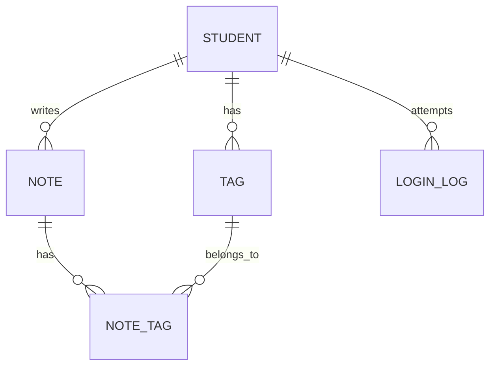

# 笔记管理系统数据库设计

## TL;DR

MySQL 数据库设计，包含学生表、笔记表、标签表及关联表，支持软删除、用户数据隔离、登录审计。

## 一、数据库概述

- 数据库名：note_db
- 字符集：utf8mb4
- 存储引擎：InnoDB

## 二、ER 图



### 表结构

| 表名 | 用途 |
|------|------|
| student | 学生表 |
| note | 笔记表 |
| tag | 标签表 |
| note_tag | 笔记-标签关联表 |
| login_log | 登录日志表 |

## 三、表结构汇总

### 1. student（学生表）

| 字段名 | 数据类型 | 约束 | 说明 |
|--------|----------|------|------|
| id | BIGINT | PK, AI, NN | 主键，自增 |
| student_no | VARCHAR(20) | NN, UQ | 学号，唯一 |
| real_name | VARCHAR(50) | NN | 姓名 |
| created_at | DATETIME | NN | 创建时间 |

### 2. note（笔记表）

| 字段名 | 数据类型 | 约束 | 说明 |
|--------|----------|------|------|
| id | BIGINT | PK, AI, NN | 主键，自增 |
| student_id | BIGINT | NN, FK | 外键 → student |
| content | TEXT | NN | 笔记内容 |
| is_deleted | TINYINT | NN, 默认0 | 软删除标记 |
| created_at | DATETIME | NN | 创建时间 |
| updated_at | DATETIME | NN | 更新时间 |

索引：
- idx_note_student_time (student_id, updated_at)
- idx_note_student_deleted (student_id, is_deleted)

### 3. tag（标签表）

| 字段名 | 数据类型 | 约束 | 说明 |
|--------|----------|------|------|
| id | BIGINT | PK, AI, NN | 主键，自增 |
| student_id | BIGINT | NN, FK | 外键 → student |
| name | VARCHAR(30) | NN | 标签名称 |
| created_at | DATETIME | NN | 创建时间 |

索引：
- tag_student_id_name (student_id, name) UNIQUE

### 4. note_tag（关联表）

| 字段名 | 数据类型 | 约束 | 说明 |
|--------|----------|------|------|
| id | BIGINT | PK, AI, NN | 主键，自增 |
| note_id | BIGINT | NN, FK | 外键 → note |
| tag_id | BIGINT | NN, FK | 外键 → tag |

索引：
- note_id_tag_id (note_id, tag_id) UNIQUE

### 5. login_log（登录日志表）

| 字段名 | 数据类型 | 约束 | 说明 |
|--------|----------|------|------|
| id | BIGINT | PK, AI, NN | 主键，自增 |
| student_no | VARCHAR(20) | NN | 登录学号 |
| real_name | VARCHAR(50) | NN | 登录姓名 |
| is_success | TINYINT | NN | 登录结果：0=失败，1=成功 |
| login_at | DATETIME | NN | 登录时间 |

## 四、设计亮点

### 1. 软删除

- 使用 is_deleted 标记删除状态，数据可恢复
- 查询时自动过滤：`WHERE is_deleted = 0`

### 2. 数据隔离

- 每个学生的标签独立管理（UNIQUE student_id + name）
- 防止跨用户操作（触发器校验）

### 3. 索引优化

- 复合索引覆盖常见查询场景
- 唯一索引防止重复数据

### 4. 级联删除

- note_tag 作为关联表，与 note、tag 级联
- 删除笔记或标签时自动清理关联

### 5. 登录审计

- login_log 记录所有登录尝试
- 保留历史，支持安全审计

## 五、存储过程

### sp_login（学生登录）

```sql
-- 功能：验证登录，记录登录日志
-- 参数：
--   IN  p_student_no  VARCHAR(20)  -- 学号
--   IN  p_real_name   VARCHAR(50)  -- 姓名
--   OUT p_student_id  BIGINT       -- 成功返回学生ID，失败返回-1
--   OUT p_code        TINYINT      -- 0=成功，1=学号不存在，2=姓名不匹配
```

### sp_create_note_with_tags（新建笔记并绑定标签）

```sql
-- 功能：新建笔记并批量绑定标签，事务保证
-- 参数：
--   IN  p_student_id  BIGINT        -- 学生ID
--   IN  p_content     TEXT          -- 笔记内容
--   IN  p_tag_ids     VARCHAR(200)  -- 标签ID列表，逗号分隔
```

## References

- MySQL 8.0 文档
- 软删除设计模式
- 数据库索引优化最佳实践
